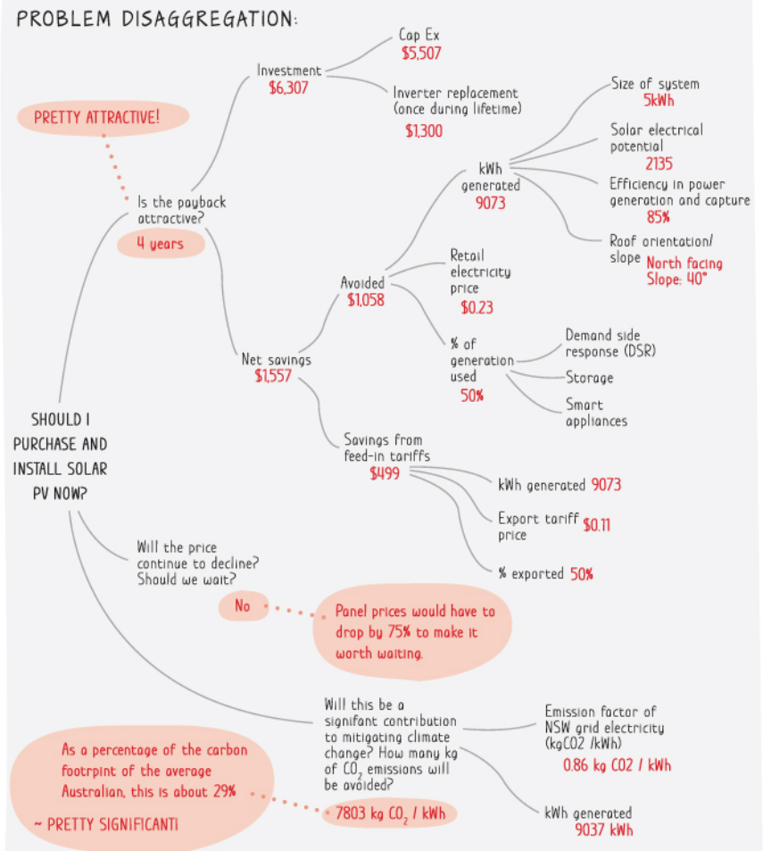

<sub>v0.1</sub>

# 1. 概述 - 解锁问题解决的秘密

在本章中，我们将探讨问题解决的本质，并了解最基本的原则。

在我们开始之前，我想介绍4种工程师在日常工作中经常面对的不同场景。我们将以这4种场景为例，看看我们如何在本次研讨会中应用原则、方法和技巧。

## 1.1 示例场景

正如你将看到的，这些场景会具有不同程度的不确定性和复杂性。随着难度逐渐增加，您需要融入更多的问题解决步骤，应用更先进的技术，并投入更多的精力。

现在想象自己置身于这四种场景中，每种场景都提供着独特的挑战和机会。也思考一下你会如何应对它们。

### 场景 A. 实现一个相对简单且独立的代码片段

> 作为开发者，你被要求实现自助广告系统的支付模块的一部分（类似于 Google Ads，用户可以在 Google 平台上下订单启动他们的广告活动）。假设每个用户有 3 个余额，即礼品余额、借记余额和信用余额（带有信用额度）。礼品余额存放用户所领取的促销活动的美元金额，例如新用户优惠券或季节性物品（类似于使用礼品卡）。借记余额存放用户向系统存入的金额，然后他/她可以用于购买广告活动（类似于使用借记卡）。信用余额存放用于购买广告活动的信用金额，需要在一定时间内支付到期金额（类似于使用信用卡）。你要实现的部分是：给定所请求广告活动的总金额（例如 $1,000）和用户的当前余额（例如 $100 礼品、$500 借记、$0/$2,000 信用），如果余额不足以进行购买，则抛出错误；否则，返回需要从每个余额中扣除的金额（例如 $100 从礼品余额中，$500 从借记余额中，$400 从信用余额中）。

### 场景 B. 向网站添加或更改功能，你可能或可能不熟悉

> 作为开发者，你被分配到一个新项目和一个新团队。仍然是上面提到的自助广告系统，但想象一下你对支付模块一无所知。你被要求实现一个功能，即通过 Slack 聊天机器人在每次付款时自动发送通知。你将得到代码库的演示。然后任务就全由你来完成。更糟糕的是，你对这个功能涉及的第三方库的使用知之甚少。

### 场景 C. 在 Web 应用系统崩溃时进行故障排除

> 作为 SRE/DevOps，你被要求确保一个高吞吐量新闻网站及其基础设施的正常运行时间和可靠性。你已经了解了系统的架构并学习了应用的基本功能。应用代码本身超出了你的权限范围，但你可以阅读并在必要时修改代码。突然间，你收到一个自动电话提醒你网站无法访问的事实。你现在需要紧急修复问题（因为这是一个对业务非常关键的应用），并尽可能地防止将来再次发生。

### 场景 D. 领导开发一个涉及第三方的中等复杂度的新应用

> 作为高级工程师/团队负责人，你被告知业务希望进入社交媒体领域。粗略的想法是创建一个在线平台，以网页应用程序+移动应用程序的形式存在（类似于 Facebook、Twitter、Reddit），面向特定用户细分。现在你需要把这个想法变成一个产品。

## 1.2 伪代码 - 问题解决的模型

在介绍了场景之后，现在让我们来看一下代表问题解决方法的伪代码。

https://github.com/StaymanHou/problem_solving_algorithm/blob/f8543d7dca936ccead6645f02e80572a0be9bd65/1_overview.rb#L1-L40

我们将它分解并尝试理解每一部分。

```ruby
solution_and_result = ProblemSolver.solve(Problem.new, is_root_problem: true)
````

这段神秘的片段是我们进入问题解决世界的入口。在这里，我们创建了一个新的 `Problem` 实例。将其传递给 `ProblemSolver` 来解决它，其中 `.solve` 方法封装了算法的实际逻辑。

这对应于我们的第一个基本原则。**问题导向思维**。

这里我们还假设给定的问题是根问题，通过传递 `is_root_problem: true`。我们将在第3章后面讨论到这个主题。有很多情况下，呈现给我们的问题可能不是我们需要解决的实际/根本问题。在这里，让我们假设它是根问题。

```ruby
module ProblemSolver
  def solve(problem, is_root_problem: false)
    while some_condition
      begin # = 其他语言的"try"
        # ...
      rescue UnderstandingOfProblemHypothesesOrSolutionUpdated > exception # = 其他语言的"catch"
        next
      end
    end
  end
end
````

`.solve` 方法的最外层是一个 while 循环，代表了问题解决的迭代性质。当我们尝试解决问题时，我们对问题或解决方案的理解会发生变化，这可能会促使我们进行另一轮迭代，如此往复......

```ruby
module ProblemSolver
  def solve(problem, is_root_problem: false)
    while problem.still_relevant?
      # ...
      return solution
    end
  end
end

class Problem
  def still_relevant?
    return false if the_requester_no_longer_needs_it
    return false if business_priorities_changed_and_the_problem_is_postponed
    # ...
    return true
  end
end
````

直到解决方案被接受；或者满足了其他条件。

`return solution` 将结束循环，代表问题已解决的情况。

如果 `problem.still_relevant?` 返回 false，也会终止循环，代表问题解决过程将被中止。

这对应于我们的第三个基本原则。**退出条件**。（我知道我刚刚跳过了第二个，我们马上就会解释）

```ruby
module ProblemSolver
  def solve(problem, is_root_problem: false)
    while problem.still_relevant?
      begin # = 其他语言的"try"
        if problem.manageable?
          solution = self.build_solution(problem)
        else
          subproblems = self.decompose(problem)
          solution = []
          subproblems.each do |subproblem|
            solution.append(self.solve(subproblem)) # !!! 递归
          end
        end
        return solution
      rescue UnderstandingOfProblemHypothesesOrSolutionUpdated > exception # = 其他语言的"catch"
        if is_root_problem
          next
        else
          raise exception
        end
      end
    end
  end
end
````

`if problem.manageable?` 当一个给定的问题是可管理的时候，我们可以很容易地提出解决方案，而无需引入算法。然而，随着问题变得更加复杂，我们将不得不将它们分解成更小的部分，直到它们达到可管理的粒度。

`subproblems = self.decompose(problem)` 和 `solution.append(self.solve(subproblem))` 表示了这个递归过程，因为我们在 `.solve` 方法中调用了子问题的 `self.solve` 方法。

```ruby
rescue UnderstandingOfProblemHypothesesOrSolutionUpdated > exception
  if is_root_problem
    next
  else
    raise exception
  end
end
```

这里的异常表示我们需要退出递归并重新审视根问题或父问题的情况，因为我们解决子问题时或其中一部分时，可能需要调整我们分解事物的方式，甚至彻底改变整个计划。

这种递归性质与上面提到的迭代性质相结合，我称之为问题解决的第二个原则。**分层思维**

当我们逐步讲解了伪代码并指出了3个原则后，现在让我们依次深入研究。

## 1.3 原则1 - 问题导向思维

> \[引言\] 阿尔伯特·爱因斯坦说：“如果我有一个小时来解决一个问题，我会花55分钟思考问题，5分钟思考解决方案。”

问题解决的核心是**问题**，而不是“解决”或“解决方案”。我经常看到工程师急于解决问题，却最终浪费时间解决了错误的问题。

> \[示例\] 一个常见的错误是，在实现或排除某些功能的过程中，开发人员会迅速阅读错误消息，然后立即将其复制并粘贴到 Google 或 ChatGPT 中，希望能轻松解决问题，相信这个错误消息就是他/她需要解决的问题。有时候这样做没问题，但有时候他/她会被误导，试图解决根本不存在的问题。重要的是要注意错误消息，仔细阅读它，查看上下文/周围的代码，并努力理解它。顺便说一句，我并不是说我们不应该使用 Google 或 ChatGPT。关键是，即使使用这些工具，我们主要寻找的是理解错误，然后才是解决方案或修复方法。

> \[示例\] 还记得在我的学生时代，我满怀信心地交上了我的考试试卷，相信我做得很好，只是后来发现因为我认为我找到了简单或花哨的解决方案，但实际上我甚至连题目都没有正确读。

### \[提示 1.3.1\] 留出时间理解和评估问题

回应爱因斯坦的引言。理解手头的问题至关重要。整个问题解决活动都围绕着问题展开。在你开始解决问题之前，花一些时间，也许读两遍问题陈述，也许与提出请求的人交谈，也许散步并思考问题。我会停下来，因为我们将在第3章后面再次回到这个主题。

### \[提示 1.3.2\] 避免以解决方案为导向的思维方式

对工程师和甚至优秀工程师的另一个常见陷阱是，我们倾向于过于执着于构建那个“完美”的解决方案，或沉溺于从“解决”活动中产生的快感或多巴胺。是的，我们可能已经足够了解问题，但当我们构建解决方案时，我们必须始终思考这个解决方案如何与问题相关联，以便我们不会为了解决方案而解决问题。


> 来源: https://www.pinterest.com/pin/22095854392198667/

这正是问题和解决方案之间不匹配会适得其反的情况。

就我个人而言，我喜欢解决难题并且享受其中。我认为那种思维上的锻炼自然地让我感到快乐，就像体育锻炼会增加多巴胺，许多人喜欢那样。我确实相信不少优秀的工程师都有类似的特质。

同样，我相信对于很多优秀的工程师来说，工匠精神是我们珍视的。我相信在某种程度上，这反映了我们创造者上帝的形象的创造性和系统性本质。就像他根据它们的种类创建了东西，然后看着他的创造并说它是好的。

然而，我认为这种态度对工程师的成功至关重要，追求完美是必不可少的，确保你的解决方案解决问题，没有多余的，也没有不足的，找到这种平衡在实际环境中也是至关重要的。我们将在第4章中更详细地讨论这个问题。

> \[示例\] 想象一个同事来找你帮忙找到一个文件中最大的数字。顺便说一句，这可能只是一次性的事情。假设以下代码是你想出来的。

```python
# 定义一个函数来找到数组中的最大数字
def find_maximum(arr):
    max_num = arr[0]  # 假设第一个元素是最大的
    for num in arr:   # 遍历数组中的每个元素
        if num > max_num:  # 如果当前元素大于最大的
            max_num = num  # 更新最大的数字
    return max_num   # 返回最大的数字

# 定义一个函数来从用户输入一个数组
def input_array():
    n = int(input("输入元素的数量："))  # 询问用户元素的数量
    arr = []  # 初始化一个空数组
    for i in range(n):
        element = int(input(f"输入第{i+1}个元素："))  # 询问用户每个元素
        arr.append(element)  # 将元素添加到数组中
    return arr  # 返回数组

# 主函数
def main():
    arr = input_array()  # 从用户输入一个数组
    max_num = find_maximum(arr)  # 找到数组中的最大数字
    print("数组中的最大数字是：", max_num)  #

 打印最大数字

# 调用主函数
if __name__ == "__main__":
    main()
```

看看这段代码有多整洁！将逻辑分离成几个函数并加上这些注释。但实际上这是一种过度。记住，你只是在写一个脚本来帮助处理一个简单的一次性任务。只要工作做得好，谁真的在乎代码看起来好不好，还是就像一堆垃圾一样。 

P.S. 当然，如果你在工作之后的时间里做这件事只是为了练习你的编码风格，那就是另一回事，因为你是在解决一个不同的问题。如果你正在做一些超级创新的产品，就像最初几代 iPhone 那样，那又是另一回事。

### \[提示 1.3.3\] 跟踪问题

下一个提示与前一个提示有关。对抗以解决方案为导向的思维方式的一种方法是跟踪问题。在解决问题的过程中，不断问自己，我正在努力解决什么确切的问题。当我们在解决问题的过程中取得进展时，这个新事物会解决什么样的问题。这个解决方案的哪一部分将为我解决问题？我的当前活动真的与我试图解决的问题相关联吗？评估你所采取的每一步的回报率。问问自己，这一步如何解决问题。我们将在下一节中详细阐述这一点。

## 1.4 原则2 - 层次化思维 / 递归与迭代过程

现在我们已经从爱因斯坦的引言中学到了教训，让我们看看另一面。尽管他是一位杰出的理论物理学家，并且完全符合他的引言，但他解决的问题与我们作为软件工程师通常解决的问题不同。这里有一句 ChatGPT 的引言强调了另一面。

> \[ChatGPT 的引言\] 只有通过实施解决方案，我们才能验证对问题的理解；通过实践而不是仅仅思考一个问题，我们学到的东西更多。

### \[模式 1.4.1\] 假设 → 验证 → 学习 → 转向

尽管我们需要努力理解问题，并以此为中心制定解决问题的方法，但我们对问题的理解总是可能存在偏见。我们在尝试解决问题时会更多地了解问题，有时甚至通过拼凑一个错误的解决方案来了解。因此，问题解决是一个迭代的过程。直到我们的解决方案被证明是正确的，我们总是带着假设生活。对问题的假设。对问题的分解的假设。对解决方案及其组成部分的假设。这个迭代的过程使我们越来越接近真正的问题和真正的解决方案，因为我们验证或纠正了我们的假设。我们不应该只是被高层次和抽象的东西迷住，以至于变得不切实际或理想化。问题解决 = 假设 → 验证 → 学习 → 转向。你迭代得越快，你就能越快解决问题。

### \[模式 1.4.2\] 递归 / 分解与综合

从另一个维度来看，问题解决也是一个递归的过程。我们将一个更大的问题分解成小块。然后再分解成更小的块。直到对我们来说是可行的为止。同时，我们需要知道如何追溯回去。知道这个小细节如何与整体图景相契合。知道我们的理解何时迭代时应该缩小到哪个层次。当我们为每个较小的组件找到解决方案时，我们最终也需要将所有东西组合起来。

正如一句著名的谚语所说...

> \[引言\] 全局思考，局部行动

问题解决具有这种双极性。它要求我们足够关注细节，分解事物，并采取具体行动，同时注视我们试图解决的大图景，根本性的问题。我称之为**层次化思维**。优秀的问题解决者将不断进入和退出问题的层次结构，或者说上下浏览堆栈。

就像我们在前面的提示中已经提到的一样。是的，我们需要在局部行动，但不要陷入细枝末节，忽略了大局。

> \[示例\] 我们经常看到程序员陷入小细节中。例如，花费数小时调查一个错误的可能共同原因（通常是从 Google 或 ChatGPT 中学到的），却没有意识到可能存在另一个相对较少的原因。

> \[示例\] 假设一个开发人员正在构建一个待办事项列表应用程序。一个功能涉及按字母顺序显示任务。开发人员开始研究复杂的排序算法，比如快速排序或归并排序，这些算法适用于大型数据集。与此同时，他/她忽视了解决问题的两个更简单的解决方案。a）内置排序。大多数编程语言都有内置排序函数。b）小数据的简单排序。对于一个小列表（比如10个项目），像插入排序这样的简单排序算法可能是完全足够的。这种算法易于理解和实现，对于这样一个小数据集，复杂算法和简单算法之间的性能差异是微不足道的。

### \[模式 1.4.3\] 树遍历

当我们将这两个维度结合在一起时，问题解决的过程实质上是反复生长，修剪，生长和修剪一棵树。我们从问题本身作为根开始（有时根也会生长，但这是后话）。随着我们将问题分解为步骤、选项、因素、假设等形式的子问题，它会不断分支出来，一层又一层。随着我们的学习，增加或删除分支。也许有些分支最终被证明是不可行的。也许另一个分支更好。这棵树会缩小和重新生长，直到我们要么达到绝对的死胡同，要么所有分支都到达叶子节点。


> 来源: 弹性问题解决：改变一切的一项技能

如果你学过数据结构和算法，你就能知道这本质上是一个树遍历问题。当然，根据手头问题的性质以及我们的

经验和技能，树的类型可能会有很大的不同。这反过来将需要不同类型的搜索策略，如深度优先搜索（DFS）和广度优先搜索（BFS）。你问什么是最佳策略？并没有一劳永逸的答案。我们将在第7章中进行调查。

## 1.5 第三原则 - 退出条件 / 知道何时停止

在我们结束本章之前，还有一件事情我们必须谈论。我们已经讨论了以问题为导向的思维方式。解决问题的方法必须围绕解决**问题**展开。我们已经谈论了问题解决实质上是一个**迭代**和**递归**的**树遍历**过程，需要**层次化思维**。那么，我们如何知道我们已经完成了？我们应该何时停止？

基本上有两种情况。要么问题已经解决，我们完成了。要么问题不再相关，我们不需要再解决它了。

### \[检查清单 1.5.1\] 我如何知道问题已经解决了？

有几个指标可以表明解决已经完成。

1. 解决方案通过了测试。（请注意，在这里我们没有指定测试的类型（手动或自动化）或测试的覆盖范围。我们将在第7章中更详细地讨论这个问题）
2. 结果已经被传达给请求者/利益相关者/用户/客户，并且收到了肯定的回复。（我们将在第8章中讨论这个话题）
3. 在解决分解结构中的子问题的情况下，能够适应更大的部分也是一个指标。

话虽如此，我们也应该意识到我们永远无法确定。

> \[引言\] "程序测试可以用来显示错误的存在，但永远不能用来显示它们的不存在。" by Edsger Dijkstra

测试无法向我们证明问题已经解决。同样，一个人的“是”的回答也不能。

> \[引言\] "顾客在看到之前不知道他们想要什么。" by Steve Jobs。我会补充说“...直到他们看到，尝试，以及在所有使用情况下使用它。”

我们能说的最好的就是，通过这些指标，我们可以认为解决方案已经达到了一定程度的可接受或令人满意的水平，具有一定的信心。仅此而已。

### \[检查清单 1.5.2\] 我如何知道问题不再相关？

在另一方面，也有几个指标可以发出信号，表明我们应该考虑放弃问题或子问题。

1. 请求者/用户表示不再需要
2. 业务优先级发生了变化，问题已被推迟或降低优先级
3. 期望的结果已过时
4. 未能验证需求
5. 需求发生了变化或对需求的理解发生了变化
6. 发现解决方案不再可行或可行
7. 发现了更好的解决方案

一般来说，可能会有多个因素，外部变化、需求变化、业务变化以及问题解决者的认识变化。

还要记住问题解决是递归的。因此，所有这些退出条件都可以应用于任何粒度级别的任何子问题。

## 1.6 章节总结

在本章中，我们讨论了问题解决的核心本质，并得出了三个基本原则。

1. 解决问题是以**问题**为中心的活动，因此需要**以问题为导向的思维方式**。
2. 解决问题是一个**递归和迭代**的过程，因此需要**层次化思维**。
3. 递归和迭代的过程至少需要一个退出条件，因此我们**必须知道何时停止**。

我们将在以后的工作坊中看到这些原则以不同的形式被应用。  

[< 主页](README-cn.md) | [下一章 >](2_framework-cn.md)
