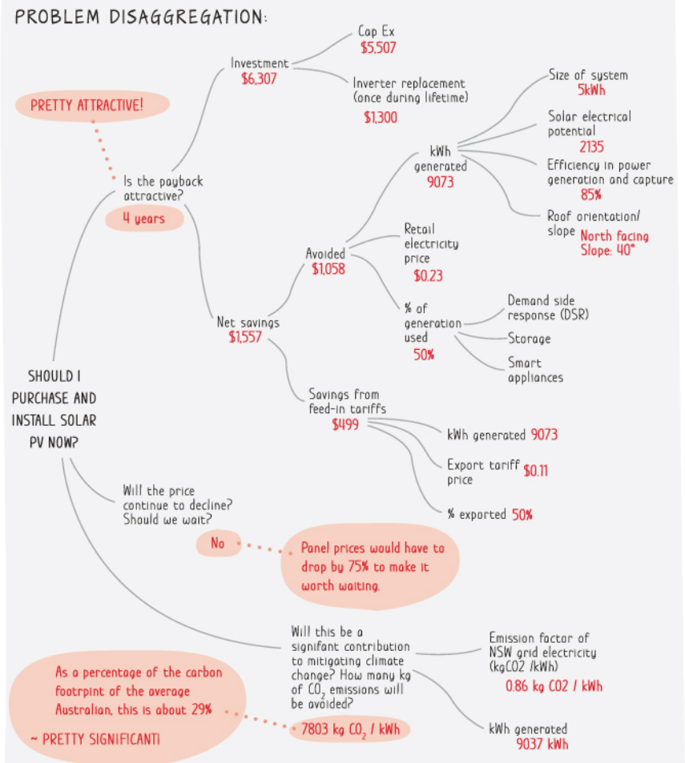

<sub>v0.1</sub>

# 1. Overview - Unlocking the Secrets of Problem-Solving

In this chapter, we'll look at the nature of problem-solving and see the most fundamental principles.

Before we get started, I'd like to introduce 4 different scenarios that engineers face most often in their day-to-day work. We will use these 4 scenarios as examples and see how we apply the principles, methods, and tips throughout this workshop.

## 1.1 Example Scenarios

As you shall see, the scenarios would have different levels of uncertainty and complexity. As the difficulty gradually increases, you would need to incorporate more problem-solving steps, apply more advanced techniques, and invest more effort.

Now imagine yourself in these four scenarios, each presenting its own unique challenges and opportunities. Also think about how you would approach them.

### Scenario A. Implement a Relatively Simple and Standalone Piece of Code

> As a developer you are tasked to implement a portion of the payment module of a self-serve advertising system (think about something like Google Ads where users can place orders to launch their ad campaign on Google's platform). Suppose that each user has 3 balances, namely gift balance, debit balance, and credit balance (with a credit limit). Gift balance holds the dollar amount of the promos a user has claimed, such as new user coupons, or seasonal stuff (think about using a gift card). Debit balance holds the amount of money a user has deposited to the system which then he/she can spend towards campaign purchases (think about using a debit card). Credit balance holds the amount of credits used towards campaign purchases where the due amount would need to be paid in a certain amount of time (think about using a credit card). The portion you are going to implement. Given the total amount of a requested campaign purchase (e.g. $1,000) and the current balances of the user (e.g. $100 gift, $500 debit, $0/$2,000 credit), throw an error if the balances are not enough to make the purchase, otherwise, return the amounts need to be charged from each balance (e.g. $100 from gift balance, $500 from debit balance, $400 from credit balance).

### Scenario B. Add or Change a Feature to a Website That You May or May Not Be Familiar with

> As a developer you are assigned to a new project and a new team. Still, the self-serve advertising system mentioned above, but imagine you know nothing about the payment module. You are tasked to implement a feature to automatically send notifications whenever a payment is made via a Slack chatbot. You will be provided with a walkthrough of the codebase. Then it would be all up to you to complete the task. And what makes things worse is that you have little knowledge of the usage of 3rd-party libraries involved in this feature.

### Scenario C. Troubleshoot a Web Application System When it's Down

> As an SRE/DevOps you are tasked to ensure the uptime & reliability of a high-throughput news website and its underlying infrastructure. You've been introduced to the architecture of the system and learned the basic functionality of the application. The application code itself is out of your jurisdiction, but you do have access to read and, if necessary, modify the code. Suddenly you got an automated call to alert you of the fact that the website is not accessible. You now need to fix the issue with some sense of urgency (as it's a very critical application to the business), and if possible, prevent it from happening again in the future.

### Scenario D. Lead the Development of a New Application with Moderate Complexity That Also Involves 3rd Parties

> As a senior engineer/team lead, you are told that the business wants to step into the social media sector. The rough idea is to create an online platform in the form of a web app + a mobile app (think about Facebook, Twitter, Reddit) that targets a specific user segment. Now you need to turn that idea into a product.

## 1.2 Pseudo Code - The Model of Problem-Solving

With the scenarios laid out, now let's take a look at the pseudo code which represents the algorithm of the problem-solving approach.

https://github.com/StaymanHou/problem_solving_algorithm/blob/f8543d7dca936ccead6645f02e80572a0be9bd65/1_overview.rb#L1-L40

We will take it apart and try to understand each piece.

```ruby
solution_and_result = ProblemSolver.solve(Problem.new, is_root_problem: true)
````

This cryptic snippet is our entry point into the world of problem-solving. Here we are given a new instance of `Problem`. Pass it to the `ProblemSolver` to solve it where the `.solve` method encapsulates the actual logic of the algorithm.

This corresponds to our very first fundamental principle. **Problem-Oriented Mindset**.

Here we are also assuming that the given problem is the root problem by passing `is_root_problem: true`. We'll get to this topic later in Chapter 3. There are a lot of cases where the problem presented to us may not be the actual / root problem we need to solve. Here let's just stick to the assumption that it IS the root problem.

```ruby
module ProblemSolver
  def solve(problem, is_root_problem: false)
    while some_condition
      begin # = "try" in other programming languages
        # ...
      rescue UnderstandingOfProblemHypothesesOrSolutionUpdated > exception # = "catch" in other programming languages
        next
      end
    end
  end
end
````

The outermost part of the `.solve` method is a while loop which represents the iterative nature of problem-solving. As we attempt to solve the problem, our understanding of the problem or the solution will change, which may call us to go another round, and so forth and so on...

```ruby
module ProblemSolver
  def solve(problem, is_root_problem: false)
    while problem.still_relevant?
      # ...
      return solution
    end
  end
end

class Problem
  def still_relevant?
    return false if the_requester_no_longer_needs_it
    return false if business_priorities_changed_and_the_problem_is_postponed
    # ...
    return true
  end
end
````

Until a solution is accepted; Or some other condition has been met.

`return solution` will end the loop, representing the case where the problem has been solved.

`problem.still_relevant?` will also terminate the loop if it returns false, representing the other case where the problem-solving process would be aborted.

This corresponds to our 3rd fundamental principle. **Exit Condition**. (I know that I just skipped the 2nd one, we will get to it shortly)

```ruby
module ProblemSolver
  def solve(problem, is_root_problem: false)
    while problem.still_relevant?
      begin # = "try" in other programming languages
        if problem.manageable?
          solution = self.build_solution(problem)
        else
          subproblems = self.decompose(problem)
          solution = []
          subproblems.each do |subproblem|
            solution.append(self.solve(subproblem)) # !!! Recursion
          end
        end
        return solution
      rescue UnderstandingOfProblemHypothesesOrSolutionUpdated > exception # = "catch" in other programming languages
        if is_root_problem
          next
        else
          raise exception
        end
      end
    end
  end
end
````

`if problem.manageable?` When a given problem is manageable, we can easily come up with solutions without having to introduce an algorithm. However, as problems get more complicated, we will have to break them down into smaller pieces until they reach a manageable granularity.

`subproblems = self.decompose(problem)` and `solution.append(self.solve(subproblem))` represent that recursive process as we are invoking the `self.solve` method on the subproblem(s) within the `.solve` method itself.

```ruby
rescue UnderstandingOfProblemHypothesesOrSolutionUpdated > exception
  if is_root_problem
    next
  else
    raise exception
  end
end
```

The exception here represents the fact that there are cases we would need to exit the recursion and revisit the root or parent problem as we solve the subproblems. Sometimes by learning more about the problem as we solve it or part of it, we will need to adjust the way we break things down, or even overhaul the entire plan.

This recursive nature combined with the iterative nature mentioned above, I call the 2nd principle of problem-solving. **Hierarchical Thinking**

As we've walked through the pseudo code and pointed out the 3 principles, let's now dive deeper one by one.

## 1.3 Principle No.1 Problem-Oriented Mindset

> \[Quote\] Albert Einstein said: “If I had an hour to solve a problem I'd spend 55 minutes thinking about the problem and 5 minutes thinking about solutions.”

The very core of problem-solving is **PROBLEM** not "solving" or "solution". I've seen that happening so often that engineers rush into solving something but end up wasting time solving the wrong problem.

> \[Example\] One common mistake is that in the process of implementing or troubleshooting some feature, a developer would quickly read the error message and immediately copy & paste it into Google or ChatGPT hoping for an easy fix, believing that this error message is the problem he/she needs to solve. Sometimes it works out just fine, other times he/she can be misled into attempting to solve a problem that's not even there in the first place. It's important to pay attention to the error message, carefully read it, look at the context / the surrounding code, and make an effort to understand it. BTW, I'm not saying we should not use Google or ChatGPT. The point is even by using these tools, what we are primarily looking for is to understand the error, And then the solution or the fix comes next.

> \[Example\] Remember during my school days, I'd hand in my exam papers with confidence believing that I've got everything right, only to find out later that I've lost points because I thought I've got the easy or fancy solution but I actually didn't even read the problem right.

### \[Tip 1.3.1\] Set aside time to understand and evaluate the problem

Echoing the quote by Einstein. Understanding the problem at hand is crucial. The entire problem-solving activity is centered around the problem. Before you even start solving it, take some time, maybe read the problem statement twice, maybe talk to the person who requested it, maybe take a walk and reflect on the problem. I'll just stop since again we will come back to this subject later in Chapter 3.

### \[Tip 1.3.2\] Avoid solution-oriented mindset

Another common pitfall for engineers and even good engineers is that we tend to get too obsessed with building that "perfect" solution or indulge in the enjoyment or the Dopamine generated from the "solving" activity itself. Yes, we may have understood the problem well enough, but as we build the solution we must always think about how this solution is connected to the problem so that we don't solve the problem for the sake of the solution.


> Source: https://www.pinterest.com/pin/22095854392198667/

This exactly illustrates how a misalignment between the problem and the solution can backfire.

Personally, I love solving puzzles and enjoy it. That mental exercise just naturally generates happiness in me, I guess just like how physical exercise boosts Dopamine and many enjoy that. I do believe quite a few good engineers share a similar trait.

Likewise, I believe that to a lot of good engineers, craftsmanship is something we hold dear to our hearts. And I believe that in a way it reflects the creative and systematic nature of the image of our creator God. Just like he created things according to their kinds, then looked at his creation and said it was good.

However, as much as I believe that this attitude is important to the success of an engineer and that the pursuit of perfection is essential, making sure that your solution solves the problem, nothing more nothing less, and finding that balance is also critical in the practical setting. We will talk about this more in Chapter 4.

> \[Example\] Image a colleague comes to you asking you to help him/her find the greatest number in a file. BTW, it's likely to be just a one-time thing. Let's say the following code is what you come up with.

```python
# Define a function to find the maximum number in an array
def find_maximum(arr):
    max_num = arr[0]  # Assume the first element is the maximum
    for num in arr:   # Iterate through each element in the array
        if num > max_num:  # If the current element is greater than the maximum
            max_num = num  # Update the maximum number
    return max_num   # Return the maximum number

# Define a function to input an array from the user
def input_array():
    n = int(input("Enter the number of elements: "))  # Ask the user for the number of elements
    arr = []  # Initialize an empty array
    for i in range(n):
        element = int(input(f"Enter element {i+1}: "))  # Ask the user for each element
        arr.append(element)  # Add the element to the array
    return arr  # Return the array

# Main function
def main():
    arr = input_array()  # Input the array from the user
    max_num = find_maximum(arr)  # Find the maximum number in the array
    print("The maximum number in the array is:", max_num)  # Print the maximum number

# Call the main function
if __name__ == "__main__":
    main()
```

See how organized this piece of code is! Separating the logic into a few functions with all these comments. However, that's essentially an overkill. Remember you are just writing a script to help with a simple one-time thing. Who really cares whether the code looks nice or just like a piece of garbage as long as it does the job.

P.S. Of course, if you do this after work hours simply to practice your coding style that would be a different story because you are then solving a different problem. And if you are working on some super innovative product like the first few generations of iPhone, that's a different story as well.

### \[Tip 1.3.3\] Keep track of the problem

The next tip is connected with the previous tip. One way to combat the solution-oriented mindset is to keep track of the problem. Keep asking yourself, what exact problem am I trying to solve as we make progress in the problem-solving. What kind of problems is this new thing going to solve as I learn it. What part of the problem is this solution going to solve for me? Is my current activity truly connected to the problem I'm trying to solve? Evaluate the ROI of each step you take. Ask yourself how does this step contribute to the problem. We shall elaborate on this in the next section.

## 1.4 Principle No.2 Hierarchical Thinking / Recursive & Iterative Process

Now that we've learned the lessons from Einstein's quote, let's take a look at the other side. As much as he's an outstanding theoretical physicist and all true to his quote, he was solving a different set of problems than what we usually solve as software engineers. Here's a quote by ChatGPT that stresses the other side.

> \[Quote by ChatGPT\] Only by implementing a solution can we validate our grasp of the problem; And we learn more by doing than by simply thinking about a problem. 

### \[Pattern 1.4.1\] Hypothesis → Verify → Learn → Pivot

As much as we need to make the effort to understand the problem and center our problem-solving approach around it, our perception of the problem can always be biased. We learn more about the problem as we try to solve it and sometimes even by putting together a wrong solution. Therefore, problem-solving is an iterative process. Until our solution is proven, we always live with assumptions. Assumptions of the problem. Assumptions of the breakdown. Assumptions of the solution and its components. This iterative process brings us closer and closer to the real problem and the real solution as we validate or correct our assumptions. We should not just get fascinated by the high-level and abstract stuff to the point where we become impractical or idealistic. Problem-solving = hypothesis → verify → learn → pivot. The faster you can iterate, the faster you can solve the problem.

This pattern also means that it's usually a good idea to try before we commit, especially in areas that we are not familiar with. If possible, turn each problem-solving step into smaller iterative cycles.

> \[Highlight\] "Don't bite off more than you can chew."

Sometimes problem-solvers can commit too early and invest too much effort and resource in an activity or option, only to realize later that there's a better option but they didn't try.

### \[Pattern 1.4.2\] Recursion / Decomposition and Synthesis

Looking at another dimension, problem-solving is also a recursive process. We decompose a bigger problem into pieces. Then into smaller pieces. Then into even smaller pieces. Until it's something actionable to us. At the same time, we need to know how to trace back. Knowing how this small detail fits into the bigger picture. Knowing which level of granularity to retract to when our understanding has iterated. And when we arrive at the solutions for each smaller component, we will eventually also need to piece everything together backup.

As the famous saying goes...

> \[Quote\] Think globally, act locallly

Problem-solving has this bipolar nature. It requires us to pay enough attention to the details, take things apart, and take concrete actions while having our eyes on the big picture, the root problem we are trying to solve. I call it **Hierarchical Thinking**. Good problem solvers would be constantly going into and out of the hierarchical structure of a problem, or shall we say going up and down the stack.

Just like we've already mentioned in the previous tips. Yes, we need to act locally but don't get trapped in a rabbit hole and lose the big picture.

> \[Example\] So often we see programmers get trapped in little details. For instance, spending hours investigating one possible common cause of an error (which is usually learned from Google or ChatGPT) not realizing that there could be another relatively rarer cause.

> \[Example\] Let's say a developer is building a to-do list app. One feature involves displaying tasks in alphabetical order. The developer starts researching complex sorting algorithms like quicksort or merge sort, which are excellent for massive datasets. Meanwhile, he/she overlooks two simpler solutions to the problem. a) Built-in sorting. Most programming languages have built-in sorting functions. b) Simple sorting for small data. For a tiny list (like 10 items), a simple sorting algorithm like insertion sort might be perfectly adequate. It's easy to understand and implement, and for such a small dataset, the performance difference between fancy algorithms and a simple one is negligible.

### \[Pattern 1.4.3\] Tree Traversal

When we put these two dimensions together, the process of problem-solving is essentially growing, pruning, and growing, and pruning, a tree, over and over again. We start with the problem itself as the root (sometimes the root will also grow but that's for later). It branches out as we decompose the problem into subproblems in the form of steps, options, factors, hypotheses, etc one level after another. Add or prune branches as we learn. Maybe some branches turn out to be not feasible. Maybe another branch is superior. The tree shrinks and grows back, until we either reach an absolute dead end, or all branches reach leaves.


> Source: Bulletproof Problem Solving: The One Skill That Changes Everything

If you've learned data structure and algorithms, you will be able to tell that this is essentially a tree traversal problem. Of course, depending on the nature of the problem at hand as well as our experience and skills, the type of tree may vary greatly. That in turn will call for different types of search strategies like depth-first search (DFS) and breadth-first search (BFS). What's the optimal strategy you ask? There's no one-size-fits-all all. We shall investigate this in Chapter 7.

## 1.5 Principle No.3 Exit Condition / Know When to Stop

One more thing that we must talk about before we wrap up this chapter. We talked about the problem-oriented mindset. The problem-solving approach must be centered around solving the **PROBLEM**. We talked about how problem-solving is essentially an **iterative** and **recursive** **tree traversal** process that demands **hierarchical thinking**. Now then, how do we know that we are done? When shall we stop?

There are basically two cases. Either the problem is solved, and we are done. Or the problem is no longer relevant, and don't need to solve it anymore.

### \[Checklist 1.5.1\] How do I know that the problem has been solved?

Several indicators can signify the completion.

1. The solution passes tests. (Note here that we are not specifying what kind of tests (manual or automated) nor the coverage of the tests. We will discuss this more later in Chapter 7)
2. The result has been communicated to the requester / stakeholders / user / customer and has received an affirmative response. (We shall cover this topic in Chapter 8)
3. In the case of solving a subproblem in a breakdown structure, being able to fit into the bigger piece is also an indicator.

With that being said, we should also be aware that we can never know for sure.

> \[Quote\] "Program testing can be used to show the presence of bugs, but never to show their absence." by Edsger Dijkstra

Tests cannot prove to us the problem has been solved. Likewise, A "yes" by a person can't either.

> \[Quote\] "Customers don't know what they want until they see it." by Steve Jobs. And I'd add "... until they see it, try it, and use it in all their use cases."

The best we can say is that with these indicators we may consider a solution to have reached an acceptable or satisfactory level with a certain degree of confidence. And nothing more.

### \[Checklist 1.5.2\] How do I know that the problem is no longer relevant?

On the opposite side, there are several indicators as well that can signal use to consider aborting the problem or the subproblem.

1. The requester/user expressed that he/she no longer needs it
2. The business priorities have changed and the problem has been postponed or deprioritized
3. The desired outcome is obsolescent
4. Failed to validate the demand
5. Requirement has changed or the understanding of the requirement has changed
6. Learned that the solution is no longer feasible or viable
7. A superior solution has been discovered

Generally speaking, there can be multiple factors, external change, demand change, business change, and perception change of the problem solver.

Also, remember the fact that problem-solving is recursive. So all these exit conditions can be applied to any subproblem at any granularity level.

## 1.6 Chapter Summary

In this chapter, we've discussed about the core nature of problem-solving and derived the 3 fundamental principles.

1. Problem-solving is an activity centered around **problem**, hence it requires a **problem-oriented mindset**.
2. Problem-solving is a **recursive and iterative** process, hence it requires **hierarchical thinking**.
3. A recursive and iterative process requires at least one exit condition, hence we **must know when to stop**

We will see these principles being applied later in different forms throughout the workshop.

[< Home](README.md) | [Next Chapter >](2_framework.md)
