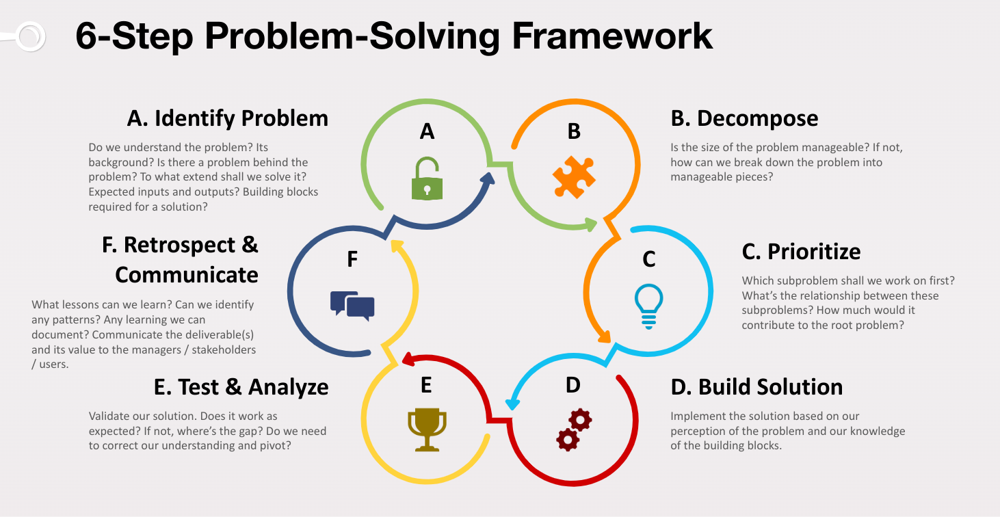
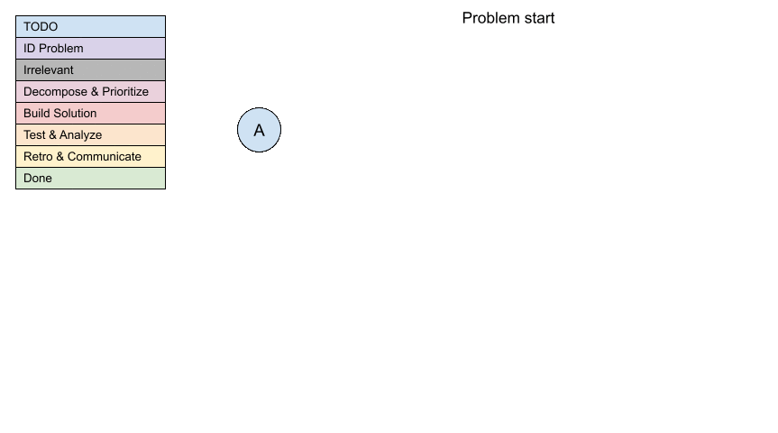

<sub>v0.1</sub>

# 2. 解决问题的六步方法 - 解决问题的框架

## 2.1 简介

我们谈过了解决问题的模型和原则。在本章中，我们将介绍六步解决问题的过程。请记住，解决问题是一个迭代和递归的过程。因此在现实世界中，你会在相当随意的顺序之间跳转步骤，除了始终从识别问题开始。你不会简单地按照线性方式执行这六个步骤并结束一天。在我们走过这些步骤后，我们将看一个例子。

这里我们首先概述了这六个步骤。

- **识别问题**
- **分解**
- **优先级**
- **构建解决方案**
- **测试和分析**
- **回顾和沟通**



## 2.2 热身

> \[热身例子1\] 想象一下你是一个**二年级学生**。你刚学会了如何做乘法。现在给你一个问题 `5 + 4 * 3 ^ 2 = ?`。你会如何解决？

> \[热身例子2\] 我们将使用的第二个例子是[情景 A](1_overview-cn.md#场景-a-实现一个相对简单且独立的代码片段)，这已经在第 1 章中介绍过了。请随时返回第 1 章来刷新你的记忆。想象一下你是一个**初级开发者**。你具备基本的编程技能。你被分配了一个任务，要实现一个相对简单且独立的函数。输入将是礼品、借记和信用的余额，以及活动成本。你要输出扣除成本后的新余额。

在我们学习这六步框架时，请记住这些例子。思考如何应用每一步。我们在本章末尾还将进行一次复盘，使用这两个例子来看这个框架如何运作。

## 2.3 伪代码 - 解决问题的主要工作流程

让我们再次回顾自上一章以来发展的伪代码。在我们逐步进行这样的过程时，我们将在深入研究即将到来的章节之前简要解释每个步骤是关于什么。

https://github.com/StaymanHou/problem_solving_algorithm/blob/a21cb2c2eca3a4eaac65bcdc2b5140a7969958d0/2_framework.rb#L1-L52

## 2.4 六个步骤

让我们拆解伪代码，逐步进行这些步骤。

### 2.4.1 识别问题

```ruby
root_problem = self.identify(problem)
if problem != root_problem
  is_root_problem = false
  return self.solve(root_problem, is_root_problem: true)
end
```

> \[引用\] 在书籍 *Bulletproof Problem Solving* 中提到：“良好的问题定义或框架可以产生巨大的积极影响。”

第一步是识别问题。记得我们在上一章中提出的第一个原则吗？**以问题为导向的思维**！而这种思维的一部分是养成始终先识别问题的习惯。根据问题、你的经验和背景，这一步可能很简单，但也可能非常复杂。这一步的目标是清楚地理解我们的最佳努力。问题究竟是什么？我们是为谁解决它的？解决方案将提供什么价值？是否存在更深层次的原因或问题？如条件子句中所示，如果当前问题背后存在另一个问题，我们可能希望考虑将该问题作为根本问题进行转变和解决。还请注意，根本问题后面可能还有另一个问题。因此这是一个递归和迭代的过程。这与我们的第二个原则，层次化思维，有关。

> \[例子\] 你看到的直接问题是：洗衣堆积了，因为洗衣机洗一次衣服要很长时间。直接的解决方法可能是重置洗衣机，检查循环，尝试新的循环。进一步调查后，你可能会发现洗衣机完成循环所需的时间很长，因为存在排水问题。水流排放得很慢。这可能需要你检查排水管是否有堵塞。也许需要清洁或移除阻碍水流的任何物体。如果我们再深挖一些，我们可能会找到这个问题的根本原因。排水管被堵塞是因为维护不良的习惯。解决方法是定期清洁排水管。

这只是问题识别的一个方面。我们只是用这个例子来展示对问题不同理解如何容易地导致不同的解决方案，有时候是荒谬的，实际上比你想象的更常见。我们将在第三章中学到更多。

### 2.4.2 分解

现在，我们已经清楚了问题，并确保我们没有试图解决错误的问题。下一步是分解问题。

```ruby
if problem.manageable?
  # ...
else
  subproblems = self.decompose(problem)
  # ...
  sorted_subproblems.each do |subproblem|
    solution.append(self.solve(subproblem))
  end
end
```

> \[引用\] 在书籍 *Bulletproof Problem Solving* 中提到：“分解给了我们可管理的片段来工作，并看到问题的结构。”

分解问题的一部分实际上是决定是否需要根据 `problem.manageable?` 条件进行分解。这也正是我们需要将问题分解成较小部分的确切原因。人类只是不擅长处理复杂的事物。当我们不知所措时，我们的判断可能会受到影响。

> \[例子\] 我假设所有读者都能立即解决这个问题。`1 + 2 + 3 + 4 = ?`。答案显而易见，即 10。然而，想象一下对于一年级的孩子来说，这个问题可能会让他们感到不知所措。因此，将其分解为 3 个问题是必要的。首先，`1 + 2 = ?`。答案是 3。然后 `3 + 3 = 6`。最后 `6 + 4 = 10`。

根据问题、你的经验和背景，问题的分解和其结构可能非常简单，只是一个单一节点，或者是一个非常复杂的树。对于简单的问题，我们可以直接解决，而对于更复杂的问题，我们需要分而治之。我们将在第五章中了解何时以及如何分解问题。我们也将看到几种常见的模式。

### 2.4.3 优先级

在问题被分解后需要立即进行的事情是对子问题进行优先级排序。

```ruby
sorted_subproblems = self.prioritize(subproblems)
```

> \[引用\] 在书籍 *Bulletproof Problem Solving* 中提到：“将早期的注意力集中在你可以操作的重要杠杆上。”（这段引用更多地是在商业背景下。稍后我们将看到这个想法如何被转化到技术背景中。）

人类并不像现代多核 CPU 那样设计成可以进行多任务处理。同样，团队总是会缺乏资源。此外，一些子问题可能存在依赖关系。在前面的例子中，一个孩子必须先解决 `1 + 2`，然后才能知道下一个问题是解决 `3 + 3`。因此，几乎不可能一次性解决所有子问题。那么问题就是，**我应该先解决哪个子问题？** 我们已经注意到，解决问题本身实质上就是一个树遍历问题。那么在识别问题及其根本问题、将其分解为子问题并探索解决方案时，遍历、扩展和修剪这棵树的最佳策略是什么？答案是我们都爱恨的：**这取决于。** 我们需要检查这些节点之间的**关系和结构**，以确定我们的策略。

> \[例子\] 假设一个孩子首先将 `1 + 2 + 3 + 4 = ?` 分解成 3 个可能的子问题 `1 + 2`、`2 + 3` 和 `3 + 4`。（假设孩子还没有学会加法的交换律，因此没有意识到 `1 + 4` 也是一个有效的子问题。）很明显，在这种情况下，我们应该优先解决 `1 + 2` 和 `3 + 4`，因为如果我们成功解决这两个问题，子问题 `2 + 3` 就会变得不相关。因此，我们不应该浪费时间先解决这个子问题。

这可能不是一个好的例子，但在解决实际问题时，优先级可能更加模糊。取决于问题的性质、子问题之间的关系以及未知因素，确定这些优先级可能会很困难。我们将在第六章中讨论一些常见的策略。

### 2.4.4 构建解决方案

```ruby
if problem.manageable?
  solution = self.build_solution(problem)
else
  # ...
end
```

一旦我们将问题分解为舒适级别的细粒度，我们就可以继续构建解决方案。现在，构建解决方案可能涉及各种不同的事情。构建一个网站需要利用与构建网络爬虫非常不同的工具。我们不会讨论如何具体使用工具和构建东西，因为这超出了本研讨会的范围。事实上，其他开放或付费课程和技术训练营已经广泛涵盖了这个内容。我们在这个研讨会的目标是识别这一步骤中的几种模式以及反模式，特别是在这个递归和迭代的上下文中。例如，当我们拼凑这个小拼图时，要确保这个解决方案稍后会为更大的拼图做出贡献，而不会失去整体视角。

> \[重点\] 通常，如果我们对问题和构建块有很好的把握，解决方案会很直接。只是时间的问题来完成它。另一种情况下，即使那是一个错误的解决方案，我们仍然必须接受对问题的最佳努力的假设，开始构建东西。**只有通过产生一个解决方案，我们才能进入下一步进行测试。** 只有通过测试解决方案，我们才能发现我们对问题和构建块的理解中存在的差距。

> \[例子\] 编写一个程序，在终端上打印一些文本。这是一个直接的问题的例子。只要你知道如何使用指定编程语言中的内置 I/O 库。

> \[例子\] 这里有另一个展示另一种类型的例子。问题：你得到一个包，里面有红色和蓝色的弹珠。在不看的情况下，你需要确定包里是否有更多的红弹珠还是蓝弹珠。但是，你只能从包里拿出三个弹珠。制定一种策略，根据你有限的拿取来确定是否有更多的红弹珠还是蓝弹珠。假设：包里至少有三个弹珠。包含红色和蓝色弹珠，只有红色和蓝色弹珠。没有其他颜色。弹珠已经混合好，每次拿取都是随机的。正如你在这种情况下所看到的，我们将不得不接受假设。我们无法在做一些事情之前完善我们的假设。

### 2.4.5 测试与分析

```ruby
self.test_and_analyze(solution, problem)
```

在构建解决方案之后，无论是针对子问题还是根本问题，我们都必须评估其解决问题的效果。完全未解决？部分解决？完全解决？然后尝试理解它。是否存在某些空白？我们对问题的理解中是否存在空白？我们分解问题的方式中是否存在空白？解决方案中是否存在空白？基于此，我们然后决定是否应该进行迭代以及如何进行。分析结果和剩余的空白。提高我们对问题和解决方案的理解。在第 7 章，我们将探讨与这一步骤相关的常见陷阱和技巧。一个快速的提示。当我们谈论测试时，请不要立即将其与编程背景下编写自动化测试联系在一起。这只是评估结果的一种形式。你可能甚至没有意识到你可能已经在做这个了。另一方面，你可能没有意识到你可能没有频繁地这样做。

> \[重点\] **测试和分析是我们迭代过程中至关重要的一步。这是我们可以验证或纠正假设和前提的几种方法之一。只有通过这样做，我们才会比之前略微更好地开始下一个迭代。**

> \[例子\] 想象一下，你正在烘烤饼干，并按照一份食谱的指示，在华氏 350 度下烤 10 分钟。10 分钟后，你拿出来，但饼干仍然又软又粘。在这种情况下，你可能对烘焙有限的了解，这就是为什么你需要那个食谱。鉴于结果，你可以猜测或采取几个行动。把饼干再放几分钟，看看是否有效。也许你想检查一下你的过程。也许面团没有做好。也许烤箱出故障了。也许你忘记了预热。也许食谱有误。通过这样做，你现在对问题有了更好的理解，并提出了更多的假设进行测试，这将使你越来越接近真实的问题和真实的解决方案。

### 2.4.6 回顾与沟通

```ruby
lesson_learned = retrospect(problem, solution_and_result)
communicate(problem, solution_and_result, lesson_learned)
```

这是最后一步。在构建和测试解决方案之后，回顾你的方法可以极大地加快你的成长，特别是当你解决了一个以前从未遇到过的新问题或子问题，或者从未将你的知识付诸实践时。在伪代码中，我为了简单起见，将这一步留在了循环之外。然而，有时甚至可以在迭代循环中进行中期回顾是有意义的。在这种情况下，它可以采取不同的形式，例如定期的检查或项目里程碑报告。

这引出了工程师在早期职业生涯中经常犯的两个常见错误。一是忽视回顾的必要性，认为他/她的任务只是完成任务本身，或者认为他/她可以通过一个接一个地完成任务而自然地成长。尽管解决问题需要以问题为导向的思维方式是正确的，但我们应该将精力集中在解决问题上。然而，对于工程师来说，学习和成长成为更好的问题解决者始终是一个长期的副业。因此，只要情况允许，这样做是值得的。

第二个误解是认为工程师沟通解决方案和结果是可选的事情。许多优秀的工程师往往非常重视实际结果，这是好的，但忽视了沟通结果的必要性。我们许多人都是务实的、实际的，并专注于交付实际的结果。(与那些只是假装结果，或者只是做花哨谈话的人相比)。然而，事实的另一面是，价值只有在另一方收到时才能充分实现，无论那是用户、客户、利益相关者还是主管。这种误解与内向性结合起来(对软件工程师的内向性进行的研究一直表明比例较高)，以及基督教信仰的一部分(上帝看到我们的行为并最终决定我们的价值)，很容易导致工程师没有足够强调和沟通他们的工作。因此，我特别想强调这一步，不是为了得到人的认可或赞美，也不是为了走捷径，而是为了充分发挥价值。

> \[引言\] "失败并不是成功之母，高质量的回顾/审查才是。" 作者：Yitang。

> \[例子\] 最终，人类的精力和注意力是有限的。例如，你的老板可能管理着 10 个人。他给你分配了一个任务。你是否期望他会一直记得它。你可能会认为，嘿，他是我的老板，他是要求这个改变的人。我已经做了。他应该注意到了，对吗？错！并不总是。那这意味着他不在乎吗？错！不一定。是的。这可能不是那么重要的事情。但是...

> \[引言\] "如果你的主管不知道你做了什么，从技术上讲，你就没有做。" 作者：Yitang。

这两个主题在其他研讨会中将更详细地讨论，但我们仍将在第 8 章中涉及到这些内容。

## 2.5 将其放在一起

现在我们已经介绍了 6 步框架，我们可以将其与前一章学习到的迭代和递归原理相结合。



您可以在 [此文件夹](raw/animated-problem-tree-example-gif/) 中找到动画 gif 的所有帧。这样您就可以逐帧阅读。

这里发生的事情本质上是对每个节点遵循 6 步，因为我们通过树生长、修剪、修订、遍历和撤回。这可能看起来混乱，但如果您仔细观察，您会看到秩序。不幸的是，我无法为您提供一个标准操作程序，您只需按照每个步骤进行操作，就可以解决任何问题，因为解决问题本质上是一种平衡各种活动的艺术，包括发现、学习、头脑风暴、研究和假设。验证、构建、测试等等。对于某些问题，我们可能会跳过或简化某些步骤或活动，而对于其他问题，我们可能会在同一步骤或活动中投入大量精力。

## 2.6 看它在实践中的表现（热身示例）

让我们看看在结束本章之前，这个框架如何与 2 个热身示例配合使用。

### 2.6.1 简单数学问题

再次想象一下，现在你是一个**二年级学生**。你刚学会了如何进行乘法。现在你面对的是这个问题 `5 + 4 * 3 ^ 2 = ?`。

**步骤 1.1 - 确定问题 (5 + 4 * 3 ^ 2 = ?)** 在这种情境下，我们可以假设问题本身是根本问题。我们大致知道输出会是什么样子，很可能是一个数字。我们对问题及其构成部分有部分理解。我们知道数字 `5`、`4`、`3` 和 `2`。我们熟悉 `+` 运算符。我们刚学习了 `*` 运算符。但是，我们对 `^` 不太确定。此刻你的老师不在身边，所以无法询问。然而，我们仍然可以做出知情的猜测，即它可能与 `+` 和 `*` 类似。它可能取两侧的数字并进行某种操作以产生另一个数字。我们还部分了解另一个重要的构成部分，即我们应该如何分解问题。我们基本上需要每次取两个数字和一个运算符，用结果替换它们，并以递归方式计算下一对。

**步骤 1.2 - 分解 (5 + 4 * 3 ^ 2 = ?)** 根据我们对问题的理解和一些假设，现在我们开始分解它。当然，作为一个二年级学生，我们不可能立即看到答案。（我知道成年人中有些人可能能做到，哈哈）。因此，我们需要将问题分解为易于处理的子问题。我们知道如果没有括号，操作的顺序应该是从左到右的。（我知道有些人已经在喊我们应该先做乘法，但我们只是一个刚学习乘法的二年级学生）因此，问题被分解为 `5 + 4 = x`、`x * 3 = y`、`y ^ 2 = ?`。

我们将跳过优先级排序步骤，因为它与整个问题不太相关。

**步骤 2.1.1 - 确定问题 (5 + 4)** 这个子问题非常直接。**步骤 2.1.2 - 构建解决方案** 进行简单的数学运算，我们得到 `9`。我们大多数子问题也会跳过测试步骤。

**步骤 2.2.1 - 确定问题 (9 * 3)** 我们刚学习了乘法，所以知道应该怎么做。**步骤 2.2.2 - 构建解决方案** 进行数学运算，我们得到 `27`。

**步骤 2.3.1 - 确定问题 (27 ^ 2)** 现在我们卡住了。我们不知道这个 `^` 是什么意思。但是，嘿！老师回来了！让我们问他。所以我们问他 `y ^ 2` 是什么意思？他告诉我们 `y ^ 2` 本质上就是 `y * y`。嘿！我们已经学会了乘法！现在我们理解了问题。我们可以做到！

**步骤 2.1.3 + 2.2.3 - 测试 (5 + 4 * 3)** 既然老师在这里，我们也可以顺便请他验证我们迄今为止的其他子问题的解决方案。显然，老师指出乘法优先于加法。我们完全忘记了这个事实，但没关系。我们刚学会了，所以需要练习。

请注意，这里发生了几件事情！
- **递归**。我们在完成子问题 `27 ^ 2` 之前跳出了它。这是这个六步框架如何由于其递归性质而失序的一个例子。
- 发生了一个非常常见的错误。在提问时，我们将它们剥离了上下文。老师没有意识到这两个问题都是一个更大问题的一部分。我们很快就会看到后果。此外，我们将在后面的章节更详细地讨论常见的错误。

好了。既然我们对问题有了一些新的理解，显然我们需要**迭代**。此外，请注意我们是从假设/假说开始的。我们可能已经意识到了，也可能没有。到目前为止，我们已经验证和纠正了其中一些，并学到了新东西。这提示我们要转变方向。

**步骤 1.1 (第二次尝试) - 确定问题 (5 + 4 * 3 ^ 2 = ?)** 这一次我们需要记住操作的顺序。另外，我们知道 `^` 基本上是将前面的数字乘以自身。

**步骤 1.2 (第二次尝试) - 分解 (5 + 4 * 3 ^ 2 = ?)** 有了新的理解，问题被分解为 `4 * 3 = x`、`5 + x = y`、`y ^ 2 = ?`

**步骤 1.3 (第二次尝试) - 构建解决方案 (5 + 4 * 3 ^ 2 = ?)** 让我们略过一些细节。根据新的分解，我们的解决方案如下。`4 * 3 = 12`、`5 + 12 = 17`、`17 ^ 2 = 17 * 17 = 289`。就是 `289`！

**步骤 1.4 (第二次尝试) - 测试 (5 + 4 * 3 ^ 2 = ?)** 是的，我们找到了解决方案。我们冲向老师。向老师提出了问题和我们的解决方案。哎呀。我们刚才提问时犯的错误又反噬了我们。老师显然指出，指数运算比乘法优先级更高。

是时候再次**迭代**了。再次注意假设 → 验证 → 学习 → 转向的模式。

**步骤 1.1 (第三次尝试) - 确定问题 (5 + 4 * 3 ^ 2 = ?)** 现在我们已经学会了先做 `^`。

**步骤 1.2 (第三次尝试) - 分解 (5 + 4 * 3 ^ 2 = ?)** `3 ^ 2 = x`、`4 * x = y`、`5 + y = ?`

**步骤 1.3 (第三次尝试) - 构建解决方案 (5 + 4 * 3 ^ 2 = ?)** `3 ^ 2 = 6`、`4 * 6 = 24`、`5 + 24 = 29`

**步骤 1.4 (第三次尝试) - 测试 (5 + 4 * 3 ^ 2 = ?)** 我们再次向老师展示我们的解决方案，最终我们弄对了。

**步骤 1.5 (第三次尝试) - 回顾 (5 + 4 * 3 ^ 2 = ?)** 吸取教训。我们应该始终注意操作的顺序。额外奖励。我们需要改进提问的方式，这可以帮助我们从一次迭代中受益。

（请注意，我们跳过了整个问题的优先级排序。我们也跳过了分析和沟通。）

### 2.6.2 场景 A - 实现一个相对简单且独立的函数

再回顾一下第一章中的场景 A，并想象你是一名**初级开发者**，已经掌握了编程基础和一种编程语言。由于我们刚刚经历了第一个数学示例，我会跳过非常相似的部分，留作你的作业。

**步骤 1.1 - 确定问题** 被分配了任务后，我们可能首先想问每个用户为什么有 3 个余额而不是 1 个。这将帮助我们了解任务的背景。了解每种类型余额的独特用例可以给我们一些上下文。接下来要考虑的是思考输入和输出。在格式方面，我们可能想确认所有数字是否都是以美元和小数的形式呈现，因为如果我们需要涉及其他货币，问题将会不同，因为我们需要考虑汇率等等。假设我们已经确认了。最后，由于我们现在对问题及其背景有了初步的了解，现在是考虑构建块的时候了。这个任务不涉及任何第三方库，它是一个相当独立的函数。构建解决方案所需的唯一知识是编程语言的使用。

**步骤 1.2 - 构建解决方案** 略过一些步骤。我们以为我们已经准备好构建解决方案了，但我们开始感到困惑。这个业务逻辑应该怎么样？我应该从哪个余额中扣除？如果余额不足怎么办？如果所有余额都足够怎么办？有的有些没有？事实证明，我们对问题仍然了解不够！

**步骤 1.1 (第二次尝试) - 确定问题** 是的，我们知道了输入和输出的格式，但我们需要一些实际的测试案例来帮助我们理清逻辑。场景细节已经给了我们一个案例，但我们需要更多。我们先从那个开始。因此，我们需要从 $100 礼物、$500 借记和 $0/$2,000 信用中共扣除 $1,000。我们应该首先从哪个余额中扣除？我们可以问我们的经理。我们了解到，每当有余额可用时，我们应该始终首先从礼物中扣除，然后是借记，最后是信用。所以从 $1,000 开始。我们从礼物中扣除 $100，剩下 $900。然后从借记中扣除 $500，剩下 $400。最后，从信用中扣除 $400。是的，我们完成了。然后我们可能决定制定更多“测试案例”来验证我们是否真正理解了问题和需要实现的逻辑。假设我们最终得到了 10 个涵盖不同情况的测试案例。（不要把测试案例想象成可以自动化的测试代码。测试案例也可以手动测试。）

|    | 输入 |         |        |              |               | 输出 |    |        |       |
| -- | ---- | ------- | ------ | ------------ | ------------- | ---- | ----- | ------ | ----- |
| ID | 礼物 | 余额    | 信用   | 信用限额     | 费用      | 礼物 | 余额  | 信用   | 错误  |
| 1  | 100  | 900     | 0      | 0            | 1000          | 0    | 0     | 0      |       |
| 2  | 100  | 1200    | 0      | 0            | 1000          | 0    | 300   | 0      |       |
| 3  | 0    | 0       | 0      | 500          | 1000          | 0    | 0     | 0      | 余额不足 |
| 4  | 0    | 0       | 0      | 1000         | 1000          | 0    | 0     | 1000   |       |
| 5  | 0    | 0       | 100    | 1000         | 1000          | 0    | 0     | 100    | 余额不足 |
| 6  | 100  | 0       | 100    | 1000         | 1000          | 0    | 0     | 1000   |       |
| 7  | 100  | 100     | 100    | 1000         | 1000          | 0    | 0     | 900    |       |
| 8  | 0    | 500     | 100    | 1000         | 1000          | 0    | 0     | 600    |       |
| 9  | 0    | 1000    | 100    | 1000         | 1000          | 0    | 0     | 100    |       |
| 10 | 0    | 1200    | 100    | 1000         | 1000          | 0    | 200   | 100    |       |

**步骤 1.2 (第二次尝试) - 分解** 现在有了测试案例，这为分解引入了一个新维度。无论我们在第一次尝试中如何分解问题，现在我们可以将其分解为两个主要子问题。a）如何实施它；和b）如何运行测试案例。（注意，这与后面的测试步骤直接相关）。问题 b）可以进一步分解为几个选项，如不进行测试、手动测试或自动化测试。我们将在第7章讨论这些不同方法的利弊。

**步骤 1.3 (第二次尝试) - 优先级** 鉴于这种新的分解，其中存在一个问题。假设我们决定进行自动化测试。记住，我们现在是初级开发人员？自动化测试听起来可能很可怕。这可能会导致额外的子问题。我们将需要学习单元测试框架。如果出了问题，我们怎么知道是实现代码出了问题还是测试代码出了问题？因此，我们需要优先考虑。我们是先编写测试代码？也许先编写实现代码是个更好的主意？因为编写测试代码的子问题显然存在更大的不确定性，我们是不是应该先做易于的任务，然后再回来解决这个？也许我们应该先解决最困难的子问题？当然，有不同的策略，我们将在第6章学习到。

**步骤 1.4 (第二次尝试) - 构建解决方案** 我们构建了我们的第一个版本的解决方案，包括测试代码和实现代码。是时候测试一下了。

**步骤 1.5 (第二次尝试) - 测试 & 分析** 我们输入了命令并运行了单元测试。哎呀，我们看到了一些失败的测试。现在我们需要分析输出，检查我们的代码，并尝试理解它。在大多数情况下，这意味着我们有一些错误的假设或假说。也许我们以为我们得到了正确的逻辑，但实际上并没有。也许我们以为我们知道一个函数做什么，但实际上它做了其他事情。也许我们以为我们以正确的语法编写了代码，但有一个拼写错误。通过这一步，我们发现了我们之前没有看到的关于解决方案的新东西。

有了这个新的见解，我们准备进行另一个迭代。这本质上就是故障排除的过程。由于在这种情况下，剩下的问题可能存在于解决方案中，我们不需要从头开始重新开始这个迭代。

**步骤 1.4 (第三次尝试) - 构建解决方案** 假设通过查看错误消息，我们做出了一个知情的推断。例如，所有的测试案例都失败了，而错误抱怨了一些语法问题。合理地推测问题出在代码的实现上。不是测试，也不是逻辑，至少目前还不是。

我们跳过其他迭代和可能的递归。我们已经构建了解决方案。所有的测试案例都通过了。大功告成！

**步骤 1.6 (N+1 次尝试) - 回顾 & 交流** 我们回顾并尝试识别我们学到的教训。最后，我们需要传达结果。这可能意味着我们需要提醒我们的经理。（有很多初级开发人员会忽略这个小步骤，特别是在公司还没有建立程序的情况下）。也许我们需要记录它，特别是对于我们未来自己或其他团队成员的逻辑的简要描述。也许我们可以创建一个演示，复制一些测试案例，但以一种可视化的方式呈现，让用户可以在他们的浏览器中真正看到它在运行，以便我们可以获得他们真正的反馈。

我们尝试将框架应用于这两个示例并观察它的运行情况。这就结束了这一章。

## 2.7 作业

\[作业 2.1\] 在上面的示例中，我们在场景 A 的情况下跳过了一堆步骤。尝试使用您选择的任何编程语言自行解决此问题。观察解决问题时涉及的活动。写下这些步骤或绘制树状结构；看看它如何适应这个框架以及交互式 + 递归过程。

\[作业 2.2\] 反思您最近参与或完成的任务或项目。确定您采取的活动和步骤。将这些写下或绘制树状结构；看看它如何适应这个框架以及交互式 + 递归过程。

[< 前一章](1_overview-cn.md) | [下一章 >](3_identify_problem-cn.md)
