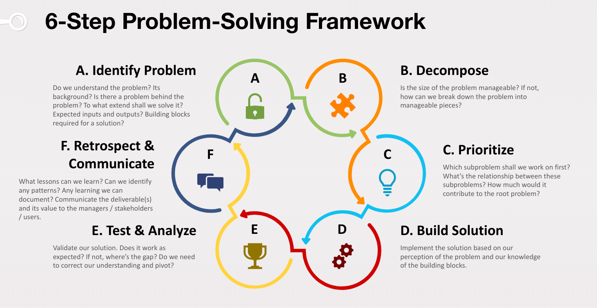

<sub>v0.1</sub>

# 2. The 6-Step Approach - The Problem-Solving Framework

## 2.1 Intro

We talked about the model and the principles of problem-solving. In this chapter, we will now introduce the 6-step problem-solving process. Keep in mind that problem-solving is an iterative & recursive process. So in the real world, you would be jumping between steps in a quite arbitrary order except that it always starts with identifying the problem. You won't be simply executing these 6 steps in a linear fasion and can it a day. We shall look at an example after we walk through these steps.

Here we outline the 6 steps first.

- Identify Problem
- Decompose
- Prioritize
- Build Solution
- Test & Analyze
- Retrospect & Commuinicate



## 2.2 Warm Up

> \[Warm-up example 1\] Image you are a **2nd grader**. You just learned how to do multiplication. Now you are given this problem `5 + 4 * 3 ^ 2 = ?`. How would you solve it?

> \[Warm-up example 2\] The 2nd example we will use is [Scenario A](1_overview.md#scenario-a-implement-a-relatively-simple-and-standalone-piece-of-code) which we already introduced in Chapter 1. Feel free to revisit Chapter 1 to refresh your memory. Image you are a junior developer. You have the basic programming skills. You are assigned a task to implement a relatively simple and standalone function. Inputs will be the balances of gift, debit, and credit, as well as the campaign cost. You are to output the new balances after deducting the cost.

Keep these examples in mind while we learn the 6-step framework. Think about how you might apply each step. We will also do a recap at the end of this chapter to see the framework in action using these 2 examples.

## 2.3 Pseudo Code - The Main Workflow of Problem-Solving

Let's again review the pseudo code which has evolved since last chapter. As we do so piece by piece, we will briefly explain what each step is about before we dive deeper in the up-coming chapters.

https://github.com/StaymanHou/problem_solving_algorithm/blob/a21cb2c2eca3a4eaac65bcdc2b5140a7969958d0/2_framework.rb#L1-L52

## 2.4 The 6 Steps

Let's take the pseudo code apart and walk through the steps.

### 2.4.1 Identify Problem

```ruby
root_problem = self.identify(problem)
if problem != root_problem
  is_root_problem = false
  return self.solve(root_problem, is_root_problem: true)
end
```

> \[Quote\] In the book *Bulletproof Problem Solving* it says: "Good problem definition or framing can have a huge positive impact."

The first step is to identify the problem. Remember the first principle we laid out in the previous chapter? Problem-oriented mindset! And part of that mindset is to form the habit of always identifying the problem first. Depending on the problem, your experience, and the context, this step may be simple, it may also be super complicated. The objective of this step is to have a clear understanding to our best effort. What exactly is the problem? Who are we solving it for? What value will a solution deliver? Is there a cause or deeper problem behind it? As indicated in the conditional clause, if there's a problem behind the problem at hand, we may want to consider pivot and solve that problem instead as the root problem. Please also note that there might be yet another problem behind that root problem. Hence a recursive & iterative process. This connects to our second principle, hierachical thinking.

> \[Example\] The immediate issue you see: Laundry is piling up because the washer takes long to wash 1 load. The immediate solution might be resetting the washer, checking the cycle, and trying a new cycle. With further investigation, you might discover that the washer is taking a lot of time completing a cycle because there's a drainage issue. The water is draining very slowly. This may require you to check the drain hose for clogs. Maybe need to clean it or remove any objects blocking the flow. If we dig a little bit more, we may find the root cause of this problem. The drain hose is clogged because of poor maintenance habits. And the solution is to clean the drain hose regularly.

This is just one aspect of problem identification. We are just using this example to showcase how a different udnerstanding of a problem can easily lead to different solutions, and sometimes ridiculous ones, actually more common than you might think. We will learn more in Chapter 3.

### 2.4.2 Decompose

Okay, now that we are clear about the problem and have made sure that we are not trying to solving the wrong problem. The next step is to decompose the problem.

```ruby
if problem.manageable?
  # ...
else
  subproblems = self.decompose(problem)
  # ...
  sorted_subproblems.each do |subproblem|
    solution.append(self.solve(subproblem))
  end
end
```

> \[Quote\] In the book *Bulletproof Problem Solving* it says: "Disaggregation gives us manageable chunks to work on and to see the structure of the problem."

Part of the decomposing a problem is actually to decide if I need to decompose it as indicated by the `problem.manageable?` condition.

> \[Example\] I'd assume all the reader would be able to immediately solve this problem. `1 + 2 + 3 + 4 = ?`. The solution is pretty obvious which is 10. However, imaging for a 1st grade kid, this problem can be overwhelming for them. So it will be necessary to decompose it into 3 problems. First, `1 + 2 = ?`. The solution is 3. Then `3 + 3 = 6`. And lastly `6 + 4 = 10`.

Depending on the problem, your experience, and the context, the decomposition of the problem and its structure can be as simple as a single node, or a very complex tree. With a simple problem, we can just solve it without having to decompose it. Whereas for a more sophisticated problem, we will need to divide and conquer. We will learn more about when and how to decompose a problem in Chapter 5. And we shall see several common patterns.

### 2.4.3 Prioritize

The immediate thing that needs to happen after a problem is decomposed is to prioritize the subproblems

```ruby
sorted_subproblems = self.prioritize(subproblems)
```

> \[Quote\] In the book *Bulletproof Problem Solving* it says: "Focus your early efforts on the big levers that you can pull." (This quote is more in the context of business. We will see later how the idea can be translated to the technical context.)

Human beings are not design for multi-tasking like the modern-day multi-core CPUs do. Likewise, teams are always going to lack resources. On top of that, some subproblems may have dependencies. In the previous example, a kid must solve `1 + 2` before he/she can tell that the next problem is to solve `3 + 3`. Therefore it's almost impossible to be able to tackle all subproblems at once. Then the question would be, which subproblem shall I solve first? We've noted that problem-solving is essentially a tree traversal problem itself. Then what's the best strategy to travese, grow, and prune this tree as we identify the problem & its root, decompose it into subproblems, and explore solutions?

> \[Example\] Pretend that a kid first decomposed the `1 + 2 + 3 + 4 = ?` into 3 possible subproblems `1 + 2`, `2 + 3`, and `3 + 4`. (Assume the kid has not learned the commutative law of addition hence not realizing that `1 + 4` is also a valid subproblem.) It should be obvious that we should prioritize solving `1 + 2` and `3 + 4` in this case, because if we can manage to solving these two, the subproblem `2 + 3` will become irrelavant. Therefore, we should not waste time upfront solving this subproblem.

This is probably not a good example, but in solving real-world problems, the prioritization can be much more ambiguous. Depending on the nature of the problem, the relationship between the subproblems, and together with the unknowns, prioritizing these can be hard. We will discuss some common strategies in Chapter 6.

### 2.4.4 Build Solution

```ruby
if problem.manageable?
  solution = self.build_solution(problem)
else
  # ...
end
```

Once we broke down a problem into a comfortable level of granularity, we may then proceed with building the solution. Now, building a solution can involve all sorts of different things. Building a website requires utilizing tools that would be very different from building a web crawler. We won't discuss about how we specifically use tools and build stuff as it's out of the scope of this workshop. In fact, that's something has been already extensively covered by other open or paid courses and tech bootcamps. Our goal in this workshop is to identify several patterns as well as anti-patterns in this step, especialy in this recursive & iterative context. For example, while we piece together this small puzzle, making sure that this solution later will contribute to the bigger puzzle without lossing the big picture.

> \[Highlight\] Usually if we have a good grasp of the problem and the building blocks, the solution would be straight forward. And it would be just a matter of time to complete it. In the other case, we still have to live with our best-effort assumptions of the problem, and start building something even if that's a wrong solution. Because only by producing a solution, we can then go to our next step to test. And only by testing a solution, we can find gaps in our understanding of the problem and the building blocks.

> \[Example\] Write a program to print some text on the terminal. That's an example of a staight forward problem. As long as you know how to use the built-in I/O library in the specified programming language.

> \[Example\] Here's another example showcasing the other type. Problem: You are given a bag containing red and blue marbles. Without looking, you need to determine if the bag contains more red marbles than blue marbles. However, you are only allowed to draw three marbles from the bag. Develop a strategy to determine if there are more red marbles than blue marbles based on your limited draws. Assumptions: The bag contains at least three marbles. The bag contains red & blue marbles and ONLY red & blue marbles. No other colors. The marbles are well-mixed, and each draw is random. As you can see in this case, we will have to live with assumptions. We won't be able to refine our assumptions until we do something.

### 2.4.5 Test and Analyze

```ruby
self.test_and_analyze(solution, problem)
```

After a solution is built whether for a subproblem or a root problem, we must assess how well it solved the problem. Not solved at all? Solved partially? Completedly solved? Then try to make sense of it. Is there some gap? Gap in our understanding of the problem? Gap in the way we decomposed the problem? Gap in the solution? Based on that, we then decide whether we should iterate and how. Analyze the results and the remaining gaps. Improve our understanding of the problem and the solution. In Chapter 7, we will explore the common pitfalls and tips related to this step. A quick note. When we talk about test, plz do not immediately connect it with writing automated tests in the context of programming. It's just one form of assessing the outcome. You may not even realize that might have been doing this already. On the other side, you may not realized that you might not be doing it frequently enough.

> \[Highlight\] Testing and analysis is a crucial step in our iterative process. This is one of the few ways we can verify or correct our hypotheses and assumptions. And only by doing so we start off slightly better in the next iteration than where we were.

> \[Example\] Imagine you're baking cookies and following a recipe that says to bake them for 10 minutes at 350 degrees Fahrenheit. You take them out after 10 minutes, but the cookies are still soft and doughy. In this case, you probably had limited understanding of baking, that's why you needed that recipe. Given the result there are couple of things you can guess or do. Put the cookies back for a few more minutes and see if it does the job. Maybe you want to review your process. Maybe the dough wasn't done right. Maybe the oven is malfunctioning. Maybe you forgot to prehead it. Maybe the recipe is off. By doing so, you know have a better understanding of the problem and came up with more hypotheses to test, which will in turn get you closer and closer to the real problem and the real solution.

### 2.4.6 Retrospect and Communicate

```ruby
lesson_learned = retrospect(problem, solution_and_result)
communicate(problem, solution_and_result, lesson_learned)
```

This is the last step. After a solution has been built and tested, reviewing your approach can great speed up your growth, especially when you've solved a new problem or subproblem that's you've never come across before, or never put your knowledge in pratice. In the pseudo code, I've left this step outside of the loop for simplicity, however sometimes it can even make sense to conduct a mid-term retrospective in that iterative cycle. In that case, it can take different forms such as regular check-ins or project milestone reports.

That brings us to two common mistakes at engineers often make during their early careers. One is neglecting the need for retrospectives, believe that his/her task is simply completing the task itself or believe that he/she can grow naturely by completing tasks one after another. As much as it's true that problem-solving requires a problem-oriented mindset, and we should focus our effort on the problem. However, for engineers, learning and growing to be better problem-solver is always a long-term side quest. Therefore, it's worth doing so as long as the situation permits it.

The second misconception is believing that communicating the solution and result is an optional thing for engineers. A lot of good engineers tend to value the actual result a lot, which is good, but neglect the need to communicate the result. Many of us are pragmatic, practical, and focus on delivering the actual outcome. (Compared to those who just fake the results, or just do the fancy talks). The other side of the fact, though, is that value is only fully fullfilled when the other party receives it, whether that's a user, a client, a stakeholder, or a supervisor. That misconception combined with introversion (research examining the introversion of software engineers consistently reveals a higher percentage) and part of Christian belief (that God see our deeds and ultimately he decides our value), easily lead engineers not to put enough emphasis and enough to communicate their works. Therefore, I want to specifically highlight this step, not to get approval or praise by man, not to take shortcuts, but to deliver the value to its full potential.

> \[Quote\] "Failure is not the mother of success. High quality retrospect / review is." by Yitang.

> \[Example\] Ultimately, human beings have limited energe and attention. For example, your boss may be managing 10 people. He assigned you a task. Do expect that he will always remember it. You may think that hay, he's my boos, he's the one requested this change. I've done it. He should have noticed it, right? Wrong! Not always. Then doesn't it mean he doesn't care? Wrong! Not necessarily. Yeah. it may not be that top priority thing. But...

> \[Quote\] "If your supervisor doesn’t know that you did something, you, technically, didn’t do it." by Yitang.

These 2 topics are covered more in details in other workshops, but we shall still touch on these in Chapter 8.

## 2.5 Put it Together

Now that we've introduced the 6-step framework, we can combine it with the iterative & recursive principle that we've learned in the previous chapter.


You can find all the frames of the animated gif in [this folder](raw/animated-problem-tree-example-gif/). This way to can read through each frame if you want.

What's happening here is essentially following the 6 steps for each node as we grow, prune, revise, traverse, and retract through the tree. It may seem chaotic but if you look at it carefully you can see order. Unfortunately I cannot provide you with an SOP that you can simply follow alone each step and get any problem solved, because in its very nature problem-solving is an art of balancing various activities including discovery, learning, brainstorming, research, hypothesising. validating, building, testing, and more. We may skip or simplify certain steps or activities for certain problems, while invest a ton of effort in the same steps or activities for other problems.

## 2.6 See it in Action (Warm-up Examples)

Let's see how this framework works with the 2 warm-up examples before we wrap up the chapter.

### 2.6.1 Simple Math Problem

Again, imaging now you are a **2nd grader**. You just learned how to do multiplication. Now you are given this problem `5 + 4 * 3 ^ 2 = ?`.

**Step 1.1 - Identify Problem (5 + 4 * 3 ^ 2 = ?)** In this context, we can assume the problem itself is the root problem. We have some idea about how the output will look like, most likely a number. We can partially understand the problem and its building blocks. We know the number `5`, `4`, `3`, and `2`. We are familar with the `+` operator. We just learned the `*` operator. However, we aren't quite sure about this `^` thing. At the moment your teach isn't around, so you can't ask about it. However we can still make an informed guess that it's something similar to `+` and `*`. It probably takes the two numbers on both sides and does something to produce another number. The other important building block we kinda know is the way we should decompose the problem. We basically need to take 2 numbers with 1 operator at a time, replace them with the result, calculate the next pair in the recursive manner.

**Step 1.2 - Decompose (5 + 4 * 3 ^ 2 = ?)** Given our understanding of the problem together with some assumptions, now we start to decompose it. Of course, as a 2nd grader, we cannot just see the answer right away. (I know some of you may be able to so as an adult lol). Therefore, we need to decompose the problem into subproblems that's managable. We know that the order of operations should be from left to right if there's no parentheses. (I know that some of you is already shouting that we should be multiplication first, but we are just a 2nd grader who just learned multiplication) So the problem gets decomposed into `5 + 4 = x`, `x * 3 = y`, `y ^ 2 = ?`.

We will skip the prioritization step as it's not that relevant in this entire problem.

**Step 2.1.1 - Identify Problem (5 + 4)** This subproblem is pretty straightforward. **Step 2.1.2 - Build Solution** Do the simple math and we get `9`. And we skip the testing step for most of the subproblems.

**Step 2.2.1 - Identify Problem (9 * 3)** We just learned multiplcation so we know what we should do about it. **Step 2.2.2 - Build Solution** Do the math and we get `27``.

**Step 2.3.1 - Identify Problem (27 ^ 2)** Now we are stuck. We don't know what this `^` thing does. But, hay! Teach's back! Let's ask him. So asked hime what `y ^ 2` does? He told us that y ^ 2 is essentially y * y. And hay! We already learned multiplication! Now we understand the problem. We can do this!

**Step 2.1.3 + 2.2.3 - Test (5 + 4 * 3)** Since the teacher is here, we might as well ask him to verify our solution of the other subproblems so far. And obviousely the teacher points out that multiplication takes precedence over addition. We totally forgot that fact, but it's ok. We just learn it so we need practice.

Note that there are a couple of things happening here!
- **Recursion**. We just jumped out of the subproblem `27 ^ 2` before completing it. That's an example of how this 6-step framework can go out of order due to the recursive nature.
- A very common mistake just took place. When asking questions, we stripped them out of context. The teach didn't realize that both questions are part of a bigger problem. We will see the consequence very soon. Also, we will address common mistake in more details in a later chapter.

All right. Now that we've gained some new understanding of the problem, it's pretty obviouse that we need to **iterate**. Also note that we started with assumptions / hypotheses. We may or may not have realized that. So far, we've verified and corrected some of those, and learned something new. That signals us to pivot.

**Step 1.1 (2nd Try) - Identify Problem (5 + 4 * 3 ^ 2 = ?)** This time around we need to keep in mind the order of operations. Also we know that `^` is basically multipling the preceding number by itself.

**Step 1.2 (2nd Try) - Decompose (5 + 4 * 3 ^ 2 = ?)** With the new udnerstanding the problem gets decomposed into `4 * 3 = x`, `5 + x = y`, `y ^ 2 = ?`

**Step 1.3 (2nd Try) - Build Solution (5 + 4 * 3 ^ 2 = ?)** Let's skip some details here. With the new breakdown, our solution will be as follow. `4 * 3 = 12`, `5 + 12 = 17`, `17 ^ 2 = 17 * 17 = 289`. `289` it is!

**Step 1.4 (2nd Try) - Test (5 + 4 * 3 ^ 2 = ?)** Yea, we got the solution. We rushed to the teacher. Presented the problem and our solution. Oops. The mistake we just made when asking the questions just backfired. The teacher obviously points out that exponentiation takes even higher precedence over multiplication.

Time to **iterate** again. Note again the hypothesis → verify → learn → pivot pattern.

**Step 1.1 (3rd Try) - Identify Problem (5 + 4 * 3 ^ 2 = ?)** Now we've learned that we should do `^` first.

**Step 1.2 (3rd Try) - Decompose (5 + 4 * 3 ^ 2 = ?)** `3 ^ 2 = x`, `4 * x = y`, `5 + y = ?`

**Step 1.3 (3rd Try) - Build Solution (5 + 4 * 3 ^ 2 = ?)** `3 ^ 2 = 6`, `4 * 6 = 24`, `5 + 24 = 29`

**Step 1.4 (3rd Try) - Test (5 + 4 * 3 ^ 2 = ?)** We show our solution yet again to the teacher, and finally we got it right.

**Step 1.5 (3rd Try) - Retrospect (5 + 4 * 3 ^ 2 = ?)** Lesson learned. We should always pay attention to precedence / order of operations. Bonus. We need to improve our way of asking questions which could have helped us from one iteration.

(Note that we skipped prioritization for the entire problem. We also skipped analysis and communication.)

### 2.6.2 Scenario A - Implement a Relatively Simple and Standalone Function

Take another look at Scenario A in Chapter 1 and imagine you are a **junior developer** who has learned the basics of programming and a programming language of choice. Since we just went throught the first math example, I'll skip the parts that are very similar and leave it as your homework.

**Step 1.1 - Identify Problem** After being assigned the task, we may first want to ask why each user has 3 balances instead of 1. That will help us to understand the background of the task. Understanding the unique use cases of each type of balances can give us some context. Next thing would be to think through the inputs and outputs. In terms of the format, we may want to confirm if all the numbers would be in USD and presented as decimals, because if we need to involve other currencies, the problem will be different as we will need to consider exchange rates and stuff. Let's say we've confirmed that. Finally, since we now have a rough understanding of the problem and its background, it's time to consider building blocks. This task does not involve any 3rd-party libraries, it's a pretty standalone function. The only knowledge needed to build the solution is the usage of the programming language.

**Step 1.2 - Build Solution** Skipping some steps here. We thought we are ready to build the solution, but we start to feel puzzled. How this business logic should be? Which balance should I deduct from? What if there's not enough balance? What if all balances have enough? How about some do some don't? It turned out that we still don't have enough understanding of the problem!

**Step 1.1 (2nd Try) - Identify Problem** Yes, we know the format of the inputs and outputs, but we need some actual test cases to help us walk through the logic. The scenario detail already gave us one, but we need more. Let's start with that first. So we need to deduct a total of $1,000 from $100 gift, $500 debit, and $0/$2,000 credit. Which balance should we deduct first? We may ask our manager. And we learned that we should always deduct from gift first whenever there's something available, next debit, and last credit. So starting with $1,000. We deduct $100 from gift, and we have $900 left. Then deduct $500 from debit, and we have $400 left. Last, deduct $400 from credit. Yea, we are done. We may then decide to come up with more "test cases" to verify that we have truely understood the problem and the logic we need to implement. Let's say we ended up with 10 test cases covering different situations. (Don't think of test cases as test code that can be automated. Test cases can be manually tested as well.)

|    | Inputs |         |        |              |               | Outputs |    |        |       |
| -- | ------ | ------- | ------ | ------------ | ------------- | ---- | ----- | ------ | ----- |
| ID | Gift   | Debit   | Credit | Credit Limit | Campaign Cost | Gift | Debit | Credit | Error |
| 1  | 100    | 900     | 0      | 0            | 1000          | 0    | 0     | 0      |       |
| 2  | 100    | 1200    | 0      | 0            | 1000          | 0    | 300   | 0      |       |
| 3  | 0      | 0       | 0      | 500          | 1000          | 0    | 0     | 0      | InsufficientBalance |
| 4  | 0      | 0       | 0      | 1000         | 1000          | 0    | 0     | 1000   |       |
| 5  | 0      | 0       | 100    | 1000         | 1000          | 0    | 0     | 100    | InsufficientBalance |
| 6  | 100    | 0       | 100    | 1000         | 1000          | 0    | 0     | 1000   |       |
| 7  | 100    | 100     | 100    | 1000         | 1000          | 0    | 0     | 900    |       |
| 8  | 0      | 500     | 100    | 1000         | 1000          | 0    | 0     | 600    |       |
| 9  | 0      | 1000    | 100    | 1000         | 1000          | 0    | 0     | 100    |       |
| 10 | 0      | 1200    | 100    | 1000         | 1000          | 0    | 200   | 100    |       |

**Step 1.2 (2nd Try) - Decompose** Now with the test cases, it introduced a new dimension into the decomposition. No matter how we would have broken downthe problem in the 1st try, we can now break it down into two major subproblems. a) How to implement it; And b) how to run the test cases. (Note that this is directly related to the test step later). And problem b) can be decomposed further into several options such as no testing, manual testing, or automated testing. We will discuss about the pros and cons of these different approachs in Chapter 7.

**Step 1.3 (2nd Try) - Prioritize** Given this new decomposition, therein lies the question. Let's say we decided to do automated testing. Remember that we are junior developers now? Automated testing may sound scary. That may lead to additional subproblems. We'll need to learn the unit test framework. if something goes wrong, how would we know whether it's the implementation code or the test code? So we need to prioritize. Do we write test code first? Maybe writing the implementation code first is a better idea? Because the subproblem to write test code is something that obviously has greater uncertainties, shall we do the easy task first and come back to this one? Maybe we shall take on the most difficult subproblem? Of course there are different strategies, and we will learn that in Chapter 6.

**Step 1.4 (2nd Try) - Build Solution** We build our first version of the solution, both the test code and the implementation code. Time to give it a spin.

**Step 1.5 (2nd Try) - Test & Analyze** We typed the command and run the unit tests. Oops, We see some failed tests. Now we need to analyze the output, exam our code, and try to make sense of it. In most cases, it means we have some false assumptions or hypotheses. Maybe we thought we got the right logic but actually not. Maybe we thought we know what a function does but actually it something else. Maybe we thought we wrote the code in the right syntax but there's a typo. Through this step, we discovered something new about our solution that we didn't see previously.

With this new insight, we are ready for another iteration. And that's essentailly the process of troubleshooting. Since in this case, the remaining problems probably lies in the solution, We don't need to restart this iteration from the beginning.

**Step 1.4 (3rd Try) - Build Solution** Let's say by looking at the error message we've made an informed inferrence. For example, all test cases failed, and the error complains about some syntax thing. It's reasonable to guess that the issue is where in the implementation of the code. Not the test, not the logic, at least not yet.

Let's skip other iterations and possible recursions. We've built the solution. All test cases passed. Voila!

**Step 1.6 (N+1 Try) - Retrospect & Commuinicate** We retrospect and try to identify the lessons we've learned. And lastly we need to communicate the result. That may mean we need to give our manager a heads-up. (There are plenty of juniors who would neglect this small step especially in companies that don't have an established procedure yet). Maybe we need to document it espcially a brief description of the logic for our future self or other teammates. Maybe we create a demo replicating some of the test cases but in a visual way so that the user can really see it in action in their browser so that we can get their true feedback.

We've tried to apply the framework to these 2 examples and seen it in action. That wraps up this chapter.

## Homework

\[Homework 2.1\] We've skipped a bunch of steps in the example above in the case of Scenario A. Try solving that problem yourself with any programming language of your choice. Observe the activities involved as you solve it. Write down these steps or draw the tree structure; And see how it fits into this framework and the interative + recursive process.

\[Homework 2.2\] Reflect on a recent task or project you worked on or have completed. Identify the activities and steps you took. Write these down or draw the tree structure; And see how it fits into this framework and the interative + recursive process.

[< Previous Chapter](1_overview.md) | [Next Chapter >](3_identify_problem.md)
