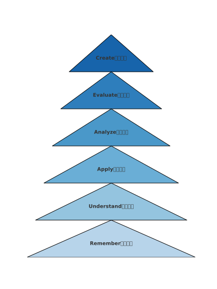
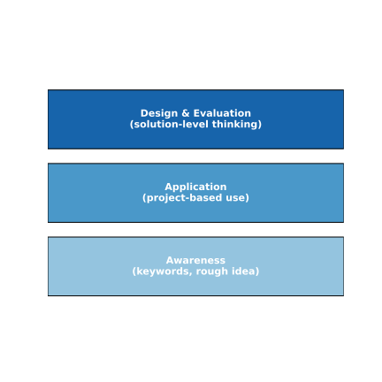
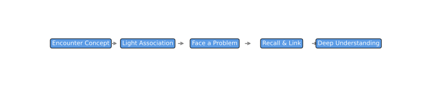

<sub>v0.1</sub>

# 3. 识别问题

这整个部分的主题是围绕技术问题的解决方案，一个个套路或者说是框架。我们之前已经聊了一些基本原则，今天主要会涉及到的是“面向问题”的这个原则。之前提到过，在解决问题时不能过度关注解决方案而忽略了问题本身。如果太早陷入在制定解决方案的过程中，有时候做出来的方案其实已经偏离了原本要解决的问题。

- 主题聚焦于“面向问题”的原则
- 强调过早关注解决方案可能导致偏离真正问题
- 提醒在解决方案设计前需精准把握问题本身

---

我们来看一个例子，这是在互联网程序员中常见的一个笑话：用户真正想要的是一个东西，他表达的是另一个东西，而你理解成了另外一个东西，最后一通操作下来，做出来的东西完全南辕北辙，根本不解决用户的实际需求。所以这是一个非常经典的案例。我们在解决问题时，一定要紧紧抓住“问题”这个焦点，准确理解问题，然后让解决方案围绕问题展开。其他的我先暂时跳过。

- 示例强调沟通误解带来的方案失效
- 核心是紧扣问题、避免误解
- 解决方案应始终围绕问题展开

---

另外我们讲到了“六步法”，也就是解决问题的六个步骤。今天主要集中在第一步“识别问题”和第四步“设计解决方案”这两部分。我们会跳过第二步“拆解问题”和第三步“排定优先级”，因为这两部分内容相对复杂，会留到后面讲。我们现在假设面对的是一个相对简单的问题，因此不需要特别去拆解或者优化你的解决方案。所以今天主要聚焦在第一步识别问题，和第四步搭建解决方案。

---

## 3.1 检查领域知识

OK，我们先来看，所以直接跳到第三张，进入主题：识别问题。识别问题的第一步，就是判断自己对这个领域的知识掌握得怎么样。比如说，这个问题涉及到的背景知识、基本概念，你是否了解？比如说，这里可能没有人学过生物医学。如果突然要我们解决一个生物医学相关的问题，比如现在很热门的用 AI 来开发新药。如果有人说：“我们现在要开发一个系统，利用 AI 来分析各种化学方程式的组合，调配出能治病的新药。”像这种问题抛出来，在场可能没人能真正解决，包括我也不行。

- 识别问题需从领域知识入手
- 缺乏背景知识会导致无法有效解决问题
- 以AI新药开发为例说明陌生领域的挑战

---

这类情况属于我们对相关专业知识完全没有概念，在大家都不了解的前提下，就根本无法谈怎么解决问题。当然在实际情况中，我们往往或多或少会了解一些相关背景，但至少在一开始处理问题时，需要先做一个判断：这个问题我到底听懂了吗？有时候完全没听懂其实还好，最怕的是自以为听懂了，其实根本没听懂，那才是最尴尬的。接下来我们会具体展开这类情况。

- 误以为理解问题比完全不懂更危险
- 开始处理问题前要先判断是否真正“听懂”
- 后续内容将展开误解风险的具体探讨

---

所以第一步就是判断我是否真正了解这个问题的背景情况。这里面还会展开一些其他的细节，我们稍后会一点一点讲清楚。第二个注意点是，当我发现自己在某些方面缺乏必要的知识储备时，为了理解并解决这个问题，我们该如何应对。这里就涉及到一些常见的基本应对方式，我们也会详细拆解并讲解。

- 两大关键：是否了解背景 & 如何应对知识盲区
- 后续将介绍常见的补知识方法
- 识别问题阶段需多方面自我校验

---

第三部分的重点是：即使我拥有了足够的知识储备，也理解了问题的大致概念，仍然可能忽略“问题背后的问题”。因为很多时候，比如我们要做一个项目、改一个功能，任务描述过来时，往往只是很表面地描述要做什么、改什么，但背后其实常常还有更深层的动机或其他问题。

- 知识充足 ≠ 问题识别到位
- 表层任务常掩盖深层动机
- 建议在识别问题时深入探索需求根源

---

比如我觉得有个例子挺有意思的：我们去年引入了一个打卡系统。表面上看是为了记录出勤，但其实背后的真正目的是为了激励大家更努力地工作。于是，打卡系统的推行带出了一系列问题：打卡规则是什么？什么属于现场办公，什么是远程办公？哪些是固定工时，哪些是灵活工时？怎么请假？等等。随着推进的过程，我们发现有些团队渐渐只关注“打卡”本身，甚至忘了这个系统的初衷是为了提升工作积极性。当然在施工团队这边还好，但如果放到市场团队，就很容易变成另一种情况：原本是希望提高工作效率，结果变成大家只是被迫按时打卡，工作内容反而被忽略了。

**图表：流程演化图**

图表可以展示“打卡系统”从初衷到误解的演化路径：
1. 系统初衷 → 2. 实施过程 → 3. 衍生问题 → 4. 偏离目标 → 5. 效果评估

---

这个例子说明，有时候我们以为在解决一个表面问题，但实际上还有一个更深层的问题需要被识别和解决。所以在识别问题的过程中，我们有时需要向下多挖一层、两层，甚至更多层，去理解真正需要解决的背景问题。

- 表面问题背后常藏有更深层逻辑
- 识别问题需层层追问、抽丝剥茧
- 避免被问题表象误导

---

最后一个部分，就是要明确任务目标，或者说明确你要解决的问题目标。有时这方面也容易被忽略。一个任务来了，大家觉得目标很清楚，可能一两句话就说完了，但其实里面常常隐藏着很多细节。这部分其实跟我们“一堂”项目管理课程中讲的内容有很多关联。我这边就简单带过，具体内容可以参考“一堂”中相关的章节。

- 明确任务目标是识别问题的终点环节
- 简短描述可能掩盖任务关键细节
- 推荐参考项目管理课程进行补充理解

---

### 3.1.1 我是否理解问题本身？

我们回过头来一点一点讲。第一点是关于知识储备，也就是是否理解相关领域背后的基本背景知识。

- 本节重点开始聚焦“知识储备”问题
- 标志性问题：我是否真的理解？

---

比如说，我们这边比较常见的情况之一是在媒体领域，过去我们做得比较多的是广告相关的系统。很多项目是我亲自参与开发的，有的是之前团队开发后我接手的，也有一些是后来外聘人员来开发的。

在这些过程中，常常会遇到一个问题：程序员可能在程序开发上没有问题，比如网页开发、编程语言的使用这些都很熟练。但问题在于，他们对广告行业缺乏理解。对于广告的生态系统，比如一个用户访问页面后，这个页面是如何发出广告请求的，广告系统又如何响应这个请求，广告内容怎么被返回并展示在页面上，广告被加载之后如何被监测，它是否被用户看到，有没有被点击，等等这些流程，如果不具备相关知识，就很难真正理解整个系统。

- 开发人员技术能力强 ≠ 业务理解到位
- 广告系统的运作流程对开发准确性至关重要
- 不理解流程易导致系统设计错误

---

我这边只是简单解释一下，但实际上，如果要深入学习，广告这一块的知识是非常庞杂的。

再比如广告中的竞价机制，现在大多数广告系统背后都有实时竞价机制。也就是说，每次一个广告位被展示出来时，背后其实有很多广告主在竞标，有的出价千分之一毛钱，有的千分之二毛钱，最终系统决定展示哪个广告。这一整套竞价机制是广告系统的核心部分之一。如果不了解这些背景知识，在开发相关系统时就很容易出错，或者以为自己懂了，其实根本没有真正理解。

**表格：广告竞价机制示例**

| 广告主 | 出价（单位：元） | 胜出情况       |
|--------|------------------|----------------|
| A      | 0.001            | ❌             |
| B      | 0.002            | ✅（被展示）   |
| C      | 0.0015           | ❌             |

---

类似的还有我们之前开发的一个 Ad Manager 系统，也就是一个广告管理系统，里面包括了记账系统。比如用户充值了多少钱，花了多少钱，这笔钱具体花在哪些广告展示上，这些都需要记录清楚。而这又涉及到一些基础的会计知识，比如单边记账、双边记账，以及采快相关的一些概念。

- Ad Manager 涉及记账流程与广告数据对账
- 会计知识对系统开发有实际影响
- 技术和业务知识缺一不可

---

如果对这些专业背景不了解，即便程序本身写得没有问题，也很难真正解决业务问题。这就是我们说的，是否真正理解了“问题本身”的关键。

- 表面代码无误 ≠ 业务解决到位
- “理解问题本身”需要业务、领域、流程三位一体

---

## 3.1.2 我是否理解当前情况、背景和上下文？

第二小点就是关于这个问题后面的一些情况和背景。因为有些问题，虽然表面上是同一个问题，但在不同的具体情境下，可能就需要不同的解决方案。所以我们在处理问题时，必须对其相关的背景、上下文、具体情况有一定的了解，这样才能更好地推进问题的解决。

- 同一问题在不同语境下可能需不同解法  
- 理解具体背景是推动有效解决的前提  
- 处理问题需兼顾技术与上下文环境  

---

这里一个比较常见的例子是在施工当中，或者说不仅仅是施工，在外部公司也很常见：做 business 的，也就是业务相关的团队，比如负责产品设计、市场的这些人，在与负责实际开发的技术团队（R&D）沟通时，常常会出现代沟，大家说的话对不到一块去。

- 业务与技术常存在语言与逻辑差异  
- 沟通障碍常源于背景知识差异  
- 理解彼此角色和目标有助于跨部门协作  

---

据我观察，除非是某些业务本身就是非常 tech-driven、技术驱动的，比如公司就是以技术作为核心驱动力的，那样的话技术这边的话语权会比较强。否则在大多数公司中，技术团队的话语权往往是低于业务团队的。这一方面确实也可以理解，毕竟如果我们抛开施工自身的意向和使命，从纯商业的角度来看，很多创业公司最终的目标就是要赚钱，而要赚钱就得服务客户。所以在公司里，最有话语权的，通常是那些能带来营收、能贴近客户的人。

- 技术在商业结构中的权力不对称  
- 客户价值常优先于系统结构优化  
- 识别问题时需站在整体商业逻辑角度思考  

---

但常常出现的问题是，技术侧的人不了解客户的需求，也不了解商业模式的运作方式，所以容易陷入技术细节，太过钻牛角尖，而忽略了整个商业背景。

- 技术视角可能遮蔽用户实际需求  
- 过度追求技术完美易脱离商业优先级  
- 提醒技术人员多从客户价值角度思考  

---

比如一个比较常见的场景是：业务侧的人会说，“我们这个东西必须要在下个月上线，我们必须尽快把它做出来。” 但技术侧通常会回应说，“不行，这个得慢慢来，我们还需要认真把结构设计好，一个模块一个模块搭起来，然后还得好好测试，确保没有 bug，才能上线。” 然后可能就提出把上线时间推迟到三个月之后。

---

当然，这样的拉扯本身是合理的，在公司内部或者施工内部，这种业务和技术之间的博弈其实很重要，能帮助团队在不同需求之间找到平衡。但我们要意识到，有时候这个“问题”本身的背景可能是，比如说竞争对手已经上线了类似产品，我们再不上线，整个市场机会可能就没了。那如果你这时候还说要等三个月才能上线，等你做好了，其实市场早就被人抢走了，做出来也白做了。

- 竞争环境决定上线节奏紧迫性  
- 技术拉长周期可能错失市场机会  
- 问题识别要理解“时间窗口”的策略意义  

---

所以我们在讨论怎么解决问题、怎么提出解决方案的时候，也需要去理解背后的语境，理解问题为什么现在被提出，它的真实背景和业务需求到底是什么。也就是说，需要有能力看懂“言外之意”，了解背后所包含的那些技术之外的东西。

- 解问题不只是分析本身，更要读懂“提出问题的时机”  
- 有效沟通需理解业务方的语境与急迫性  
- 技术之外的逻辑决定方案是否被采纳  

---

还有另一个例子，就是我之前跟阿末斯聊到的，关于阿里云的事情。我觉得挺有意思的。当时马云要求技术团队做阿里云，而且明确规定必须用国内的硬件来做。阿里的技术总监最初是很反对的，他觉得这个做法非常吃力不讨好。

- 案例引出政策约束下的“非技术型决策”  
- 技术人员难以单从技术视角理解背景动因  
- 提醒问题识别需超越“最优解”思维  

---

为什么？因为当时国内的硬件很多都不稳定，质量也无法保证，做起来会特别费劲。而从他的角度来看，倒不如直接用现成的解决方案，用进口硬件，既省事又稳定，还便宜。但实际上，这件事背后的真正背景，是国家政策的要求——国家希望这些大型科技公司要建立起自主可控的基础设施，不能完全依赖国外的技术和硬件。

**表格：国产 vs. 进口硬件对比**

| 项目            | 国产硬件           | 进口硬件         |
|-----------------|--------------------|------------------|
| 成本            | 高（初期）         | 较低             |
| 稳定性          | 较差               | 较高             |
| 政策合规性      | ✅                 | ❌               |
| 可控性          | ✅（自主可控）     | ❌（依赖外部）   |

---

所以表面上看，好像是马云强行要求做阿里云，用国产硬件，是在给技术团队增加难度，甚至看起来像是“瞎指挥”。但背后其实有着政策层面的压力和战略上的考虑。从技术视角来看，可能完全无法理解这个决策，但如果你理解了背景，你就会知道这个“技术问题”其实不是单纯的技术问题，它是业务、政策、战略多重因素交织下的一个任务。

- 问题的“技术表象”背后常是多维博弈结果  
- 理解战略意图有助于精准识别问题边界  
- 技术人员需学会从政策和战略视角解构问题  

---

所以这就是我们在识别问题时需要特别注意的部分——理解它所处的商业背景、当时的情境，甚至政策层面的影响。这些背景信息在考虑解决方案的时候不能被忽略，但往往是技术人员最容易忽略的一块。

- 背景信息不可缺位：商业 + 竞争 + 政策  
- 技术人员要提升“非技术语境”的识别能力  
- 多维度理解是识别问题质量的保障  

---

### 3.1.3 我是否知道解决方案可能需要的基本构建模块？

#### 很多时候，我们无法在不引入某种解决方案的情况下正确定义问题。可以将其视为指向月亮的手指。

好，第三块，这一部分相对来说比较简单，我就简单带一下。很多时候我们在讨论如何解决一个问题时，其实很难完全不涉及解决方案。虽然像斯坦福的产品课中提到，要把“问题”和“解法”分开来看，但对绝大多数人来说，很难真的在讨论中只谈问题、完全不提解决方案。实际上，很多情况下，反而是通过讨论初步的解决方案，大家才能更准确地对齐：我们到底是在解决什么问题。

- 现实语境中“问题”与“解法”常并行出现  
- 初步方案有助于厘清目标与背景  
- 过度强调分离反而可能降低沟通效率  

---

比如“一堂”课程中提到的“读书角”这个例子，简单来说，公司想做一个“读书角”。如果你想进一步挖掘问题本质，单纯只聊“问题”往往是聊不下去的。就像那个虚拟员工六六跟老板讨论时，如果他完全跳开解决方案，直接问老板：“你到底想解决什么问题？”可能老板只会说：“就是想让大家读点书啊，所以做个读书角。”但实际上，老板真正的意图可能是希望激发员工的学习热情，培养大家成长和发展的意识。只是这些深层次的动机，如果不借助“读书角”这个解决方案，很难自然地表达清楚。

- 示例说明方案帮助挖掘隐藏动机  
- 解决方案是识别问题路径的一部分  
- 沟通中需善用“方案语言”引出真实目标  

---

所以在识别问题的过程中，其实我们也需要对可能的解决方案有一个基本的了解，至少对其中的一些关键构成模块心里要有概念。这样在交流中才能更顺畅地理解问题、厘清问题。有时候，识别问题本身也需要依赖对初步解法的识别和理解，两者是相辅相成的。

- 方案结构认知是“识别问题”的补充维度  
- 理解模块 = 更好共识 + 更准识别  
- 问题识别和解法识别往往是并进的过程  

---

这一块的核心就是，识别问题不仅需要了解背景知识、上下文信息，也要对可能的解决方案结构有一定的认知。这样才能更全面地看清问题的本质。

- 问题识别需具备三重感知力：知识、语境、方案结构  
- 全面视角有助于找到“问题真正的样子”  
- 识别问题是一种系统性的认知活动  

---

## 3.2 获取领域知识

接下来是第二大点，聊一聊我们要怎么去习得或者获取这些背景知识。也就是说，当你识别完问题之后，接下来就需要考虑如何解决它，那相关的背景知识自然是绕不开的。这里我想了一下，把这一大块内容再细分成了四个小类，也就是常说的那四种“知识状态”——“我知道我知道”、“我不知道我知道”、“我知道我不知道”，以及“我不知道我不知道”。

- 识别问题后，背景知识成为解法基础
- 采用四种“知识状态”来细分学习策略
- 引出接下来的结构：从认知层面探索知识获取路径

---

### 3.2.1 我知道我知道

一般来说，在识别问题或解决问题的过程中，如果是“我知道我知道”的情况，那基本上问题不大。你已经学过、练过，甚至做过类似的事情，这种时候可以直接迁移你之前学到的知识或经验，用在当前问题上，往往就可以顺利推进。这种情形我们就不特别展开讲了。

- 明确掌握的知识可以直接迁移应用
- 该状态下问题解决效率高、风险低
- 属于最理想的知识状态

---

当然，这里面有一种例外的情况，就是“我以为我知道，但其实我并不知道”。这其实是最危险的一种，因为你会误以为自己掌握了知识，但实际并没有真正理解。这种情况很难自我察觉，也不太容易通过常规手段解决，所以这里我们先不展开，后面有机会再细讲。

- “以为自己知道”是高风险盲区
- 误判会导致错误决策和执行偏差
- 后续可考虑设计机制来揭示这类误区

---

### 3.2.2 我不知道我知道

第二个类别是“我不知道我知道”。这个我们也暂时不做特别深入的展开，但我个人是觉得这类情况其实也挺常见。我自己也经历过不少这样的例子，就是我发现自己其实会一些东西，但一开始并没有意识到自己会。

- 潜在知识未被显性化，但已存在
- 经常以“直觉”或“感觉”形式表现出来
- 属于经验沉淀后的无意识能力

---

比如，有时候我们说某个人“很有 sense”或者“很有天赋”，或者“他对这个东西很有感觉”，很多时候就是指这种状态——他其实已经掌握了一些隐性的知识或能力，但可能自己说不太清楚为什么、怎么做，就是直觉反应就能把问题处理得很好。

- 这类能力难以用语言清晰表达
- 往往表现为执行层面“做得对”，但解释不清楚
- 在创新或复杂问题中具备高价值

---

这类情况，如果只是自己单独解决问题，那其实没有什么问题，你有那个感觉，有那个直觉，能把问题解决掉就可以。但当你需要去教别人、带别人一起做，或者希望复制这种能力到另一个人身上时，就会遇到困难。因为你自己都不知道自己是怎么会的，那自然也就没法教给别人。这时候只能说这个人“很有感觉”，但换一个人来，就可能怎么带也带不出来。

- 难以外化和传承是此类知识的最大障碍
- 复制、协作、教学等场景中易暴露出问题
- 对团队成长提出更高要求：能力显性化

---

所以这一类的情况，在需要传承、协作或者培养他人的场景下，会暴露出问题。但本节的重点还是后面两种“我不知道”的情况，我们接下来重点看这两块。

- 暗知识在“单打独斗”时优势明显
- 多人协作则需更多“显性化处理”
- 过渡到重点讨论“未知”型知识状态

---

### 3.2.3 我知道我不知道

第一个稍微展开讲的是“我知道我不知道”。这种情况其实还好处理，因为你知道自己在哪些地方有欠缺，那最直接的方式就是去学、去问、去想办法把“我知道我不知道”的状态，转变成“我知道我知道”。

- “我知道我不知道”是可主动修复的知识盲区  
- 关键在于识别并及时采取行动  
- 通过学习/提问可推动状态正向转化  

---

#### 3.2.3.1 学习

关于怎么去学习，以解决这个问题、获得所需的知识，其实主要还是靠学习和实践。这方面在“一堂”课中也讲了不少，比如在 IPO 课程里，以及“deliberate practice”（刻意练习）这一块，都有比较深入的讨论。当然我这里想结合技术类的内容稍微再展开讲一点。

- 学习是“补全认知”的核心路径  
- 技术学习相较于 business 更强调“现学现用”  
- 学习目标需因内容类型灵活调整  

---

因为技术相关的知识有时和“一堂”课程中讲的偏 business 的内容不太一样。技术类的知识往往是要“现学现用”的，比如你刚学了一个新框架，马上就要用这个框架做一个网站、做一个 app；不像 business 那边的内容，有时候你了解个大概，有个 sense 就够了，不一定非要马上落地做出一个东西。

- 技术知识应用具有即时性与任务导向特征  
- 掌握程度必须满足“可操作”门槛  
- 技术学习场景中，反馈循环更短更直接  

---

所以在技术类的学习里，更需要明确学习目标，然后根据不同的学习目标采取不同的学习方法。

- 明确目标有助于匹配合适的学习方式  
- 学习方法应依据输出要求灵活选用  
- 技术学习不可一概而论，需要结构化拆分  

---

##### 布鲁姆分类法概述

这里有一个很常见的学习模型，叫做 Bloom’s Taxonomy（布鲁姆认知分类法）。我之前在 Ruby on Rails 的课上也简单提到过，这里再稍微解释一下。

- Bloom 框架适合解析学习深度与复杂度  
- 六大层级从“记忆”到“创造”构成认知发展路径  
- 适用于设计渐进式技术学习计划  

---

这个框架把学习目标或掌握程度分成六个层次。其实大家从小到大在学校里的学习，大体上也是按照这个顺序推进的。比如说初高中教材和考试大纲，也常常是按“了解、掌握、应用”这样分层的，整体思路是一致的。

**图表：Bloom’s Taxonomy 六层级（简化金字塔）** 

 

---

简单来说，有些知识点你只要记住、有个印象就可以，可能考试也不考；有些是必须要能背出来的，考试会直接考；再进一步的，有些你要能够用它来解题。

- 认知层级决定知识的使用方式  
- 不同掌握深度对应不同产出能力  
- 应用型工作更偏向中高阶层级（Apply 以上）  

---

而在施工的实际工作中，要求会更高一些。比如你不仅要会用，还要能分析，比如两种解决方案的优劣是什么，能不能评估它们的适用性，最后根据实际情况做决策，比如说在当下场景中到底选哪个更合适。

- 实战要求融合“应用 + 分析 + 评估”  
- 决策场景常需跨层级能力组合  
- 评价型认知在复杂问题中更具价值  

---

再往上一个层次，是你能不能创新——能不能基于你学到的东西，自主组合、改造，甚至创造出新的解决方式。比如你能不能把两个不同的工具、两个不同的思路，结合起来变成一个新方法、新模型。

- 创造力建立在高质量输入之上  
- 创新不仅是“做出东西”，更是方法论生成  
- 框架组合是技术学习的高级产出形式  

---

当然，这六个阶段我这里就不细拆了，只是大致说明一下这个“应用”阶段，有时也可能包含一定的“创作”。虽然严格意义上 Bloom 把“应用”和“创造”分成不同的层级，但在我们平时的学习和工作中，这种边界未必那么清晰。

- 实际操作中，认知层级之间往往交叉模糊  
- 技术执行中“创造”常伴随“应用”出现  
- 不必强求形式分界，应关注产出实效  

---

如果你感兴趣，也可以再深入了解一下 Bloom’s Taxonomy，它背后其实还是一套很系统的认知学习框架，这里只是先做个简单介绍。

---

##### 技术学习的应用层次

如果真的要套用 Bloom 这个架构来理解技术学习，我会说，比如你学了 Rails，然后你能用它做出一个网站，那这个大概属于“应用”层级（Apply）。而如果你能在 Ruby on Rails 的基础上自己搞一个新的框架出来，那才算是“创造”（Create）。当然这里面也涉及用词的问题，毕竟你用它做了一个网站，从某种意义上说你也在创造一个东西。但如果我们稍微严格一点去定义，这里的“Create”更多是指你在知识结构或方法上的原创性构建，而不只是用它做出一个项目。

- 案例对照说明“应用”与“创造”层级差异  
- 强调原创结构和方法的高阶属性  
- 项目产出 ≠ 结构创新，二者标准需区分  

---

那回到正题，我也正好借这个机会说一下，我自己对技术领域里比较常见的几类学习目标的理解。首先是最底层的，我觉得在“Remember”下面其实还可以再加一层，叫“Awareness”（意识层）。因为在技术学习里，很多时候光是背下来或者理解，并不一定有用。你理解了，但不能用出来，也没什么意义；你理解了概念，结果解决不了实际问题，那也白搭。

- 技术学习应以“可用性”为核心标准  
- 增设“Awareness”层有助于识别学习起点  
- 仅理解 ≠ 可操作；知其然也需知其所以然  

---

当然，理解确实可以帮助你更好地去应用，但技术学习更看重的是你能不能用、能不能上手。所以很多时候技术学习的第一层就是“我知道有这个东西”，比如我知道有个框架叫 Ruby on Rails，我知道有个概念叫 AI，这个“知道”本身就已经是第一步了。你可能大概知道 Rails 是个 MVC 框架，知道 MVC 代表的是 Model、View、Controller，知道这些内容的存在，基本上就够你入门了。

- 入门门槛通常为关键词级认知  
- 技术工具入场最重要是“方向感”  
- 不要求立即掌握，但要建立可查找锚点  

---

##### 记忆与理解的实用性

记忆在技术学习里，我觉得意义真的不大。我们搞技术的又不是学语文、社科，不需要把定义死记硬背。比如考试问你“什么是 MVC”，你默写出来也没什么用，实际开发的时候不会有人让你默写定义。记住一些关键词，比如知道 MVC 是三个单词的缩写，Model、View、Controller，这样你在用的时候能想起来关键词，之后去 Google 或者问 ChatGPT，就可以查出你想知道的东西。

- 技术学习更强调“关键词检索能力”  
- 死记硬背价值低，信息检索效率更关键  
- 知识更新快，长期记忆往往很快失效  

---

技术上的知识更新太快，你今天把接口名、方法名背下来了，一年后版本升级，接口结构就变了，所有背下来的也就失效了。比如 Rails 从 7 升到 8，React、Redux 的设计也会变，你今天全记下了，明天就不一样了。Node.js 的版本更新更频繁，背也没意义。

**表格：技术学习中的“记忆 vs 实用性”比较表**

| 项目               | 死记硬背型记忆   | 实用性学习策略       |
|--------------------|------------------|------------------------|
| 接口/版本适配性     | 差（容易失效）    | 高（随查随用）         |
| 时间性             | 长时间保持        | 快速响应为主           |
| 应对变化能力        | 低                | 高                     |
| 学习效率           | 低                | 高（查 + 用）          |

---

变成语言也是一样，Python 从 2 到 3，Ruby、JavaScript 全都是这样。Node 的迭代尤其快。今天你花时间记住了很多底层 API，过不了多久版本一更新，全变了。所以我认为，记住几个关键字，能让你需要的时候能搜到，然后临时快速再理解、再用出来，这样就够用了。

- 快速查找 + 关键词定位 = 技术学习核心组合  
- 应对高频变化需降低依赖长期记忆  
- 学习目标从“理解并记住”转向“识别并搜索”  

---

至于理解，在我看来也不是最关键的。它更像是在应用过程中自然形成的过程。你多用几次，自然就理解了。没必要一开始就特别去纠结某个概念到底什么意思，尤其是当这个概念不是你当前马上要用的内容时，其实理解得不彻底也没什么大碍。很多时候，我看到有些人花大量时间去钻牛角尖，只为搞懂一个并不急需的技术点，反而效率不高。理解当然好，但也要看性价比，是否值得在当下花那么多时间去理解清楚。

- 技术理解更适合在“用中学、学中用”  
- 理解成本需评估投入产出比  
- 过度求解不急需点易陷入低效误区  

---

##### 技术学习的核心策略

所以我个人觉得，在技术领域的学习中，其实只要掌握最基础的那一层——甚至是在 Bloom 分类法中“Remember”层级之下的一层——也就是你知道这个东西存在，有个模糊的概念，能记住关键词并且能搜到它，就已经可以了。这是第一层。而第二层就是直接跳到“Apply”，也就是能用出来就行。至于中间的“理解”和“分析”这两个阶段，其实很多时候是自然而然发生的过程，不需要刻意去追求。

- 技术学习建议聚焦在两层：意识（Awareness）与应用（Apply）  
- 关键词识别 + 快速搜索能力 = 实用型学习的关键  
- “理解”和“分析”多数可通过实践自然达成  

---

就拿我自己来说，很多技术内容我都记不住。因为我做的项目每次使用的编程语言可能都不一样，比如说我上次做 Python 项目可能已经是一两年前了，上一次用 C 语言甚至可能是十年前的事了。这些语法我肯定记不住，但也没关系，真正要用的时候，上网搜一下相关语法，一分钟就能搞定。

- 技术记忆不稳定是常态，搜索能力比长期记忆更重要  
- 多语言经验不依赖死记硬背，而靠检索能力支撑应用  
- 实战环境强调“用时即查、查后即用”  

---

然后说到“Apply”这层，正如 Tony 提到的，如果要达到应用的层级，最好的方式其实就是跟着教程做例子。技术教程里一般都会有示例、案例这些东西。第一步就是照着这些示例把它做一遍。第二步，我通常会在示例的基础上自己做一些修改，比如调一调、改一改，看看这个东西是不是还能跑，行为是否和我预期的一样。

- 入门学习路径：复现 → 改动 → 理解 → 应用  
- 示例驱动学习是技术入门高效方式  
- 修改示例代码可验证理解、推动主动学习  

---

##### 实践中的举一反三

举个例子：教程的示例是一个简单的发帖网站，介绍了 MVC 怎么实现发帖的创建、查询、更新、删除等基本操作。我把这个例子跑通之后，大概就能理解它是怎么应用的。接下来我会尝试做一些调整，比如说：如果我给这个帖子加一个字段，会怎么样？比如加一个 `tag` 字段，让每个 post 支持标签分类，我就试着在原来的例子基础上加这个字段，看看整体流程是否还能顺利跑通。

- 学习举一反三的第一步：在原例子基础上加字段测试  
- 小变动是理解代码结构和数据流的有效练习  
- 观察系统对改动的反馈可加深对机制的理解  

---

再比如，我会思考：能不能把它做得更通用一些？原来叫 `Post`，那我是不是可以把它变成一个更抽象的 `Content`，这样它既可以是文本，也可以是图片、音频或其他形式的内容？这就涉及到在原有技术基础上做一点通用化、抽象化的拓展。

- 从 `Post` 到 `Content` 的演化体现建模抽象能力  
- 通用化是系统设计中的初阶建构训练  
- 抽象练习有助于为后续的可扩展性奠定基础  

---

还有一种做法是故意把它搞坏。比如在创建功能中加入一些额外的逻辑，比如加个校验条件：判断某个字段是否符合规范，如果不符合就报错。这样我就可以观察：当规则被打破时，系统会怎么反应？是不是还能正常运行？这样可以更深入地理解系统的行为边界。

- 破坏式实验是技术理解深化的有效路径  
- 有意识“搞坏”可以揭示系统的边界与容错能力  
- 推荐在安全环境下尝试：如本地开发或沙盒环境  

---

到了“Apply”层级的时候，学习就不只是模仿，更要主动思考如何做举一反三的练习。能不能在学了一个例子之后，基于它稍微拓展一下、改动一下，验证一下你的理解和掌握程度。

- 应用层级的关键是“变化实验”与“假设验证”  
- 判断学习是否到位的标准是能否自由改写示例  
- 举一反三既是测试手段也是成长通道  

---

基本上只要能达到这两个层级——知道有这个东西，关键时候搜得出来，然后能用它做点东西——那就已经很可以了。在实际解决问题时，基本就足够用了。

- 技术学习的底线：检索能力 + 最小可用技能  
- 不必追求全部掌握，只需“够用即好”  
- 有效实践优于理论记忆  

---

##### 高阶技能与系统设计

再往上走一层的技能，就是在解决实际问题时，需要独立地提出和设计解决方案。对于技术岗位来说，很多人到了架构师这个层级时，工作内容就从单纯地“使用工具”转向“从头设计系统”。

- 高阶转变从“工具使用者” → “系统构建者”  
- 架构级角色聚焦整体方案设计与权衡  
- 能提出“为什么这样设计”比“怎么写代码”更重要  

---

比较典型的场景就是：我们现在有一个需求，需要做一个新的网站。那这时候你不仅要写代码，更要去分析、评估，比如：这个网站是用这个框架做好，还是用另一个框架更合适？数据库是选这种类型好，还是那种类型更稳定？

- 高阶问题聚焦在“选型与权衡”而非具体代码  
- 框架选择、数据库匹配等决定系统的长远性能  
- 能力重心从“执行”转向“评估 + 决策”  

---

前几天我跟阿姆斯聊数据库时就提到了这一点。到了这个阶段，你就需要对不同的解决方案、不同的框架有基本了解。最好你之前已经动手试过，不一定是很复杂的项目，但起码在一些实验性质的小项目或者 side project 中简单用过，有实际操作的经验，知道它们怎么用、优缺点大致是什么。

- 实操经验是架构选型的基础  
- Side project 是测试和比较技术栈的练兵场  
- 框架/数据库理解要结合实际应用情境  

---

这样当你要设计整套技术方案的时候，才能有依据去做评估和决策。比如，你会知道这个框架更适合快速开发，那个框架更适合长期维护；这个数据库支持大规模数据量但配置复杂，那个数据库上手快但扩展性差。

**表格：框架与数据库选型对比示例**

| 技术栈项     | 类型 A（如 Rails）    | 类型 B（如 Express） |
|--------------|-----------------------|------------------------|
| 适合快速开发 | ✅                     | ✅                     |
| 长期维护性   | ✅                     | ❌                     |
| 学习曲线     | 中                    | 低                     |
| 社区成熟度   | 高                    | 高                     |

---

但光了解技术还不够，你还得把功能需求、用户需求、业务场景、商业背景都考虑进去。比如，这个项目是需要“做得快”还是“做得稳”？你的团队人手是否足够？预算是否充足？这些现实条件都可能会影响你最终的技术选型。

- 技术选型不能脱离实际背景：功能、时间、人力、预算  
- 商业语境是所有技术决策的隐性前提  
- “做得快”与“做得稳”常常不可兼得，需判断优先级  

---

##### 长期与短期技术选型

有时候你还需要考虑时间维度，是偏向短期目标还是长期战略。有的框架短期开发很慢，但长期维护性很好；而另一些框架短期上手快，可以迅速上线，但长期维护成本会很高。

- 技术选型需明确时间维度：短期 vs. 长期  
- 上手速度与维护成本常构成反比  
- 战略与交付目标决定框架优先级  

---

举个具体例子，在我们做 cross map 项目的时候，当时情况就是必须尽快上线。在这种背景下，我们就没法太考虑长期维护成本，而是优先考虑怎么快点把东西做出来。所以我们选择了 WordPress 这样的成熟系统，它基本上模块都封装好了，直接拿来用就能上线。

- 典型短期导向选型案例：WordPress  
- 成熟系统封装度高，适合快速上线  
- 牺牲灵活性换取交付速度  

---

但如果是另一种情况，比如这个项目不是那么急着上线，而是从战略上要长期持续维护，那我们就可能选 React 这类更灵活、可扩展性更强的框架。虽然一开始开发速度慢一些，但从长远来看，维护起来更方便，系统也更稳定。

- 长期导向偏好组件化、高扩展框架（如 React）  
- 初期成本换取后期稳定与演化能力  
- 可维护性是长周期项目的关键价值  

---

所以，我觉得虽然 Bloom 把学习分成六个层级，但在技术领域，其实归纳成三层就够了：一是知道这个东西存在，二是能实际应用，三是能基于已有知识设计出解决方案。这三种学习目标决定了我们在学习策略上的不同选择，也意味着在不同阶段要有灵活多变的学习方式。

**图表：技术学习的三层目标对照图**


 

---

##### 一十一百学习法则

这里其实可以对照“一堂”课里讲到的“一十百”学习法则。那边讲的是读书的方法：一百本书里，你先快速读完一遍每本书的 summary，也就是读别人的总结，这样一百本书你很快就能过完，甚至一天一本书，一百天就能读完一百本。然后从中挑出十本深入阅读，最后再精读其中的一本。这就是一百、十、一的结构。

- 一十百模型强调“扫面广 → 聚焦深 → 精准投”  
- 技术学习与阅读策略有可迁移通用结构  
- 广度优先更适合早期建立体系感知  

---

这个法则应用到技术学习上，也是一样的道理。很多时候技术学习也存在“深度”和“宽度”的问题——有些时候你要先追求“宽”，先快速过一遍所有内容，把知识面铺开，对整体有个印象和把握。

- 初期应优先建立技术图谱，避免深陷细节  
- 宽度优先策略有助于搭建领域框架感  
- 掌握术语、结构远比掌握细节更具效益  

---

比如说在学习 Ruby on Rails 时，Rails 的教程里其实包含了很多碎片化的概念和机制，如果你去看官方文档，它基本上是遵循“约定大于配置”的原则，不需要你去配置很多东西。但问题是，它背后的这些“约定”你根本不知道，所以很多时候就容易被卡住。

- 框架内部机制默认值多，新手易因不知“约定”被阻  
- 全览文档结构可辅助理解隐性逻辑  
- “扫全 + 记关键”是应对封装框架的策略  

---

再比如，你要学 JavaScript，可能有人会直接拿起《犀牛书》这么厚的一本经典教程开始啃。但如果你一上来就打算从头到尾逐字精读，想把所有细节都抠清楚，那可能三个月都看不完，甚至会因为太难坚持而中途放弃。而实际上，这种“抠细节”的投入方式，在早期阶段，特别是在你还没开始实际用它写代码的时候，它的“ROI”（投资回报率）是非常低的。

- 早期阶段避免“深研型”阅读策略  
- 高门槛经典教材适合中后期补强使用  
- 实践前精读细节 ROI 极低，可能打击信心  

---

##### 技术学习的优先级筛选

尤其是在工作场景下，如果你是在做施工、落地项目，不是做科研或理论研究，那就更应该避免一开始就深挖那些用不到的细节。有些东西你可能一辈子都用不到，那你现在花时间去学，意义其实不大。所以在这种场景下，一个更有效率的学习策略就是套用“一十百”的模型：

- 学习目标需结合工作场景适配优化  
- 技术选题应关注“近期可用性”优先级  
- 把精力集中在短中期可变现技能上  

---

“百”的层面，就是先把整个技术文档、教程快速刷一遍，不需要完全理解、记住细节，重点是建立整体印象，知道有哪些模块、每一章讲了什么。

- 百 = 扫一遍目录、模块，建立结构感  
- 理解可延后，掌握结构是第一性目标  
- 模块感知比内容细节更重要  

---

比如说在学习 JavaScript 时，你可以快速扫一遍教程的大纲，每个章节都至少过一遍：比如了解变量、函数、对象、原型、作用域这些基本概念；在学习 Ruby on Rails 时，也一样快速过一遍它的 MVC 结构，知道 Controller 是干嘛的，View 是什么，Model 又是干什么的。至于像 Deeper、Internationalization、Testing、Debug 这类模块，可能你现在暂时用不到，也可以先扫一眼，知道它们存在，有个模糊印象就好。

**表格：技术文档快速扫读结构示例**

| 技术内容       | 快速扫读重点               |
|----------------|----------------------------|
| JavaScript     | 变量、函数、对象、原型、作用域 |
| Ruby on Rails  | Model、View、Controller、路由等 |
| 延伸模块       | 测试、调试、国际化（略读感知）   |

---

这种快速刷一遍的方式，其实就是你第一轮学习的目标：先建立整体框架感和关键术语的 awareness。

- 建立框架感 + 关键词索引是第一轮学习目标  
- Awareness 层级决定后续是否“搜得准、学得快”  
- 不求深懂，先求通读  

---

因为我们刚刚也提到，在技术学习中，核心的三个目标层级分别是：第一，知道它的存在（有印象）；第二，能把它用出来（应用）；第三，能横向对比和评估（选型）。所以学习策略上，“百”就是先覆盖宽度，把这一整套知识体系的边界先铺开；比如 Rails 的基本结构、JavaScript 的语言核心部分，你都先快速了解一遍，有个感知，然后再决定要不要往下挖，挖多深。

- 宽度学习是“是否值得深入”的前置筛选工具  
- 结构视野比理解深度更适合作为学习起点  
- 策略核心：感知 → 筛选 → 深入  

---

##### 技术学习的笔记策略

那你觉得在看这些文档或书籍的时候，有没有必要记笔记呢？我个人是从来不记技术类的笔记的。其他类型的内容我会记笔记，但技术方面我基本不记。可能一方面是我从小到大就习惯在技术这块直接动手思考，所以不太依赖笔记；另一方面是技术类的知识，本身更新快、结构也相对明确，我只会记一些关键词，比如刚才提到的，有个印象就行的那种关键术语，方便之后能搜得出来。

- 技术笔记建议聚焦于关键词而非整段知识记录  
- 结构明确、更新快的领域无需精细笔记  
- 动手比笔头更重要：写代码 > 写笔记  

---

记到这个程度我觉得就差不多了。对我个人而言，看一遍文档即使不完全理解，只要能记住关键词，之后遇到问题自然就能联想起来：哦，我之前看到过这个词，遇到这个问题的时候可以搜那个关键词。有人会建议整理一个大纲，方便回顾，也挺好。我觉得也可以采用，但没必要规定一定要怎么做，主要看自己适应哪种方式。

- 关键词索引构成“可搜索式记忆结构”  
- 大纲适合团队协作或长期归档，非必要  
- 学习方式应因人制宜，不强制统一模板  

---

我自己的习惯是“过目留痕”。虽然很多细节记不住，但关键词我一般能记得住；还有就是我会记得这个技术或概念是“解决什么问题的”。很多时候我脑子里好像有个自动索引，看过一个东西之后，我记住的不是它的细节，而是它出现在哪种问题场景下有用。这种“问题-关键词”联想结构，是我最常用的一种方式。

- 以“问题 → 技术 → 关键词”构建学习检索路径  
- 记忆模式偏向问题场景映射而非定义背诵  
- 推荐构建自己的“问题型关键词库”  

---

##### 问题驱动的学习模式

我觉得我在第一层的“有印象”的学习阶段，一般自然而然就会形成这种关联印象。一方面在学习的过程中，我会边看边想：这个东西到底有什么用？这种“带着问题去学”的方式，确实更有助于留下印象。如果我完全想不到这个知识的应用场景，那我通常就很难记住它。

- “带着问题”比“被动接收”更容易形成记忆锚点  
- 应用想象力是激活知识印象的有效方法  
- 无法找到应用场景的知识往往难以留存  

---

但如果我在学的过程中能想到：“哦，比如说我要开发某个功能，可能会用到这个东西”，或者“如果我在设计某一类系统，也许可以用上这个”，那这种“轻轻带过”的思考过程，本身就会帮助我把这个知识点记下来。

- 微弱但明确的应用设想就足以帮助记忆  
- 学习中模拟“未来使用情境”提升理解深度  
- 轻量化内化比强记更高效持久  

---

之后当我真的遇到类似的问题时，我就会自然想起：“我之前是不是在哪看过相关的东西？”然后就能快速联想到可能解决这个问题的工具或框架，再去查资料、深入学细节。这个就是一种“问题驱动”的学习路径。

**图表：问题驱动学习路径流程图**



---

所以如果把“一十百”法则套用在技术学习上，单位其实不一定是“整本书”，而可以是“书的章节”或“教程的模块”。很多技术内容在第一遍接触的时候，其实可以很简单地扫一遍，不用太认真啃细节，特别是在刚开始铺开知识体系的时候，快速过一遍就足够了。

- “一十百”单位可缩放为章节或模块  
- 技术学习初期强调结构覆盖而非内容深读  
- 初轮学习目标是感知“全景”  

---

##### 分层学习的实际应用

然后当中的“一”和“十”呢，“十”的部分更多是指学习进入第二层，也就是要能应用的时候。以 Ruby on Rails 为例，如果你在学这个框架，那至少得把教程里最基础的 hello world 做出来。这种东西如果只是看一眼、有个印象，那基本等于没学。你要学一个框架，最基本的应用层面就是把它跑起来，能写出一个最简单的项目，这是必须掌握的。

- 第二层目标是“最小可用应用”：能跑、能改、能生成结果  
- Hello World 是进入“能用”层级的标准入口  
- 仅观看不实作 ≈ 零掌握  

---

然后根据实际情况，接下来你可能会判断说，有一些模块你也得重点掌握，比如说像 ActiveRecord，也就是 Model 层的数据抽象。这部分不管你是开发什么 MVC 架构的网站，基本都是绕不开的，因为你总归要把数据结构抽象出来。但哪些模块该重点学、哪些可以跳过，这个在实践中确实也不好判断。

- 判断重点模块依赖项目需求与经验积累  
- 数据抽象（如 ActiveRecord）通常为核心模块  
- 非关键模块可延后探索，以降低初期负担  

---

##### 以问题为导向的深度学习

这也正好说到我想展开的一点：我个人觉得，还是要以问题驱动来学习。也就是说，如果你学习是为了要做一个项目，那你就应该带着项目里的问题去学。兴趣爱好型、纯探索型的学习另当别论，我们这里主要讲的是为了完成某个具体任务而去学习。

- 区分“兴趣型探索”与“任务导向学习”场景  
- 项目驱动学习可形成更强的目标感和节奏感  
- 实际问题是引导知识结构化的重要力量  

---

所以最开始你可以先快速刷一遍，先建立个全局印象。刷完之后，再回头看哪些部分可能跟你的项目相关，哪些可能用得上。那些大概率会用到的内容就重点学一学，把它们的代码示例跑一遍，甚至在例子基础上做点修改，动手调一调。

- 第一轮：构建知识地图  
- 第二轮：标注“可复用区块”，进入精学模式  
- 改代码 + 跑例子 = 内化学习成果  

---

因为你是带着问题去学的，所以在修改示例代码时，其实你是有方向感的。你会想，我这个问题可能需要什么功能，我要把这个功能加进去，于是你就知道要往哪个方向改代码。很多时候学习的过程就是这样，把教程和你自己的问题逐步对齐。

- 问题提供方向感，避免“盲调”  
- 教程是蓝图，问题是路标  
- 学习的有效性 = 教程内容 × 当前任务适配度  

---

当然有时候你确实不确定哪些部分是相关的，所以我觉得“先刷一轮”是很有必要的，这能让你后续做判断的时候更有依据。

- 第一次扫读是为第二次筛选奠定基础  
- 模块印象 = 后续深学的筛选器  
- 宽覆盖是“方向判断”的先决条件  

---

##### 分阶段学习的必要性

学习不一定要一次性学到位，可以分阶段推进。一个比较实用的套路就是：第一轮快速扫一遍，第二轮针对性地深学，然后真正需要用到的时候，再刷第三轮。有时候太追求一步到位，反而容易卡住，尤其是当你还不清楚哪些细节你以后会真的用到的时候，更应该边用边学、边做边查。越有可能用到的内容，就越优先去学。

**图表：三轮学习策略分层结构图**

- 第一轮：扫 → 快速构建“知识地图”（广度优先）  
- 第二轮：筛 → 明确项目相关模块（深度聚焦）  
- 第三轮：精 → 上手实战、验证掌握（问题驱动）


---

所以再讲回来，这个“一十百”结构中的“十”，指的就是那些你判断为跟你项目相关、能直接应用的部分，要重点学，而且要学到能应用的程度。而“一”在技术学习里，跟一堂讲的那个“商业书籍中最值得精读的一本”不太一样。在技术领域，它可能不是某一本书或者某个教程，而是你对一个核心概念、关键设计模式的完全掌握。

- 技术学习中的“一”是概念级的完全理解  
- 并非教材单位，而是“认知锚点”或“核心模型”  
- 如 MVC / MVVM / 状态管理模式等  

---

##### 技术学习的抽象与总结

从技术学习的角度来看，其实没有哪一本书或一个教程是“必须完整学完”的。这里所谓的“一”，更多指的是你能把知识抽象出来、结构化地理解。比如说你在学网站框架，最终你要掌握的关键概念就是 MVC 这种设计模式；在学 React 的时候，你要真正吃透的是基于组件的 MVVM 思维。这些能被你抽象出来的核心结构，就是你真正学会的东西。

- 真正掌握的知识 = 被你结构化吸收的内容  
- 框架只是工具，设计模式才是思维框架  
- 模型内化后可迁移到任意技术栈中使用  

---

这个部分讲了不少，我想说的核心是：技术学习这一块，我比较倾向的问题驱动法。学的时候想着要解决什么问题，先广泛刷一遍，把知识面铺开，不急于精学，然后再从中找出你真正要用的那一部分深入去学。第一轮的刷，主要是为了建立印象，不一定要上手写代码，也不一定要逐行理解。到了第二层要真正应用的时候，再去跑代码、改代码、测试代码，然后思考这些代码还能不能用在别的场景下。这个时候再精读、再优化你的理解，就已经是很完整的一轮学习了。

- 学习路径建议从“扫 → 试用 → 拓展”三阶段展开  
- 把“问题”作为学习路径导航器  
- 提高效率的关键：以用促学、以需定深  

---

##### 递归式问题解决原则

OK，然后这里其实也关联到我们前面提到过的另一个问题解决的大原则，也就是“递归式”的过程。这个在第一节课的时候有提到，跟我们现在讲的一十一百的学习策略是相通的。正因为问题解决是一个递归过程，所以我们在一开始处理问题时，并不需要急着深入到所有细节层面。很多时候更重要的是先建立一个整体的框架概念，知道这个问题大致可以拆成哪几部分，后续再分别逐步深入。

- 递归式思维 = “框架优先 + 层层深入”  
- 学习/解决问题不追求“一次到位”  
- 拆解优先于理解细节，是效率关键  

---

比如说开发一个网站，最基本的拆解方式就是：分成 Model 层、View 层和 Controller 层。拆解出来之后，每一层的内部细节我可以不着急去弄明白，而是等我真正做到那一部分时再具体深入。这种“递归式展开”的方式，既高效又符合认知规律。

---

##### 现有系统维护的学习策略

这种方法不仅适用于从零开始构建系统的情况，也同样适用于你接手别人写好的系统，比如你要继承维护一套已有的代码。这种时候更不可能要求你一上来就把所有代码全部看懂。特别是很多施工场景中最常见的情况就是：原有系统没人维护了，但现在急着要改功能，于是你被派去接手。你要做的，是尽快改出东西来。

- 接手系统时的首要目标是“可修改性”而非“全懂”  
- 掌握结构优先于理解细节  
- 快速识别修改入口比梳理全部逻辑更实用  

---

这时候去学习这套代码的逻辑结构，就更需要“递归式”的思路。你没法一口气掌握所有细节，也没必要。而是应该先快速扫一遍整体结构，先建立对系统的全局印象。细节不理解没关系，重要的是你知道大概有哪些模块、整体是怎么组织的。等你要动某一部分时，再进入那一块去细扣。

- 初始目标：建立系统地图  
- 操作目标：按需精读对应模块  
- 精力分配以任务相关度为导向  

---

##### 分层拆解与细节把控

在递归式的问题解决过程中，当你面对一个具体功能需求时，你需要判断：这个功能大致涉及哪些模块、哪些类、哪些方法。然后再往下深入，具体去看这个类的代码是怎么写的，方法里的逻辑是怎样的。一层层向下钻，直到定位到那个真正与你当前任务有关的细节。

- 功能需求 → 模块定位 → 类级分析 → 方法实现  
- 层层深入有助于避免走错路径  
- 技术细节只在“上下文确定”后才值得关注  

---

所以这又回到我们说的“一十百”策略：先有一个整体的掌握，然后针对某一部分再建立该部分的整体印象，之后再进一步往下拆，最终锁定到你真正要用的那一小块。这种逐层递进的方式，是非常典型、也非常实用的技术学习和问题解决路径。

**图表：一十百 × 递归式问题解决对照表**

| 层级          | 学习视角                  | 问题解决视角             |
|---------------|---------------------------|---------------------------|
| 百（全貌）    | 扫全教程/文档结构         | 浏览系统模块结构         |
| 十（局部掌握）| 核心模块跑例子 + 修改测试 | 锁定相关功能模块         |
| 一（深入精研）| 关键设计/模式精学         | 逐行理解关键实现逻辑     |

---

##### 常见学习误区分析

当然，实际学习过程中也容易出现一些误区。最常见的一个 pitfall 就是学得不够全面，或者说花太多时间在不必要的细节上。比如你开始学 JavaScript，一上来就死磕第一章第一节，花一个月时间只看那一节内容，但其实那一节可能只是一个概览性质的介绍。

- 过早深入细节会阻断结构性理解  
- 局部完美 ≠ 全局掌握  
- 学习顺序应先广后深，避免陷入盲区  

---

或者你从第五章开始看，比如讲字符串，结果你在正则表达式那一节卡了一个月，只为了搞清楚各种特殊字符、转义符、修饰符的含义。可是你对整体结构完全没有掌握，其他章节内容一点印象都没有。最后你可能学得很累，但却很难应用，因为你根本不知道这个语言的整体轮廓是什么。

- 深度学习脱离上下文会造成知识孤岛  
- 局部精研若缺乏结构引导，难以应用迁移  
- 学得“辛苦”不代表学得“高效”  

---

##### 覆盖面不足的后果

更常见的问题是：你要学一百个东西，结果你把百分之八十的精力都花在其中百分之八十或九十的内容上，而剩下的百分之十、二十完全没碰。结果你最需要的那个解法，可能刚好就在你没看的那部分里面。

- 精力分布不均衡容易错过关键知识点  
- 覆盖盲区常常隐藏关键突破口  
- 学习策略要警惕“舒适区滞留效应”  

---

也就是说，你花了很多时间在自己已经了解的内容里反复打转，试图解决问题，但其实真正的最佳解法、最简单的做法，可能就在你完全没看过的模块里。这种因为覆盖面不足导致的“错失最佳路径”，是很多人在学习或解决问题时最容易掉进去的一个陷阱。

**图表：时间投入 vs. 知识覆盖的风险示意图**

TODO 绘制柱状对比图：  
- x轴：不同模块（已掌握 vs. 未涉猎）  
- y轴：时间投入/产出效果  
- 标出“盲区风险”区域，强调需广覆盖后聚焦  

---

#### 3.2.3.2 假设 / 尝试 / 测试 / 验证（迭代）

哦，然后后面是关于“实践”，这边简单一笔带过。实践的意思就是说，我们学习的时候最终是要落地的，特别是技术类的内容，最终目标就是要真正写出东西来，能够用于开发，把它做出来、跑出来。这个过程其实也是比较自然的，在技术领域里不像有些领域，只靠一张嘴，说得天花乱坠、把黑说成白就行。

- 技术学习的最终检验是“可运行性”  
- 实践是理解是否正确的外部反馈机制  
- 不可只学不做，必须落地为代码  

---

做技术的一般来说，很少会出现只说不做的情况。当然也有一些这样的例子，但并不多。所以这里也就不特别强调了，简单提一下：你在学习的时候，要不断地去尝试，把代码写出来、跑起来。

- 学习-实践一体化是技术领域的基本逻辑  
- 写代码是测试理解最直接的方法  
- 尝试失败是反馈系统的重要组成部分  

---

这其实就是一个不断循环的过程：你学一点，试一点，在尝试过程中获得反馈——比如代码报错了，那就说明哪里理解错了；那你再回去查一下、学一下。如果代码跑通了，说明你写对了，同时也验证了你对知识的理解是到位的。

**图表：技术学习实践反馈循环图**

TODO绘制闭环流程图：  
→ 学习 → 假设 → 编码尝试 → 报错或成功 → 查证/验证 → 再学习 → ...（回到循环起点）

---

这个过程非常自然，不需要额外强调细节，跳过即可。

---

### 3.2.4 未知的未知领域

第四小点是“我不知道我不知道”。这是一种非常危险的情况，也是在前面提到的学习误区里最容易导致盲区的地方。比如你在学习某个系统时，只学了其中的 90%，剩下的 10% 没学。如果是你有意识地没去学，那还好；但更常见的是，那 10% 是你完全没有意识到它存在，甚至根本没注意到的。这就是典型的“我不知道我不知道”的状态。

- “我不知道我不知道” = 风险最大但自我察觉最难  
- 最大的问题是无法主动应对或规避  
- 学习最危险的盲区往往是完全“看不见的部分”  

---

#### 非结构化学习的局限性

这种类型的学习，往往出现在非结构化、业余时间、随兴趣推进的学习中。比如说，你闲暇时看看相关资料、扫一眼新出的文档，试图“顺便”了解一些相关技术。这种方式虽然有好处，但也有明显的盲区——你很难系统性地覆盖到所有重要的知识点。

- 零散型学习缺乏覆盖保证机制  
- 兴趣驱动适合广度感知，但不适合全面掌握  
- 容易形成“知识缺口而不自知”的状态  

---

在实际工作中，这个问题也很常见。比如新入职时，有些知识你根本不知道要去学。比如说你做外部开发，可能根本不知道会涉及到哪些系统、哪些概念；又或者你要做运维，但你对运维相关的指令、工具、环境搭建等完全没有概念。这时候你不光“不知道怎么做”，甚至连“需要去了解什么”都不知道。

- 入职阶段易出现“认知盲区 + 行动盲区”并存  
- 技术任务场景常常隐藏未意识到的学习需求  
- 先建立“领域地图”可缓解这种不确定性  

---

#### 系统化培训与反馈机制

“我不知道我不知道”这种情况，其实相对来说还是比较好解决的，关键就是要有结构化的机制来补足这部分盲区。最常见的方式就是——听导师安排。比如入职培训、体系化课程、导师带教、标准化教材等方式，都是为了帮助新人把这类“完全不知道”的知识，尽快变成“知道我不知道”，再逐步进入“知道我知道”。

**图表：知识状态转化路径图**

TODO使用三阶段转化箭头图表示：  
“我不知道我不知道” → “我知道我不知道” → “我知道我知道”，  
每阶段下方标注：感知盲区 → 明确目标 → 掌握技能，对应培训/反馈手段。

---

当然，从施工的角度来说，这块其实更多是我这边需要考虑和搭建的部分。比如怎么把培训体系设计好，把所有必要的知识点全面梳理出来，让大家在进组、进项目、进系统的时候，都能接触到这些信息，不会因为一开始不知道就一直错过。

- 培训体系的目标是把“隐性盲区”转为“显性学习项”  
- 结构化 onboarding 是解决认知盲点的关键机制  
- 全面性胜于深度，先暴露“存在”，后补“内容”  

---

另一个非常有效的方式就是——通过持续反馈。我基本上也在实践这一点，就是定期跟大家交流，反馈我看到的知识盲区。比如我发现某个同学在某一块明显不熟，我就会提出来，提醒大家有意识地去补这块。这种基于实践场景中的及时反馈，也是发现和弥补“我不知道我不知道”的重要手段。

- 实战反馈是动态暴露“未知未知”的最佳方式  
- 第三方观察能弥补自我觉察的盲点  
- “错一次”+“被指出”比“自学推测”更高效  

---

一堂的课程中也有提到这一点：在不同的学习阶段，要有多种信息输入的来源（inputs），确保信息的覆盖度。这不仅仅靠你自己去探索，也要依赖于系统的机制、团队的反馈、他人的经验来共同补全。

- 多源输入策略能有效防止知识结构偏斜  
- 团队反馈 + 模板机制 + 经验分享 = 系统护栏  
- 个人成长不应孤立于集体智慧之外  

---

#### 3.2.4.1 调研与对标

还有一种方式是做调研和 benchmark（对标）。当你面对一个完全不熟悉的问题，一上来不知道该怎么拆解，也不知道会涉及哪些内容，这时候就可以去做调研。比如去了解一下这个领域的最佳实践——一堂课程里也提到过这个点，就是去看那些做得好的人是怎么做的，他们学了什么、做了什么。通过这种方式，你就有可能意识到：原来我还有哪些东西是不知道的。

- 调研 = 把“未知”显性化的一种工具  
- benchmark 是认知扩展的捷径  
- 模仿高手是了解知识边界的有效方式  

---

比如最近的一个例子我可以稍后展开讲，这里先简单把方法讲清楚。

---

除了被动获取，还有一些主动方式。最典型的就是“问”——不知道就问，甚至觉得自己知道了，也可以再去问。因为“我不知道我不知道”这种情况，有时候就是你以为自己知道了，结果其实并没有真正掌握。所以多和别人聊聊是有好处的。我最近也在尝试改善这方面，有意识地多和大家聊聊项目、技术，很多时候就是在聊天过程中突然意识到：哦，原来有些事我是完全不知道的。

- 多问问题 + 多聊项目 = 暴露盲区  
- 问不是“展示无知”，而是拓展视野的手段  
- 对话是揭示潜在认知落点的低成本方式  

---

##### 技术学习的主动探索策略

主动探索也可以是带着问题去问别人，比如你手头上有个问题，就拿去聊一聊，看对方有什么看法，也许就能碰出一些你之前没意识到的点。甚至不带具体问题，单纯交流彼此了解的领域，也可能碰撞出你原本不知道的盲区。

- 主动输出 → 更高密度的信息交换  
- “带问题交流”胜过泛泛闲聊  
- 新发现常出现在“不设防”的知识边界处  

---

业余学习也是一种重要的补充策略。因为我们前面提到，如果学习完全是项目驱动的、有明确目标的，那其实很难接触到与当前问题无关但未来可能有用的知识。而这些“旁支知识”恰恰可能构成你未来解决问题的关键。

- 项目驱动学习解决“当前问题”  
- 兴趣拓展学习解决“未来盲区”  
- 旁支知识 = 解法多样性的储备库  

---

所以从我的体会来看，做技术想做得比较深入，业余时间的投入是非常重要的。不仅仅是上班时间“全职搞技术”，真正深入的技术人，很多时候也是在业余时间保持对技术的兴趣和探索，不断拓展视野。

**图表TODO：技术能力积累的主/副通道模型图**

主通道：工作场景 → 目标明确  
副通道：业余学习 → 知识拓展  
二者合流 → 长期成长的关键驱动力

---

##### 跨领域知识拓展实践

比如说，假设你现在的 Web 项目是用 Ruby on Rails，那你可以在业余时间顺手去了解一些其他 Web 框架；前端开发中如果你现在主力用的是 React，那也可以去看看 Vue、Svelte、Angular 这些东西。

- 横向扫一眼其他框架，有助于形成通用性模型  
- 不求深入，只求识别与区分  
- 技术迁移的前提是多样化认知  

---

这类学习不需要特别深入，只要达到“一百”的标准就可以了。也就是说，不是为了掌握它，而是为了建立一个印象，能从“我不知道我不知道”变成“我知道我不知道”。听起来有点绕，但本质上就是：只要你知道了某个东西的存在，你未来有机会就能再深入，而不是连入口都没有。

- 从 UU（unknown unknown）转为 KU（known unknown）是学习启动点  
- “知道入口”比“掌握入口处细节”更关键  
- 快速覆盖面胜过深挖陌生区块  

---

现在网上也有很多免费的公开课，很多内容可以随手找到，尤其是技术类的。这类学习内容其实大多数情况下都可以轻量处理，快速过一遍，不用抠细节，有印象就好。

- 利用免费资源快速“感知生态”  
- 不追求练习或产出，只做印象级吸收  
- 关键词记忆 + 术语认知 = 后续搜索起点  

---

##### 推荐算法的核心要素与分类

我举个实际例子。现在我在负责 cross map 的推荐系统这块研发。推荐系统这个东西，如果你完全没接触过，会觉得它非常神秘，好像是搞个什么算法，神奇地自动就知道要推荐什么给谁。

- 推荐系统常见误解：算法神秘化  
- 初学目标应聚焦“结构性认知”而非“公式推导”  
- 去神秘化的关键是对基本组成的理解  

---

其实我第一次接触这个领域，是差不多十年前了。当时也是业余时间，偶然刷到了一门课。应该是 Coursera 上的一个推荐系统专项课程（可能课程现在已经改版了）。那时我刚好对广告系统有点兴趣，尤其是 native 广告（比如 Revcontent 那种），那种广告当时能赚不少钱。

---

当时我在想：能不能把这种推荐逻辑用在文章内容推荐上？比如一个人读完一篇文章后，给他推荐下一篇相关的，提高阅读粘性。就带着这个问题开始找资源，结果就看到了这门课。于是我就开始刷课，但其实我什么代码也没写，也没做练习，就是吃饭的时候看一看，通勤的时候听一听，就这样刷了一遍。

---

虽然没有实际编程实践，但我通过这门课建立了一个对推荐系统的基本印象，比如有哪些常见算法，有哪几种推荐策略，要考虑哪些因素。这个印象在后面我真正要做推荐系统的时候就帮了大忙。

- 目标是“获取概念地图”而不是“获得能力证书”  
- 被动听课也可积累术语、策略、结构印象  
- 印象型学习为未来深入提供关键入口  

---

所以，像这种学习的目标不是为了“掌握”，而是为了有一个基础认知，知道有哪些做法、有哪些路径、有哪些术语。等你以后真要用的时候，再回头深入就会容易很多。

---

##### 推荐系统的核心考量维度

稍微整理一下推荐系统的核心要素，其实无非就是几个关键因素。第一个是时效性，也就是内容发布的时间对推荐的影响；第二个是流行度（popularity），也就是某个内容本身是不是热门，不管它是在哪个人群中火，只要整体上很火，就可以成为推荐的优先项。

第三个因素是用户和用户之间的相似性，比如女性用户之间的偏好通常比较接近，男性用户之间也有相似性。这个里面可以继续细分，比如用户的行为模式、属性标签等，都会影响他们的兴趣偏好，从而可以基于这些信息去计算用户间的相似度。

第四个因素是内容与内容之间的相关性。比如在 cross map 这个项目中，我们有很多关于 parenting（养育孩子）的话题，那一篇关于育儿的文章和另一篇育儿相关的内容，大概率是可以关联推荐的。也就是说，不只是用户之间有关联，内容本身也存在结构性相关性。

**表格：推荐系统四大核心因素对照表**

| 关键因素       | 示例说明                                  |
|----------------|-------------------------------------------|
| 时效性         | 刚发布的文章推荐优先                     |
| 流行度         | 越多人读/点赞，推荐权重越高               |
| 用户相似性     | 同龄男性用户行为偏好 → 算法推测推荐       |
| 内容相似性     | 文章主题标签重叠高 → 交叉推荐可行         |

---

##### 算法性能与适用场景

所以通过这样简单的拆解，我在看完那门推荐算法课程之后，就大致知道如果要设计一个推荐系统，要考虑的因素主要有哪些。再进一步，这些推荐算法其实还有细分的类别，比如协同过滤（Collaborative Filtering）、基于内容的推荐（Content-based Filtering）、混合模型等等。

- 推荐算法常见分类：协同过滤 / 内容推荐 / 混合推荐  
- 不同算法适应不同数据量、目标精度、计算资源  
- 分类思维有助于应对实际选型场景  

---

我大致有印象哪些算法适合处理小数据量、哪些适合处理大数据量，有的速度快但准确性差，有的速度慢但精度更高。这些权衡本质上就是算法设计中要面对的典型决策场景。业余时间的学习不需要深入掌握这些算法的实现细节，但能建立一个大致分类的认知框架，就已经很有价值了。

**表格：推荐算法性能对照简表**

| 算法类别               | 适用数据量 | 准确性     | 计算成本   |
|------------------------|------------|------------|------------|
| 协同过滤               | 中等       | 中等       | 低~中      |
| 内容推荐               | 小~中      | 中等       | 低         |
| 深度学习/神经协同推荐 | 大数据     | 高         | 高         |
| 混合模型               | 大数据     | 最高       | 高         |

---

##### 从理论到实践的技术迁移

刷完课程之后，我的目标不是立刻能写出一个推荐系统，而是要获得这样一种能力：将来如果真的要做这个系统，我知道从哪里入手，要拆成哪几块，要评估哪些维度。这样当任务真的来临时，我不会完全没有头绪。

- 学习目标并非“立刻实现”，而是“未来入场不陌生”  
- 建立“技术拆解图”比掌握某个算法更重要  
- 知道入口 > 理解全部  

---

业余时间的学习本身不是为了立刻应用，而是为了把“我不知道我不知道”的领域，先转变成“我知道我不知道”。然后当我真的需要做推荐系统时，就可以进入到新的学习阶段，进一步深入掌握细节。

- 学习阶段目标：将盲区显性化、建立术语印象  
- 项目阶段目标：激活旧印象、补足细节  
- 学与做是时间错开的递归过程  

---

##### 开源解决方案的筛选策略

当我要真正上手做的时候，第一步就是去找现成的开源资源。这个时候，因为我之前已经有基本概念，所以我知道可以去 GitHub 上搜 “awesome recommendation system”。这个 “awesome” 标签是 GitHub 上很多优质项目集合的整理方式，基本每一个领域都会有人维护一个对应的 awesome 列表，把该领域里最流行的、最常用的工具都整理出来。

- awesome 列表 = 技术入口索引目录  
- 掌握术语是找到“入口钥匙”的前提  
- 分类目录 + 阅读文档 + 初步筛选是快速上手关键  

---

因为我有之前的基础，我知道这个领域的关键术语和方向，所以我能快速定位到这些资源，也能读懂大部分内容。虽然我十年前学这门课的时候，技术还没发展到今天这个程度，但正因为有那一轮基础认知，哪怕技术已经有了更新换代，我也能比较顺利地理解当下的工具和趋势，从而快速进入状态，开始真正动手。

---

##### 技术选型的多维评估

在进入实际项目时，我会先回顾之前积累的印象，并快速做第二轮调研。比如说，我通常会去 GitHub 上搜索 “awesome recommendation system”，看有没有人整理了推荐系统相关的开源方案清单。这些 awesome 列表通常会列出该领域里被广泛使用的开源项目。

- 第二轮调研主要看：最近维护、社区活跃度、使用案例  
- awesome 只是起点，最终选型还需实际验证  
- 时间排序、star 数、issue 活跃度是有效筛选信号  

---

当然，列表本身也可能已经有些过时，所以我会关注它的维护状态，比如 star 数、最后更新时间等。像有些项目三年没维护了，基本可以先筛掉。有时候这些清单中也会包含商业方案，那我也会一并排除，聚焦在当前项目能用、可控的部分。

---

上次我们项目要真正开始落地推荐系统时，我也是这样操作的。那时候我搜出来好几个候选方案，最后主要参考的是其中一个维护得比较活跃的项目。

---

##### 解决方案的落地实施

选型的第一步，通常是决定方向：我们是要花钱买商业解决方案？还是用开源的？还是从零开始搭建？实际上，自己从头搭是最不现实的，大多数情况下要么买现成的，要么选一个开源的自己集成。

- 三大路径：商业购买 / 开源集成 / 自主搭建  
- 选型先从“是否可控、是否轻量”做预筛  
- 从零构建极耗资源，仅适用于高度定制场景  

---

因为我前面已经刷过一遍相关课程，对推荐系统的核心概念和关键词有一定了解，所以我能看懂开源项目的介绍、文档、架构描述等。然后我就开始筛选：像是标明 abandoned（已废弃）的项目直接排除，商业性质的项目暂时不考虑。

---

接下来会看每个项目的 GitHub 仓库，关注 star 数量、活跃度、最近一次提交时间等，再筛一轮。然后再结合项目描述中提到的算法模型、性能指标、适配场景等信息，做最后的筛选。

---

很多项目在 README 或官方文档里会有性能 benchmark，也会把自己和其他主流方案做一个对标比较。一般来说，最后能留下来的都是顶层三四个解决方案，它们之间的差异也会被明确列出来，有时候还会说明自己在哪些方面有优势。

**图表TODO：开源推荐方案筛选流程图**

结构建议为流程图：  
GitHub 搜索 → awesome 列表 → 维护状态 + star → benchmark 对比 → 预选 3-5 个方案 → 试用 1-2 个 → 确定方案

---

特别是在推荐算法里，一旦涉及 deep learning 或大模型，计算成本就会显著提高。这时候一看某个方案根本没用深度学习，就可以大致推测：这个项目对算力的需求应该相对低很多，部署起来更轻量。

---

##### 算法选型与性能权衡

同时，我也会结合自己之前学到的一些知识，比如推荐算法大致可以分为 A 类、B 类、C 类，每一类的算法复杂度、计算成本都不同。有了这个基础判断后，我就能从算法类型入手做预估。比如某个方案基于 A 类算法，那我就大致知道它不会太吃算力；如果是基于 C 类的，那基本上可以预期它计算密集型、资源要求高。

**表格：算法类别与计算开销预估对照表**

| 类别 | 特征                     | 算法复杂度 | 资源需求 |
|------|--------------------------|-------------|-----------|
| A 类 | 简单统计 + 协同过滤     | 低          | 低        |
| B 类 | 传统机器学习 + 模型选择 | 中          | 中        |
| C 类 | 深度学习 + 多层模型     | 高          | 高        |

---

之后我再去刷第二遍、第三遍，做深入的方案调研，最后缩小到两三个最终备选。再进一步试用，最终选定一个具体的解决方案。

---

比如说今天上午我就在试我们选定的那个推荐系统方案，开始实际搭建。这时候就进入了“从印象到上手”的过渡阶段，意味着从学习阶段进入了落地实施。

---

##### 问题本质与技术落地的关联

回到识别问题的主题：很多时候问题的描述其实是很简洁的，但背后的需求和背景往往非常复杂。为了准确识别这个问题的本质，你需要借助相关学习去加深理解，才能更好地提出合理的解决方案。

- 问题识别 ≠ 接受表面任务  
- 精准定位问题 → 决定学习方向 + 技术选型逻辑  
- 理解问题是解决方案设计的前提  

---

而这也再次强调了解决方案与问题之间的双向关系——不是先有一个方案就能一劳永逸，也不是单靠问题描述就能做出正确判断。理解问题和构建方案之间是一个不断迭代、互动的过程，只有不断挖掘、不断验证，才能真正做到“对症下药”。

**图表TODO：问题识别与方案构建的双向迭代图**

结构：问题识别 ↔ 方案推演 ↔ 反馈验证 ↔ 问题精化 ↔ …（循环）

---

## 3.3 识别根本问题

### 3.3.1 预期外故障的排查逻辑

技术领域中比较常见的一类问题是 Troubleshooting，即排查故障，尤其是在系统或程序出错时。这类问题在网络段子中也很常见，比如找程序员报错时，程序员常会说“你先重启一下”，很多维护 IT 或硬件的人也常这么建议。实际上，有时候重启确实能暂时解决问题。

- “先重启”是常见快速应对方式，但非根本解法  
- Troubleshooting 不应止步于“止血”  
- 故障定位是“根因识别”与“短期缓解”的并行过程  

---

但问题是，这种做法往往只是“治标不治本”。如果系统或程序有根本性的 Bug，单纯地重启只是掩盖问题而不是解决问题的方式。因此要判断：是简单修一下就好，还是要深入去挖问题的根源？

- 判断“修表 vs. 深挖”的关键是影响范围与频次  
- 临时缓解措施不等于最终解决方案  
- 根因不明可能导致重复踩坑  

---

判断的标准之一是问题的影响面大小。比如某个 Bug 只影响一个人，或者虽然影响到了一百人，但一年才发生一次，这种低频、低影响的问题，用临时方案（哪怕是治标不治本）也还说得过去。

---

#### 问题影响的深度评估

相反，如果某个问题影响面很大，或者出现频率高，就需要认真考虑是否要进一步深挖本质原因，找出真正的底层问题。即便是影响不大的问题，如果你有时间和精力，去挖掘背后的原因也很值得。因为这类“深挖”的经验本身是可以迁移的，你今天解决了一个类似的问题，明天在别的系统或模块中可能也能派上用场。

**图表TODO：故障评估二维决策矩阵**

x 轴：影响频率（低 → 高）  
y 轴：影响范围（小 → 大）  
象限定位建议：
- Q1（低频小范围）：可接受临时方案
- Q2/Q3（高频或高影响）：应深挖根因
- Q4（高频大范围）：立即优先修复

---

所以这里也牵涉到一个“投资回报率”的判断：你花时间去深挖，是否能积累下一次遇到类似问题时的能力？如果能，那这个投入就可能是值得的。

- “修根因”不仅服务当前系统，更为未来打基础  
- 一次深入诊断 = 多次预防  
- 时间/价值判断可借助 ROI 角度评估  

---

#### 临时修复与根本解决

从反面来说，如果你每次都只是重启、打个补丁（hotfix），从来不去处理问题的本质，那久而久之你就会形成一种“只修表面、不看根源”的习惯。

- Hotfix 过度依赖 → 导致问题常态化  
- 表层修复无助于知识积累和能力迁移  
- 长期“救火文化”会腐蚀系统质量与团队技术力  

---

长期来看，这种方式会导致两个问题：第一，你现在维护的系统可能会反复出问题，陷入反复修复的死循环；第二，你在未来开发新的系统时，也很可能再次踩到同样的坑，因为你从未真正理解问题的底层逻辑。

---

#### 工程师素养的培养路径

所以说，从项目角度来说，深挖问题有利于系统稳定性；而从个人成长角度来看，这更是技术人员应具备的一种素养。如果你有精力，哪怕最后没有时间去彻底修复那个深层问题，至少你先找到了它、理解了它，也已经是一个很有价值的结果了。

- “意识到问题 ≠ 修复问题”，但仍具有价值  
- 思维训练本身就是一种经验资产  
- 问题调研记录可转化为组织级知识文档  

---

这也回到前面提到的斯坦福产品课的一个核心原则：问题和解决方案是可以分开的。如果你没时间修复问题的根源，那也可以只把它记录下来、标记出来——这本身就已经是一种进步。

---

#### 技术人员的核心意识

我个人认为，一个合格的程序员，至少应该具备“深挖一层”的意识。遇到问题时不能只想着怎么快点修完，而是要愿意追问“为什么会这样”。当然现实中并不是所有场景都允许你花很多时间去钻根源，毕竟我们不是搞科研的，施工场景中还得考虑效率。

- “为什么会这样？”应成为每次故障后的标配提问  
- 工程实践中“意识层提升”同样重要  
- 深挖力 = 长期经验沉淀力  

---

理想状态是你既有抛根问底的意识，又能在现实限制下做出合理取舍——在可行的时候深入，在不行的时候记录好问题，留待日后再处理。这种平衡感，本身也是一个成熟工程师所需的重要素质。

**图表TODO：深挖意识与执行平衡模型**

建议绘制二维象限图：  
- x 轴：时间资源充裕度  
- y 轴：工程师的深挖意识  
象限可分为“可深挖”“应记录”“谨慎忽略”“立即解决”

---

#### 实际案例分析：网站过载

这是关于第一种类型的问题——排查系统故障、识别根本问题的典型场景。当系统死机、报错时，确实有些情况是表层的错误，没有更深的根因；但有时候，这些表层症状背后是有更本质问题的。比如，最近发生的一个实际例子就很说明问题。

- 案例型问题有助于理解“深挖 vs. 表修”的真实权衡  
- 症状-现象 vs. 根因-机制应分开思考  
- “重新上线后故障”是典型触发场景之一  

---

我们最近做了高速海网站的改版，整个系统重新开发并上线。结果没过多久，网站就出现了过载问题。这个问题一发生，其实是很典型的“网站挂掉”现象。如果我们只从表层出发，可能第一时间就是简单处理一下，比如重启服务器，或者调整服务器配置，把资源升上去，让它不再过载。

---

这种“先止血”的操作当然是有必要的，网站毕竟不能一直挂着，所以第一反应必须快速响应。但这只是第一步，之后必须要往下深挖：为什么之前的旧版没问题，现在上线新版就出问题？这就是典型的需要继续追问“下一层问题”的场景。

**图表TODO：案例式排障流程图**

流程线索示意：
新版上线 → 出现过载 → 临时重启处理 → 问题复现 → 比对旧版架构 → 分析负载机制 → 定位核心变更项 → 根因确认

---

#### 多维度假设验证

要继续追问这个问题，就需要提出各种假设并逐一验证。比如：

- 是不是新版一上线，突然有大量用户涌入？
- 是不是新版的程序性能有问题，计算资源消耗变高了？
- 是不是新版部署时的服务器配置比旧版低？

- 多因假设是识别根因的关键起点  
- 排查要基于假设树：每个疑点→数据验证  
- 假设间需相互独立、互相排斥以收敛验证成本  

---

每个方向都值得查一查。比如要去看最近的流量数据，确认是否流量异常增长；要去看旧版和新版的服务器配置，有没有明显差距。通过排查这些可能性，才能真正缩小问题范围。

**图表TODO：多假设验证流程图（树状结构）**

中心节点：“网站过载”  
→ 流量异常？  
→ 程序负载升高？  
→ 服务器配置降低？  
→ 第三方攻击？  
每个分支继续细化为验证路径

---

#### 系统性排查的复杂性

这个问题的复杂性还在于：它发生在新版上线的同时。时间点非常巧合，就容易让人“以为”是新版本身的代码或架构导致的问题。但实际情况并非如此。

- 时间巧合是故障排查中常见的“误导信号”  
- 强关联 ≠ 因果关系  
- 排查过程中要对直觉判断保持警惕  

---

我们后续深入排查后发现，其实很可能是一次外部的 DDoS（分布式拒绝服务）攻击。虽然我们不能百分百确定，但从各项线索看，大概率是如此。这类攻击的特征是短时间内大量无效流量涌入，消耗服务器资源，导致正常用户无法访问。

- 外部输入类问题（如 DDoS）往往更隐蔽  
- 不能被系统日志直接捕捉的线索更难确认  
- 攻击类异常通常表现为“资源骤然耗尽 + 访问失败”  

---

#### 误导性时间点的干扰

因为 DDoS 攻击刚好发生在新版上线时，所以产生了一个很强的“时间关联误导”：直觉上会以为是新版的问题。但如果我们只是基于这个时间点下结论，那就会错判问题的本质。

- 时间线误导是“症状与根因错配”的高风险信号  
- 真正的根因可能在新版之外  
- 样本偏差会导致诊断盲区  

---

所以在做系统性排查时，不能只靠直觉，也不能只靠概率判断，即便某种原因的可能性高达 90%，也要去考虑剩下 10% 的可能性，特别是当这 10% 正好在关键时间点上出现时。

**表格：系统性排查风险清单示例**

| 误导类型       | 示例                             | 潜在风险             |
|----------------|----------------------------------|----------------------|
| 时间关联误导   | 新版上线时 DDoS 同时发生         | 归因错误，错修系统   |
| 样本选择偏误   | 只看服务器 A 的日志               | 遗漏其他节点线索     |
| 假设跳跃       | 只验证最可能的一个假设           | 忽视其他真正原因可能 |

---

#### 系统性排查方法论

因此，要深挖问题、识别根因，就需要尽可能全面地考虑所有可能性，并有逻辑、有依据地去验证它们。不能因为某个可能性“听起来最有道理”就武断下结论。所有假设都要经过数据验证或对比分析，哪怕是最小概率事件，也不能忽视。

- 不验证 ≈ 不排查  
- 排查不是拍脑袋决定，而是逻辑链驱动  
- 小概率假设在关键节点上不可忽视  

---

这个过程其实就很像运维领域里的“法医调查”（forensics）。就像刑警破案一样，要通过线索和痕迹一步步还原问题发生的全过程。比如：

- 如果是用户访问量过高造成的过载，系统表现一般是什么样？
- 如果是服务器配置不足，资源瓶颈会在哪个点上出现？
- 如果是代码 bug，异常日志一般呈现什么样的特征？

**图表TODO：技术问题“法医调查”逻辑图**

建议结构：问题现象 → 收集线索 → 假设推演 → 证据交叉验证 → 根因锁定  
对应字段包括：日志、资源曲线、流量图、错误码、接口响应等

---

#### 技术领域的“法医学”

这种系统性排查思路，其实在技术领域是很重要的一种能力。不能只靠“感觉像是某个问题”就做决策，而是要有依据、能说服自己，也能说服团队，说明“我们为什么判断是这个原因”。否则，只是靠经验拍脑袋做决策，最后可能问题没真正解决，或者错失了更关键的线索。

- 工程思维强调“可解释性”与“可复现性”  
- 根因分析应能 withstand challenge（经得起反问）  
- 过程本身比结论更具说服力  

---

技术人员在处理系统性问题时，应该有这种调查式、佐证式的分析方法，而不是“看起来像就直接修”或者“感觉修好了就结束”。这种思维方式，是从“表层解决问题”向“识别并处理根因”的转变过程。

- 从“症状应对”转向“机制理解”  
- 排查行为也可以结构化、训练化  
- 成熟工程师要掌握“拆因 + 证据 + 定因”完整闭环  

---

### 3.3.2 开发新功能

OK，这部分展开得有点多了，我们来看下一个话题：另一类在技术领域中非常常见的问题——我们要开发一个新功能，或者做一个新的网站、新的应用之类的。

- 新功能开发 ≠ 一定需要做  
- 识别“做不做”本身是一个核心判断  
- 技术的第一个反应应是质疑需求必要性而非实现路径  

---

在这类需求中，常见的一个需要“刨根问底”的地方，就是需求背后是否还有更深层次的需求。我们可以问自己，或者问需求方这样一个问题：这个东西**有没有可能不做**？这是一个反例，也提醒我们——搞技术的人有时候容易太执着于“做点什么”。

- 深层次问题常藏于“做或不做”的二元决策后  
- 技术侧惯性思维是“造东西”，需主动反转  
- 最有效的问题识别有时源自“提出不做的可能性”  

---

怎么说呢？比如说搞开发、做技术的人员，往往是很喜欢“造东西”的。一般来说，特别是程序员，很多人之所以适合做程序员，是因为他们本身就喜欢折腾、喜欢搞东西，喜欢从无到有地实现一个功能。所以一旦有了需求，技术人员的第一反应往往是：“我们怎么实现它？怎么解决这个问题？要做出个什么来？”但这种反应有时候反而会掉进一个“陷阱”——也就是我们说的 **pitfall**。

- **技术思维偏向行动驱动：有需求 → 想办法做出来**  
- **问题识别思维偏向反问：真的要做吗？有没有替代？**  
- “过度快速进入解决方案” 是项目失败高频原因之一  

---

这就回到了施工场景的讨论。非施工场景也许没太大关系，但在施工的语境下，我们是强调效率和产出的，所以更要思考清楚：我们做的这个东西，真的有必要做吗？

> Why? Can we not do it? (Lean) Can we solve another simpler problem?  
> 为什么我们一定要做？可不可以不做？有没有一个更简单的问题可以先解决？

---

所以面对一个新提出的需求时，我们应该反问自己：“我有没有可能不做这个需求？”  
如果非做不可，那为什么这个需求必须做？比起另一个需求，为什么做这个，而不是做那个？有时候我们会发现，需求方认为优先级最高的问题，和我们从技术角度判断出来的优先级根本不一样。

**图表TODO：需求合理性判断引导图**

结构：
- 是否必须做？→ 是 → 技术上可行吗？→ 否 → 提出替代方案  
- 否 → 是否有简化版？→ 有 → 试做简化版本  
- 否 → 记录 & 拒绝  
每一步有“需求方 vs 技术侧”的沟通触点标记

---

顺着这个思路，我再随性展开一点。其实这个也是需求方和技术方之间常常难以把握的一件事：到底是他们对，还是我们对？有时候，需求方提出的确实是合理的，因为它背后有一些 business 背景，有一些商业上的考量，那在这种情况下，我们技术侧就需要做出妥协，去对齐需求侧。

- 双方都有盲区，需协作打通  
- business 背景决定“why”，技术评估决定“how + can”  
- 需求合理性 ≠ 实现合理性  

---

但也有一些情况，确实是需求方提的东西本身就不太合理。这种时候就需要我们去提出反对意见，去争取沟通。这种判断其实是很难标准化的，我也不知道是不是有朝一日我能整理出一个像样的方法论，有一套比较固定的套路来分辨——到底这个需求是合理的还是不合理的。

---

但至少我觉得，从技术侧来讲，这是一个多方协作的过程。按照圣经福音的原则，我们无法要求对方一定要配合我们，但我们可以要求自己先努力去理解对方。也就是说，我们要尽量弄清楚他们到底在说什么，要尽量理解他们所处的业务场景。至于理解之后要不要配合，那是下一步的事，但至少“理解”是技术侧必须做到的。

- 技术协作起点不是拒绝，而是充分理解  
- 理解 ≠ 同意，但为后续判断打基础  
- 技术人员需要进入 business 语境才能提出合理建议  

---

然后，在理解了这个业务场景、理解了需求背后的真实问题之后，我们再结合我们在技术上的判断，来进行分析。因为有的时候，某些需求从技术角度来看是根本做不了的。比如说，它要实现的功能需要十年八年才能开发出来，或者需要一个十几个人的团队才能支撑。那这种时候，该退就得退。

- 技术评估应该基于：成本 / 时间 / 可维护性 / 系统兼容性  
- 不可行需求不能“硬接”，要学会专业性反推和说服  
- 拒绝实现 ≠ 拒绝合作，而是避免无效投资  

---

另一方面，如果我们识别出来，这个需求可能并不合理，或者优先级不是很高，那也要据理力争。从技术可行性、资源分配等角度出发，去做出合理的判断。对，这确实是一种平衡。

---

具体怎么平衡？以后有机会可以再详细展开聊聊。其实我自己现在也还在摸索中，因为这部分确实是比较难的。很多时候需求方并不懂技术，而最棘手的情况就是——需求方不懂技术，技术方也不懂需求。这是最难搞的情况，沟通完全搭不上，最后就容易陷入混乱。

**图表：技术-业务沟通难度矩阵**

|                       | 技术方懂业务 | 技术方不懂业务 |
|-----------------------|--------------|----------------|
| 需求方懂技术           | ✅ 最理想合作 | ⚠️ 偏重技术主导 |
| 需求方不懂技术         | ⚠️ 技术主导风险 | ❌ 高风险冲突 |

---

其次的难度是，需求方不懂技术，但技术方懂需求。这个相对好一点，但也会遇到问题——有时候技术方虽然看起来理解了需求背景，但其实理解得并不完整。还有一些情况下，技术方根本不知道自己不理解，就成了“我不知道我不知道”的状态。

- 假理解比不理解更危险  
- 技术方必须自我验证理解：对业务目标、优先级是否准确把握？  
- “误对齐”往往导致产品方向偏移  

---

这种情况搞起来其实非常复杂。我自己也遇到过类似的情况。比如以前在做抓网页的功能时，刚开始就有人提出问题，说格式不对。这种“无端指出格式问题”的反馈，很多时候背后其实有一堆需求没被讲清楚，我们一开始根本不知道他到底想要什么。

- 模糊反馈是“隐藏需求未表达”的信号  
- 技术人员需主动探问“你要的到底是什么？”  
- 明确预期 ≠ 明确表达，需求文档往往缺失动机说明  

---

### 3.3.3 何时停止？

我刚才聊到哪了？扯得有点远了，对，回到我们刚刚说的——比如说我们要解决一个问题，要做出一个新的东西来。比较理想的情况是，我们能够多挖一层、两层，去了解这个需求背后的真正诉求是什么。然后再判断，这个诉求是不是真的成立？是不是真的有必要去做？如果做的话，是否值得我们投入这么大的代价？或者，我们有没有可能退一步，去解决一个更简化的问题？

- **问题识别三问：是否成立？是否必要？是否值得？**  
- 深挖不为形式，而为聚焦最小可行路径  
- 简化问题是常被忽略的“更优解”之一  

---

这些点其实都很重要，不过因为时间关系，今天我就不展开细讲了。

---

最后，我想简单补充一点：我们到底应该**挖到什么程度**才可以不用再继续挖下去？

因为在实际工作中，很多时候如果你真的想深挖，那是可以一直往下挖的，一层又一层。业界有一个说法叫 **“Five Whys”**，也有人说是 **Six Whys**、**Seven Whys**，就是一个问题连续问六次“为什么”。在“一堂”课程里也提到过这个思路：通过不断地问“为什么”来刨根问底，找到最核心的问题。

**图表：五个为什么示意图（纵向层层追问图）**  
问题 A  
→ 为什么？→ 原因 1  
  → 为什么？→ 原因 2  
    → 为什么？……直到 Root Cause

---

当然，我觉得这个思路本身是很好的，至少你得有这样的态度和意识，愿意去深挖，愿意去理解问题的本质。

- “五个为什么” 是一种态度，而非硬性流程  
- 关键是愿意深入、不断验证逻辑链  
- 没有资源也可以“停在合适的一层”  

---

但我们也知道，在产业实践当中，尤其是在施工的实践语境里，很难真的有那么充裕的条件去每个问题都挖六层七层。所以我的一个建议是：按照你当前的理解能力，先挖一到两层就可以了。

- 深度 ≠ 一次性完成  
- 一层一层积累，逐渐形成“多层识别模型”  
- 持续进化的理解力比一次深挖更现实  

---

而且你在这个过程中，其实也会逐渐建立起对问题的理解。比如说，你第一次挖，可能刚刚意识到需求背后还有一个 deeper 的诉求；那下一次你再遇到类似问题时，你就有可能挖得更深，理解得更透。你不一定一次就能问到底，但通过一次次的积累，每次多挖一点，最后也可以形成比较深入的理解。

---

所以我个人觉得，实践中不需要强求“深挖到底”，而是一次挖一点，一步一步往前推，慢慢积累。

> short term vs long term

---

另外还有一个值得注意的问题，就是 **短期 vs 长期** 的平衡。

一般来说，你挖得越深，最终提出的解决方案就越偏向长期方向。比如我们回到前面说的那个例子：某个系统突然挂了，如果你只是浅浅处理一下，也许能快速把系统恢复，短期内不再出问题。但如果你多挖一层，找到系统不稳定的根源，重新设计一部分逻辑，那你可能未来五年都不用再为这类问题烦心。

- 深挖 ≈ 长期解法；快速修复 ≈ 短期应急  
- 一层深挖 ≈ 多年收益（长线投资）  
- 每个修复方案都在回答：解决现在 or 预防未来？  

---

但这里面就涉及到一个 **投资回报率（ROI）** 的问题：你为了多挖一层，需要投入多少时间和精力？那你能从中获得的实际收益是多少？这些其实都需要你去权衡，去判断。

**图表TODO：问题处理 ROI 权衡图**

x 轴：投入成本（时间/人力）  
y 轴：长期收益（稳定性/预防复发）  
不同处理方案标注在图中，方便比较  
例如：
- 快速修复：低投入、低回报  
- 结构重构：高投入、高回报  

---

## 3.4 澄清目标

OK，我们简单往下跳，进入第四个大点：**澄清任务目标**。在“识别问题”这个阶段，其实任务目标本身就是非常重要的一环。

- 没有明确目标的问题识别是模糊的  
- “问题是否解决”必须有“衡量的镜子”——也就是目标  
- 明确目标也是避免“跑题”式解决方案的手段  

---

所谓任务目标，其实就是要能清楚地勾勒出这样一个画面：**如果我把这个问题解决了，最终会达成一个什么效果？**

---

这部分内容其实可以结合“一堂”课程里讲到的项目管理相关知识，尤其是关于任务目标制定的方法。这里我就不展开讲太多。但如果套用到我们技术这边的语境，这里还是有一些很值得注意的点。

---

### 3.4.1 期望的输入与输出

聊一个问题，最核心的，其实就是聊清楚它的**输入和输出**。

- 所有问题本质上是一个**输入 → 转化 → 输出**的过程  
- 明确“输入”和“输出”是构建问题定义的第一步  
- 技术工作中一切模糊的问题，大概率都卡在输入输出不清  

---

比如说，我们要实现一个功能，或者修复一个 bug，那首先要搞清楚输入是怎样的，比如说传入的数据、用户的输入是个什么样的结构或形态；然后还要明确输出长什么样。

- 输入：格式、结构、来源（如 API、表单、文件）  
- 输出：类型、格式、展现方式（JSON、网页、图表等）  
- 定义输入输出的过程 ≈ 构建问题边界  

---

就像托尼之前提到的那样：你希望的输出格式到底是什么？是要输出成 JSON？是要写入 Google Sheet？还是最后要呈现在网页上？如果是网页形式，那大概要展示成什么样子？这些东西都需要尽可能清晰地沟通好。

**图表：输入输出样式选择树**

结构示意：

```
输入：  
→ 来自用户表单？  
→ 来自后端数据？  
→ 第三方 API？  

输出：  
→ 纯数据？（JSON / CSV）  
→ 展示视图？（Web / App）  
→ 写入系统？（DB / Sheet）
```

---

所以在“识别问题”的阶段，输入输出的预期要尽量明确，**越具体越好**。

- 抽象目标 = 风险高  
- 具体结构 + 示例样本 = 风险控制  
- “先清输入输出，再谈实现路径” 是安全落地的关键顺序  

---

#### 低保真、高保真、原型等

这里举一个网站开发的例子，也可以套用到 App 开发中。最常见的情况就是：你一开始可能只有一个“功能清单”。

- 早期需求描述通常非常抽象（“做个推荐系统”）  
- 抽象需求必须通过“具体化清单”方式降解  
- 功能清单是问题分解的第一步，不是交付目标  

---

比如你说，我们要做一个评论系统，或者做一个推荐系统。听起来没问题，但其实这些描述都太宽泛了。你说的“推荐系统”和我理解的“推荐系统”可能是完全不一样的东西；同样你说的“评论系统”，也可能和我脑子里想的天差地别。

---

所以第一步，我们可以先用**简单的文字**把功能细化、列清楚，比如推荐系统是否包含：

- 按时间排序推荐  
- 按最新内容推荐  
- 按关键词相关性推荐  
- 按用户行为推荐  

- 每一个维度都对应一种“排序规则”或“推荐逻辑”  
- 需求拆分的结果应该是：有无 → 明确 → 决策  
- 这也是输入输出定义在功能层面的具体化  

---

把这些维度列出来后，逐项讨论：“我们要这个功能吗？这个功能要做吗？”通过这种方式，来对齐输入输出以及最后预期的实现效果。

---

评论系统也一样，比如可以列出：

- 评论的用户交互界面  
- 是否需要登录才能评论  
- 评论展示的形式是树状结构还是时间排序  
- 是否需要举报、投票、拉黑、审核等功能  

**图表：功能需求多维拆解矩阵**

| 模块            | 子功能                 | 是否需要？ | 备注说明 |
|-----------------|------------------------|-------------|-----------|
| 评论展示        | 时间排序 / 嵌套结构    | ✅/❌        |           |
| 用户身份控制    | 登录后评论 / 匿名支持  | ✅/❌        |           |
| 用户交互行为    | 点赞 / 举报 / 屏蔽      | ✅/❌        |           |
| 内容审核机制    | 关键词过滤 / 手工审核   | ✅/❌        |           |

---

可以拆成一级或两级的清单，便于更清晰地和需求方对齐“任务到底要做什么”。

这个过程本身就是一个**迭代的过程**。我们一开始理解的问题和后来再理解的问题，往往是不一样的。所以要不断地和需求方互动。

- 功能对齐 = 认知同步的过程  
- 需求从“模糊”到“清晰”依赖反复沟通  
- 清单结构应支持版本迭代和功能删改  

---

第一步可以用功能列表；第二步可能就可以做个**低保真的线框图**（Lo-fi Wireframe）——这个就是中文所谓的“线框图”：把交互界面大致画出来，比如页面一、页面二大概长什么样，不考虑颜色、排版，只表达核心的功能和用户体验。

---

接着下一步，你可能会做一个**高保真的 Mockup**，比如用 Figma。Figma 是我们设计团队最常用的工具。左边是 Lo-fi 线框图，简单好改，右边是 Hi-fi Mockup，看起来就很接近实际产品了。

**图表TODO：原型可视化流程**

流程线条：  
功能清单 → 线框图（低保真）→ Mockup（高保真）→ 实际开发（HTML/Code）

---

当然现在在施工的流程里，我们程序员一般只做到 Wireframe 阶段就行了，Mockup 通常由设计那边来完成。我们程序端通常不需要画 Hi-fi，只要能把问题转化成清晰的 Wireframe 交给设计，就可以进入下一阶段了。

---

另外这里也涉及到一个原则：不管是列清单、画 Wireframe，还是做 Site Map，这些事情都**需要花时间**，不可能拍脑袋一分钟搞定。

- 结构清晰来自“刻意表达”而非“灵感闪现”  
- 前期模糊将导致后期大量返工  
- “明确输入输出”是一种节省资源的工程实践  

---

#### 做原型的 ROI：1/10 原则

所以这里涉及到一个 ROI 的平衡：你花多少时间打一个原型草稿出来，是否值得？

我个人的经验是采用 **“1/10 原则”**：  
如果你预估整个任务要花 10 个小时来完成，那你可以花大约 1 个小时画一个草稿、一个原型来和对方对齐；  
如果草图要花 5 个小时才能画出来，那还不如直接做完交付了再说。

- 原型不是多完美，而是“沟通是否高效”  
- 投入小比例时间，预防大比例返工  
- ROI 评估强调提前对齐的收益大于原型本身  

---

当然这不是一个绝对数字，但这个“花一小部分时间去换明确共识”的思路是值得坚持的。

最终的目标就是：**尽量在一开始就把“我们到底要解决什么问题”、“解决出来的效果是什么”说清楚**，而不是在做完所有开发之后才发现，原来做出来的东西和需求方想的完全不一样，最后推翻重做。

**图表TODO：1/10 原型 ROI 流程图**

- 步骤1：预估总开发时长（如 20 小时）  
- 步骤2：预留 1/10 时间画草图（2 小时）  
- 步骤3：提前校准预期 → 减少返工  
- 若草图成本 > 1/3 → 考虑是否直接开发更划算  

---

#### 解决到什么程度？2/5/3 原则

还有一个原则是“一堂”里提到的 **2/5/3 原则**。不知道大家还有没有印象。

意思是：所有任务或项目大致都可以拆分成：

- 20%：**必须做到最好**的部分，必须打磨精致、尽善尽美；  
- 50%：**做出来就行**的部分，功能达成就可以；  
- 30%：**锦上添花**的部分，可做可不做。

- 区分任务优先级，防止“过度完美主义”与“粗糙交付”两极化  
- 明确哪些部分需要精细，哪些部分可做减法  
- 避免“每个模块都花等量时间”这类低效策略  

---

这个原则可以帮助我们避免两个常见的极端误区：

- 一种是过于追求完美，把所有事情都要打磨得非常极致，结果花了太多时间；  
- 另一种是反过来，怎么简单怎么来，能不做就不做，结果交付质量不稳定。

---

当然前面我们提到，确实有些需求从一开始就不成立，那这种能不做就不做没有问题。但如果凡事都得过且过，也会出问题。

---

所以在“澄清任务目标”的过程中，真正需要去聊的是：**哪些部分是必须做好的，哪些是基本完成即可的，哪些是可以暂时搁置的？**

**图表：2/5/3 工作优先级分布图（堆叠条形图）**

| 分类        | 目标                                   | 资源占比（建议） |
|-------------|----------------------------------------|------------------|
| 20% 精打细磨 | UI 细节、用户体验、关键路径稳定性     | 30–40%           |
| 50% 功能达成 | 支撑主流程功能、基本交互完整           | 40–50%           |
| 30% 加分项   | 可视化美化、动画增强、配置中心等        | 10–20%           |

---

几乎每个项目都会出现这种情况：一开始聊得很理想，各种功能、各种想法都列出来。但实际推进过程中，时间和资源有限，不可能全都实现上线。如果前期不把优先级聊清楚，就容易拖延和内耗。

---

我们要做的，是识别出哪些功能是直接对应核心诉求、必须高质量完成的部分，那就需要投入足够的精力去打磨。而那些边角需求、次要功能，其实可以视情况延后或舍弃。

---

总之，把任务目标的优先级聊清楚，哪些是最重要的，哪些是可以放一放的，有助于我们更好地分配精力，**更快交付真正有价值的内容**，避免陷入不必要的返工与资源浪费。

---

## 总结

> 不仅仅是思考，有时需要采取行动

OK，最后我们再回过头来看一下。今天聊了很多，都是围绕“识别问题”展开的。

不过呢，这里也提醒一下，另一个常见的极端是：**在识别问题这一步上卡太久了**。有些人一旦开始思考问题的本质，就会陷进去了，开始想很多、顾虑很多。比如：

- 这个东西到底要不要做？  
- 做了有没有意义？  
- 能不能做出来？  
- 重不重要？

---

这一类反复拉扯思考，容易让人迟迟动不了手。

- “拖延的理性化” 是很多技术人面临的真实陷阱  
- 想明白当然重要，但行动才能产生反馈  
- 先动手、后迭代，比原地空转有效得多  

---

所以我们还是要把思路拉回到中间，也就是更平衡的角度来看这个问题解决的过程。

---

整体上，问题解决本来就是一个**迭代的过程**，它不是一步到位的。很多时候是一边做一边学，一边学一边做，然后在过程中不断验证自己的理解是否到位，哪里错了就调整哪里。

**图表TODO：问题解决的螺旋迭代模型图**

结构示意：  
→ 理解问题 → 尝试解决 → 获得反馈 → 修正理解 → 优化方案 → 回到起点  
（构成一个持续提升的螺旋循环）

---

所以，有时候也不需要一开始就想太多、顾虑太多。动手做一下，也许就能更快发现问题，推进下一步。重要的是，保持灵活、持续迭代，逐步让问题的边界和方向清晰起来。

---

好，今天就先到这里吧，我这边大概就讲到这些。其实还有一些细节没展开讲，有机会做第二版的时候再补充进去。

[< 前一章](2_framework-cn.md) | [下一章 >](4_build_solution-cn.md)
