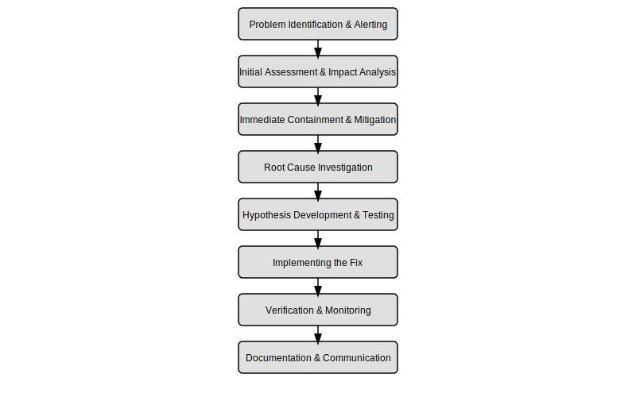

<sub>v0.1</sub>

# 5. Decompose

## 5.1 Manageable (sub)problems

Granular enough (no more / no less) to solve the problem at hand

[Example 1] Scenario: Building a simple login functionality.

Too Granular:
- Task A: Create the login page HTML.
- Task B: Create a form container.
- Task C: Create the username input field.
- Task D: Create the password input field.
- Task E: Write a function to capture keystrokes for the username field.
- Task F: Write a function to capture keystrokes for the password field.
- Task G: Validate each keystroke individually.
- Task H: Create a submit button.
- Task I: Write a function to format the user credentials.
- Task J: Write a function to send credentials to the server.
- Task K: Write a function to handle server responses.
- Task L: Write a function to display errors.

[Example 2] Scenario: Processing an order in an e-commerce system.

Too Coarse:
- Task A: Write one monolithic function called `processOrder` that:
(Reads the order details. Validates user input. Calculates the total price. Applies any discounts or promotions. Updates inventory. Sends a confirmation email. Logs the transaction.)

Rules of thumb
- Is this task simple enough for me without feeling **overwhelmed**?
- Can I easily verify this task
- Can this task be completed with minimal reliance on others?
- Is there an existing library?

Also refer to Yitang PM course - Just granular enough so that you can be confident that the R person can reliably solve it. In this case the R person is yourself.

[Exmaple] 1+2+3+4 (depending on the person) | Also refer to Yitang PM course

## 5.2 One at a time

(Slightly different angle from previous chapter)

- Avoid Overwhelm
- Milestones or Checkpoints (confirm completion before moving on to the next)
- Timeboxing (prevent spending too long on one piece)

Refer to the previous chapter

======== Common Frameworks ========

If don't know how to break down? => Known-unknown => Learn => 1:10:100

Ultimately, these frameworks are one of the core competencies that we need to delibrately practice.

## 5.3 Coding

(Inspired by https://www.coursera.org/specializations/object-oriented-programming)

### 5.3.1 Understand existing logic

Before changing or adding new functionality, invest time in reading and running the existing code. Try to understand how data flows, which modules interact, and what assumptions the code makes.

Tools & Techniques:
- Code walkthroughs
- Read existing unit/integration tests if present. (NemiBot example)
- Check existing diagrams or flowcharts if present. Or create diagrams or flowcharts if needed. (Any ERD / flowchart example)

### 5.3.2 Design new logic

Sketch Your Approach: Before writing code, sketch out your algorithm or module design. Use **pseudocode** or **diagrams** to clarify the logic.

### 5.3.3 Translate logic to code

Take the logic from previous step and implement using the actual programming language

#### 5.3.3.a Scaffolding

Think of scaffolding as setting up the temporary structure that supports the final build—like creating directories, empty classes or functions, and basic project configuration.

Helps verify that your development environment is set up correctly. Ensures that dependencies and integrations (APIs, language features) are correctly installed and configured.

Tip:
Write placeholder functions with clear signatures and add simple tests to check that the scaffolding works before fleshing out full logic. (Fake it before you make it)

[Example] This workshop itself ^_^
(Check the commit history)
- https://github.com/StaymanHou/problem_solving_algorithm/blob/main/1_overview.md
- https://github.com/StaymanHou/problem_solving_algorithm/blob/main/9_all_together.rb

#### 5.3.3.b Try a working example / Hello world

(Validate API usage / language syntax)
Before diving deep into the new logic, write a small working example (or a “Hello World” equivalent) that exercises key parts of your design if you are not familiar with it.

This step helps you validate that you're correctly using the language, frameworks, or APIs. It’s like taking the scaffolding for a test run to ensure it’s solid.

Incremental Development:
Start small, then incrementally add more logic once the basic structure is verified.

[Example] Me trying LLM fine-tuning this week
https://www.youtube.com/embed/52clfKcM4M4?si=Y8rSxDi2J90CryzZ
https://github.com/linyiLYi/bilibot
Macbook Pro -> Mac Mini M4
Qwen1.5-32B-Chat -> Qwen1.5-0.5B-Chat

TODO how to rule out the possibility of each part going wrong?

### 5.3.4 Refactoring

After your code works, it's time to refine it. Refactoring is about cleaning up and enhancing your code without changing its functionality.

- Readability & style
- Maintainability
- Reduce complexity
- Enhance flexibility
- Improve performance
- Security
(Design principles & patterns)

Refer to the book Refactoring and the book Gang of Four

#### 5.3.4.a Naming conventions

Clarity is Key:
Choose names that clearly describe the purpose of variables, functions, and classes. For example, prefer `calculateTotalPrice()` over `calcTP()`.

Consistency:
Follow established naming conventions (camelCase, snake_case, etc.) as agreed by your team or language community. Can be enforced using linters.

#### 5.3.4.b When to comment and How

Explain the "Why":
Comments should **add context that isn’t obvious from the code itself**. For instance, if a particular algorithm was chosen for its performance under certain conditions, document that decision.

Avoid Redundancy:
Don't comment on every single line. Instead, focus on non-obvious logic, complex operations, or decisions that might be revisited later.

Update Regularly:
Make sure comments remain relevant and updated as code changes. Outdated comments can be misleading.

Document Assumptions & Constraints:
If there are any assumptions or known limitations, document them right where they matter.

[Bad Example]
```python
def calculate_total(items):
    # Initialize total to 0
    total = 0  
    # Loop over each item in the items list
    for item in items:
        # Multiply the price by the quantity of the item and add to total
        total += item['price'] * item['quantity']  
    # Return the final total
    return total  
```

[Good Example]
```python
def calculate_total(items):
    """
    Calculate the total cost for a list of items.
    
    Each item is expected to be a dictionary with 'price' and 'quantity' keys.
    This function multiplies the price by the quantity for each item and sums them up.
    
    Note:
        - It assumes that the 'price' is per unit.
        - Quantities are expected to be positive integers.
    """
    total = 0
    for item in items:
        total += item['price'] * item['quantity']
    return total
```

### 5.3.5 [Bonus] Testing

(See chapter 7)
TDD vs. Testing After the Fact

## 5.4 Debugging

Debugging is more than just hunting for errors—it's a structured approach to identifying why your program isn't behaving as expected. By categorizing the types of issues, you can use targeted strategies to isolate and fix them.

### 5.4.1 Wrong expected I/O
The output you get from your program doesn't match what you anticipated.

Common causes:
- Incorrect assumptions about the data.
- Faulty test cases.
- Misunderstanding of the problem requirements.

Tips:
- Write unit tests that clearly specify the expected input and output.
- Use logging to compare actual vs. expected values.

[Example] Codewars - visible test cases, hidden test cases.

[Example] Newsletter scheduling system (possibly user scheduled it twice)

### 5.4.2 Wrong logic

Errors in the underlying algorithm or business rules.

Common causes:
- Wrong condition
- Incorrect loop boundaries.
- Flawed algorithmic design.

Tips:
- Walk through the logic (pseudocode or flowchart) manually or with a debugger.
- Add assertions to validate key points in your code.

[Example]
```ruby
  def each_materialized_work_session_on_and_after(datetime, limit: 100)
    work_schedule_items_count = work_schedule_items.length
    return unless work_schedule_items_count > 0

    datetime_in_user_tz = datetime.in_time_zone(user.tz)
    counter = 0
    datetime_pointer = datetime_in_user_tz
    seeking = true

    while counter < limit-1
      work_schedule_item = work_schedule_items[counter % work_schedule_items_count]
      counter += 1
      limit += 1 if seeking

      if seeking
        delta = (WorkScheduleItem.day_of_weeks[work_schedule_item.day_of_week] + ((counter-1)/work_schedule_items_count)*7) - datetime_pointer.wday
        next unless delta >= 0

        seeking = false
        datetime_pointer = datetime_pointer + delta.days
      else
        # Pay attention here. The Wrong logic assumed incremental style would work
        delta = (WorkScheduleItem.day_of_weeks[work_schedule_item.day_of_week] - datetime_pointer.wday)%7
        # But delta would always be 0 if there's only one workday in the schedule
        datetime_pointer = datetime_pointer + delta.days
      end

      materialized_work_session = work_schedule_item.materialize_work_session(datetime_pointer, user.tz)

      yield(materialized_work_session) if block_given?
    end
  end
```

[Patched]
```ruby
  def each_materialized_work_session_on_and_after(datetime, limit: 100)
    work_schedule_items_count = work_schedule_items.length
    return unless work_schedule_items_count > 0

    datetime_in_user_tz = datetime.in_time_zone(user.tz)
    counter = 0

    while counter < limit-1
      work_schedule_item = work_schedule_items[counter % work_schedule_items_count]
      counter += 1

      delta = (WorkScheduleItem.day_of_weeks[work_schedule_item.day_of_week] + ((counter-1)/work_schedule_items_count)*7) - datetime_in_user_tz.wday

      next unless delta >= 0

      datetime_pointer = datetime_in_user_tz + delta.days
      materialized_work_session = work_schedule_item.materialize_work_session(datetime_pointer, user.tz)

      yield(materialized_work_session) if block_given?
    end
  end
```

### 5.4.3 Logic doesn't fit the constrains or paradigms

The solution works, but it doesn’t adhere to required constraints (e.g., performance, memory usage) or the programming paradigm (e.g., functional vs. object-oriented).

Common causes:
- Not leveraging appropriate data structures.
- Mixing paradigms in a way that hinders maintainability.

Tips:
- Review the system requirements and refactor your solution.
- Ensure that your approach aligns with the architectural guidelines of your project.

[Example] Force normalized relational DB schema design into a non-relational system like DynamoDB

### 5.4.4 Typo in code

Simple mistakes like misspelling a variable or function name.

Common causes:
- Human error during coding.
- Lack of code review.

Tips:
- Use an IDE with spell-checking and autocomplete features.
- Conduct peer code reviews.

[Example] `if a=1` vs `if a==1`

### 5.4.5 Syntax error

Violations of the programming language's grammar rules.

Common causes:
- Missing semicolons, brackets, or parentheses.
- Incorrect indentation (especially in languages like Python).

Tips:
- Rely on linters and automated tools that check syntax.
- Read error messages carefully; they often pinpoint the location of the error.
- Use IDE and syntax highlighting

### 5.4.6 Wrong usage of language feature

Misapplying or misunderstanding a language-specific feature.

Common causes:
- Not fully understanding the behavior of a language construct.
- Overcomplicating a solution by using an advanced feature incorrectly.

Tips:
- Consult the language documentation.
- Write small experiments to understand how a particular feature works.

[Example]
```javascript
function displayUserScore(score) {
  // Wrong usage: using a falsy check to determine if a score is provided.
  if (!score) {
    console.log("No score provided, defaulting to 100.");
    score = 100;
  }
  console.log("User score is:", score);
}

displayUserScore(0); // Expected: "User score is: 0", but instead it outputs the default.
```

### 5.4.7 Wrong usage of framework feature

Incorrect implementation of a framework’s intended functionality.

Common causes:
- Lack of familiarity with the framework’s best practices.
- Overriding default behaviors without full understanding.

Tips:
- Review the framework documentation and sample projects.
- Leverage community examples and tutorials.

[Example]
```javascript
export default {
  data() {
    return {
      username: ''
    }
  },
  created() {
    // Attempting to focus the input before it's mounted
    // This will fail because the DOM element isn't available yet.
    this.$refs.usernameInput.focus();
  },
  template: `
    <div>
      <input ref="usernameInput" v-model="username" />
    </div>
  `
}
```

`TypeError: Cannot read property 'focus' of undefined`

`created()` => `mounted()`

### 5.4.8 Wrong usage of 3rd-party API / library

Misinterpretation or misuse of an external API or library.

Common causes:
- Incorrect assumptions about the API’s behavior.
- Not keeping up with changes or updates to the API.

Tips:
- Check API documentation and check for version updates.
- Write tests specifically for integration with the API.

[Example]
https://stackapps.com/questions/8202/unable-to-make-api-calls-using-access-token-for-private-stack-overflow-teams-sit

### 5.4.9 Bugs in 3rd-party

Errors that originate from the external libraries or services you’re using.

Common causes:
- Flaws or unhandled edge cases in the 3rd-party code.
- Incompatibility issues between different library versions.

Tips:
- Check the library’s issue tracker or community forums.
- Consider using alternatives or contributing a patch if possible.
- Check source code and contribute

[Example]
https://github.com/sendgrid/sendgrid-nodejs/pull/1424

### 5.4.10 Wrong understanding of existing codebase

Misinterpretation of how the existing system works, leading to incorrect assumptions.

Common causes:
- Poor or outdated documentation.
- Complex or convoluted code that lacks clarity.

Tips:
- Spend time reviewing the code and any available documentation.
- Pair with someone familiar with the codebase to gain insight.

### 5.4.11 Inherited problem from existing codebase

Bugs that were carried over from legacy systems or previous implementations.

Common causes:
- Legacy code that wasn’t refactored properly.
- Accumulated technical debt.

Tips:
- Identify and document known issues during code reviews.
- Plan gradual refactoring to eliminate these legacy issues.

### 5.4.12 [Bonus] Race Condition

A concurrency problem where the outcome depends on the sequence or timing of uncontrollable events.

Common causes:
- Poor synchronization in multi-threaded or asynchronous code.
- Shared resource access without proper locks or atomic operations.

Tips:
- Use proper synchronization mechanisms (locks, semaphores, atomic operations).
- Design your system to minimize shared state or use thread-safe data structures.

[Example]
```javascript
let sharedValue = 0;

async function addOne() {
  // Read the current value
  const temp = sharedValue;
  // Simulate asynchronous work with a random delay
  await new Promise(resolve => setTimeout(resolve, Math.random() * 100));
  // Update the shared variable based on the stale read
  sharedValue = temp + 1;
}

async function subtractOne() {
  const temp = sharedValue;
  await new Promise(resolve => setTimeout(resolve, Math.random() * 100));
  sharedValue = temp - 1;
}

async function raceConditionExample() {
  // Run both functions concurrently
  await Promise.all([addOne(), subtractOne()]);
  // Depending on which update happens last, the final value may be 1 or -1.
  console.log("Final value of sharedValue:", sharedValue);
}

raceConditionExample();
```

#### Divide and conquer

| **Category**                    | **Description**                                                                                         | **Common Causes / Examples**                                                                                     | **Tips / Solutions**                                                                                                        |
|---------------------------------|---------------------------------------------------------------------------------------------------------|------------------------------------------------------------------------------------------------------------------|-----------------------------------------------------------------------------------------------------------------------------|
| Wrong Expected I/O              | Output doesn’t match what’s expected.                                                                   | Incorrect assumptions, flawed test cases, or misinterpreted requirements.                                        | Write clear unit tests; log and compare actual vs. expected values; double-check assumptions.                                |
| Wrong Logic                     | The underlying algorithm or business rules are flawed.                                                | Incorrect conditions, loop boundaries, or algorithm design mistakes.                                             | Step through code with a debugger; use assertions; review and trace the logic manually.                                    |
| Logic Doesn’t Fit Constraints   | Code works but doesn’t adhere to constraints (performance, memory, or paradigm).                        | Using inefficient data structures or mixing paradigms.                                                          | Refactor the solution; review system requirements; apply relevant design principles and patterns.                           |
| Typo in Code                    | Simple typographical errors that break the code.                                                      | Misspelled variable or function names.                                                                           | Use IDE features like autocomplete; perform peer code reviews; use linters.                                                 |
| Syntax Error                    | Violations of the programming language’s grammar rules.                                               | Missing commas, brackets, mismatched quotes, etc.                                                                 | Rely on linters and auto-formatters; read error messages carefully; validate code syntax before executing.                  |
| Wrong Usage of Language Feature | Misapplying a language-specific feature leads to unintended behavior.                                | Misunderstanding JavaScript falsy values or using async/await incorrectly.                                         | Consult language documentation; write small tests; use explicit checks (e.g., check for `undefined` rather than falsy).        |
| Wrong Usage of Framework Feature| Incorrect implementation of a framework’s intended functionality.                                     | Using an inappropriate lifecycle hook in Vue.js (e.g., trying to access DOM elements in `created` instead of `mounted`). | Follow framework documentation and best practices; review community examples; test lifecycle timing carefully.               |
| Wrong Usage of 3rd-Party API/Library | Misusing an external API or library due to incorrect assumptions or parameter names.              | Passing a wrong parameter (e.g., using `team_url` instead of `team` in an API call) that leads to misleading errors. | Double-check API documentation; validate parameter names and values; compare with similar examples from the community.       |
| Bugs in 3rd-Party               | Issues arising from the external libraries themselves.                                               | Flaws or unhandled edge cases in the API/library; version incompatibilities.                                      | Check issue trackers and community forums; update to the latest version or consider alternatives; apply temporary workarounds.|
| Wrong Understanding of Codebase | Misinterpreting existing code leads to mistakes.                                                     | Incorrect assumptions about function return values or component behavior.                                         | Review the documentation; pair with experienced colleagues; use debugging tools to trace behavior.                         |
| Inherited Problem from Codebase | Legacy issues carried over from previous implementations.                                             | Hard-coded values, accumulated technical debt, or outdated logic from legacy systems.                             | Identify and document known issues; plan for gradual refactoring; increase test coverage on legacy components.               |
| Race Condition [Bonus]          | Concurrent asynchronous operations interfere, causing unpredictable outcomes.                        | Two async functions reading/updating a shared variable without proper synchronization (e.g., async/await race).       | Use proper synchronization (e.g., locks, atomic operations); design concurrent code with careful ordering; test under load.   |

## 5.5 Design Tech Stack

A well-designed tech stack is the backbone of any application. It involves strategic choices not only about the technologies but also about how you acquire or develop each component. Let’s dive into the two main aspects:

### 5.5.1 Build vs. Borrow vs. Buy

This decision centers on whether you should:
- **Build:** Develop the solution in-house.
- **Borrow:** Leverage existing open-source or third-party libraries.
- **Buy:** Purchase a commercial solution.

#### How to Evaluate:

1. **Criticality to Core Business:**  
   - **Build:** If the component is a core differentiator, building it gives you full control and customization.  
   - **Borrow/Buy:** For non-differentiating components (e.g., user authentication, payment processing), it's often better to leverage existing solutions.

2. **Time-to-Market:**  
   - **Build:** Can be slower but tailored exactly to your needs.  
   - **Borrow/Buy:** Typically faster—open-source or commercial solutions can significantly reduce development time.

3. **Cost Analysis:**  
   - **Build:** Consider long-term maintenance costs and the initial investment of resources.  
   - **Borrow/Buy:** Evaluate licensing fees, potential vendor lock-in, or the cost of customizing an off-the-shelf solution.

4. **Scalability & Flexibility:**  
   - **Build:** Offers maximum flexibility for future changes but may require more initial foresight.  
   - **Borrow/Buy:** Assess if the chosen solution can scale with your business and adapt to your changing needs.

5. **Integration Complexity:**  
   - **Build:** Integrating a custom solution might be easier if designed in-house.  
   - **Borrow/Buy:** Ensure the solution you’re adopting has good documentation, strong community or vendor support, and plays well with your existing stack.

### 5.5.2 Web / Mobile

When planning your tech stack for web or mobile applications, it's helpful to break it down into three primary layers: the frontend, the backend, and the infrastructure/operations (CI/CD).

#### 5.5.2.a Frontend

- **User Interface & Experience:**  
  - **Web:** Frameworks like React, Angular, or Vue.js help create dynamic, responsive interfaces.  
  - **Mobile:** Native (Swift for iOS, Kotlin for Android) or cross-platform frameworks (Flutter, React Native) enable robust app development.
  
- **Performance & Responsiveness:**  
  Ensure that your chosen technology provides smooth performance across various devices and screen sizes.

- **Tooling & Ecosystem:**  
  Evaluate the availability of libraries, community support, developer tools, and ease of integration with backend APIs.

#### 5.5.2.b Backend

- **API & Business Logic:**  
  The backend handles data processing, business rules, and exposes APIs. Technologies like Node.js, Python (Django/Flask), Ruby on Rails, or Java (Spring Boot) are common choices.

- **Data Management:**  
  Decide between relational (SQL) and non-relational (NoSQL) databases based on the needs of your application. Consider caching mechanisms to improve performance.

- **Scalability & Security:**  
  Design your backend with scalability in mind (e.g., microservices vs. monolith) and ensure robust security measures for user data and transactions.

- **Modularity:**  
  Keeping business logic modular aids in testing, maintenance, and future enhancements.

#### 5.5.2.c Infra & Ops

- **Infrastructure:**  
  This includes your servers, cloud services (like AWS, Google Cloud, or Azure), and containerization/orchestration tools such as Docker and Kubernetes.

- **Continuous Integration/Continuous Deployment (CI/CD):**  
  Automate testing, building, and deploying your code to ensure that changes can be integrated quickly and safely. Tools like Jenkins, GitLab CI, or GitHub Actions are commonly used.

- **Monitoring & Logging:**  
  Implement robust monitoring (using Prometheus, Grafana) and logging (using the ELK stack or similar) systems to keep track of performance and quickly diagnose issues.

- **DevOps Practices:**  
  Adopt infrastructure-as-code (e.g., Terraform), automated testing, and secure deployment practices to streamline operations and maintain system integrity.

### 5.5.3 Team / Talents

People Are as Critical as Technology:

- **Skill Alignment:**
Assess your team's expertise with the technologies under consideration. If the team is already familiar with a given stack, that might tip the scales in its favor.

- **Learning Curve:**
Consider the ramp-up time for new technologies. For instance, adopting a cutting-edge framework may offer benefits but require training.

- **Team Size & Structure:**
For small teams, simplicity and maintainability are key. For larger teams, consider modularity and clear ownership of different parts of the stack.

- **Hiring & Collaboration:**
Evaluate whether you need to hire additional talent or upskill existing staff. Sometimes, choosing technologies with a larger talent pool can ease future hiring challenges.

- **Real-World Consideration:**
A tech stack that is perfect on paper might falter in practice if the team isn’t comfortable with it. Always balance technical merits with the human element. When the team understands and trusts the stack, the likelihood of long-term success increases.

## 5.6 Troubleshooting Production Systems

### 5.6.1 Typical Process

#### 5.6.1.a Problem Identification & Alerting
- **What Happens:** Monitoring tools (like Prometheus, Datadog, or New Relic) trigger alerts when key metrics deviate from normal. Customer complaints or error logs (e.g., failed checkouts) are also indicators.  
- **Example:** An alert is raised because the checkout failure rate spikes above a threshold, and customer support logs multiple complaints about “payment errors.”

#### 5.6.1.b Initial Assessment & Impact Analysis
- **What Happens:** Quickly determine the scope—how many users are affected, what parts of the system are impacted, and potential business impact (revenue loss, user dissatisfaction).  
- **Example:** The operations team assesses that 20% of transactions over the past hour failed, affecting users in a particular region.

#### 5.6.1.c Immediate Containment & Mitigation
- **What Happens:** Apply temporary fixes to reduce harm. This might involve rolling back a recent deployment, increasing server capacity, or enabling a failover mechanism.  
- **Example:** The team decides to revert a recent update to the payment gateway integration that coincided with the spike in failures, temporarily restoring normal operations.

#### 5.6.1.d Root Cause Investigation
- **What Happens:** Conduct a systematic review of logs, metrics, and system changes to determine what triggered the issue.  
- **Example:** Investigation reveals that a change in the payment gateway API introduced stricter validation rules that were not properly handled by the new code.

#### 5.6.1.e Hypothesis Development & Testing
- **What Happens:** Formulate possible explanations for the failure and design tests or queries to confirm or refute these hypotheses.  
- **Example:** A hypothesis is formed that the new validation rules are causing certain transactions to be rejected. The team simulates transactions in a staging environment to see if the behavior is reproducible.

#### 5.6.1.f Implementing the Fix
- **What Happens:** Once the root cause is confirmed, implement a permanent solution. This might involve patching code, updating configurations, or negotiating changes with a third-party service.  
- **Example:** Developers update the integration code to correctly handle the new API’s validation requirements, and the patch is deployed following proper review processes.

#### 5.6.1.g Verification & Monitoring
- **What Happens:** Validate that the fix resolves the issue without causing regressions. Enhanced monitoring ensures that similar problems do not recur.  
- **Example:** Post-deployment, the team closely monitors the checkout process to ensure transaction success rates return to normal, and no new alerts are triggered.

#### 5.6.1.h Documentation & Communication
- **What Happens:** Document the incident, steps taken, and lessons learned. Communicate with stakeholders and update runbooks or playbooks for future reference.  
- **Example:** A post-mortem report is prepared, detailing the root cause, the fix implemented, and recommendations to prevent similar issues in the future. The team holds a debrief meeting with customer support and engineering leads.



### 5.6.2 Typical Root Causes

#### 5.6.2.a Access Pattern Changed

- **Example:** A sudden promotional campaign leads to unexpected user behavior, overwhelming certain endpoints with requests that weren’t designed for that load.

- **Common Symptoms:**
  - **Performance Degradation:** Noticeable slowdown or increased latency in certain endpoints.
  - **Error Spikes:** More frequent 5xx errors, timeouts, or dropped requests.
  - **Resource Overuse:** Sudden increases in CPU, memory, or network utilization.
  - **Anomalous Traffic Patterns:** Unusual request volumes or query patterns not seen during normal operations.

- **Potential for Misdiagnosis:**
  - **Overload vs. Code Bug:** Increased latency and errors might be mistaken for inefficient algorithms or poorly optimized code when they’re actually due to unexpected traffic surges (e.g., a viral event or promotional campaign).
  - **Security Concerns:** These symptoms could also trigger a false alarm for a DDoS attack, leading teams to focus on security defenses rather than scaling resources.
  - **Infrastructure Misinterpretation:** High resource usage might be misinterpreted as an infrastructure misconfiguration when the true cause is the changed access pattern.

#### 5.6.2.b Issue Introduced into Application Code

- **Example:** A recent deployment inadvertently introduced a bug in the payment module that wasn’t caught during testing.

- **Common Symptoms:**
  - **Application Errors:** Frequent exceptions, crashes, or unhandled errors in the logs.
  - **Incorrect Business Logic:** Unexpected outputs or behavior, such as calculation errors or failed transactions.
  - **Regression in Functionality:** Features that previously worked suddenly malfunction.
  - **Degraded User Experience:** Users encountering broken workflows or inconsistent states.

- **Potential for Misdiagnosis:**
  - **Transient vs. Persistent:** Intermittent errors might be misinterpreted as flaky infrastructure or network issues rather than a new bug in the code.
  - **Shared Symptoms with Middleware/Infra:** Similar error patterns (like timeouts or null pointer exceptions) can also emerge from misconfigured middleware or even hardware issues, leading to an initial misdirected investigation.
  - **Legacy Code Impact:** Sometimes, a recent change might expose latent issues in legacy code, which could be wrongly attributed solely to the new code rather than an interaction between the two.

#### 5.6.2.c Infra Issue

- **Example:** A misconfigured load balancer or a failing server instance causes sporadic service interruptions.

- **Common Symptoms:**
  - **Unresponsive Services:** Slow or unresponsive servers, network timeouts, or connectivity drops.
  - **Resource Saturation:** High load averages, disk I/O errors, or memory shortages on specific servers.
  - **Deployment/Configuration Problems:** Issues with load balancers, DNS resolution errors, or misconfigured firewalls.
  - **Unexpected Restarts/Crashes:** Server or container crashes without a clear application error.

- **Potential for Misdiagnosis:**
  - **Code vs. Hardware:** Similar symptoms like high latency or timeouts might be misattributed to inefficient code rather than underlying hardware failures or network misconfigurations.
  - **Transient Network Glitches:** Temporary infra hiccups can mimic intermittent application errors, leading teams to focus on application-level fixes.
  - **Scaling Misinterpretation:** A failure to scale (e.g., autoscaling not triggering) may look like a software bug if monitoring isn’t carefully correlated with infra performance metrics.

#### 5.6.2.d 3rd-Party Service Issue

- **Example:** An external payment gateway suffers downtime or changes its API, impacting your system’s ability to process payments.

- **Common Symptoms:**
  - **API Failures:** Repeated error responses (e.g., 400/500 status codes) or timeouts from external service calls.
  - **Inconsistent Behavior:** Fluctuating performance or intermittent connectivity issues with external services.
  - **Service Unavailability:** A complete or partial outage in a critical external dependency (e.g., payment gateway or data provider).
  - **Dependency Latency:** Increased response times from external APIs affecting overall system performance.

- **Potential for Misdiagnosis:**
  - **Internal vs. External:** Symptoms might initially be blamed on internal service bugs, particularly if error handling is not robust, leading to attempts to fix code that’s actually behaving correctly.
  - **Caching Effects:** Cached error responses or stale data from third-party APIs might hide the real-time status of the external service, causing misinterpretation of the issue’s source.
  - **Infrastructure vs. Dependency:** Increased latency may be wrongly attributed to network or infrastructure issues when the actual slowdown is due to the third-party service itself.

#### 5.6.2.e Middleware

- **Example:** A caching layer (e.g., Redis) experiences performance degradation or misconfiguration, leading to stale data or timeouts.

- **Common Symptoms:**
  - **Stale or Inconsistent Data:** Cache misses or outdated information being served.
  - **Session or State Errors:** Issues with session persistence, leading to user authentication or state management problems.
  - **Communication Bottlenecks:** Middleware layers (e.g., message queues or API gateways) introducing delays or errors.
  - **Unexpected Behavior in Data Flow:** Erratic routing of requests or errors in data transformations.

- **Potential for Misdiagnosis:**
  - **Application Code Overlap:** Middleware issues can present similar symptoms to bugs in the application logic (e.g., improper handling of cache invalidation), leading developers to inspect application code first.
  - **Infra Confusion:** Performance degradation in middleware might be confused with broader infrastructure issues, especially if the middleware is tightly integrated with other system components.
  - **Transient Issues:** Middleware problems might be intermittent, causing them to be misdiagnosed as race conditions or sporadic infra failures, rather than a persistent misconfiguration in the middleware layer.

By clearly understanding both the symptoms and the potential pitfalls in diagnosing these issues, teams can avoid common missteps in troubleshooting. This detailed breakdown helps ensure that each root cause is investigated with the right context and that similar symptoms across different layers are carefully differentiated.

| **Root Cause**                   | **Common Symptoms**                                                                                                                                                                         | **Potential for Misdiagnosis**                                                                                                                                                                   |
|----------------------------------|---------------------------------------------------------------------------------------------------------------------------------------------------------------------------------------------|--------------------------------------------------------------------------------------------------------------------------------------------------------------------------------------------------|
| **Access Pattern Changed**       | - Performance degradation (increased latency) <br> - Error spikes (5xx, timeouts) <br> - High resource usage (CPU, memory, network) <br> - Anomalous traffic patterns                   | - Mistaking traffic surges for inefficient code <br> - Confusing overload with a DDoS attack <br> - Interpreting high resource use as infra misconfiguration rather than changed usage    |
| **Issue Introduced into Application Code** | - Frequent exceptions or crashes <br> - Incorrect business logic and unexpected outputs <br> - Regression of functionality <br> - Degraded user experience                         | - Attributing intermittent errors to network or infrastructure issues <br> - Overlooking latent legacy issues exposed by new changes <br> - Confusing with middleware or infra issues       |
| **Infra Issue**                  | - Unresponsive services and connectivity drops <br> - High load averages, disk I/O, memory shortages <br> - Misconfigurations (load balancers, DNS, firewalls) <br> - Unexpected restarts | - Blaming inefficient code instead of hardware/network failures <br> - Misinterpreting transient network glitches as application bugs <br> - Scaling issues misread as code errors      |
| **3rd-Party Service Issue**      | - Repeated API errors (400/500) or timeouts <br> - Inconsistent performance and intermittent connectivity <br> - Complete or partial external service outages <br> - Dependency latency | - Mistaking external API failures for internal service bugs <br> - Caching or stale data hiding the real-time status of the dependency <br> - Misattributing delays to network issues     |
| **Middleware**                   | - Stale or inconsistent data <br> - Session or state management errors <br> - Communication bottlenecks (e.g., message queues, API gateways) <br> - Erratic request routing       | - Attributing issues to application logic rather than middleware faults <br> - Confusing middleware performance degradation with broader infra issues <br> - Misdiagnosing intermittent issues |

### 5.6.3 The 3 Pillars Of Observability

Observability lets you understand the internal state of a system through its external outputs. The three key pillars are **Logging**, **Metrics**, and **Tracing**. Each pillar has a unique role in troubleshooting production systems:

#### 5.6.3.a Logging

**Description:**  
Logging involves capturing detailed, timestamped records of events within your system. Logs are ideal for debugging because they record what happened at a specific point in time.

**Concrete Example:**  
An Apache server error log might contain an entry like:  
```
[Mon Mar 28 10:30:01.123456 2025] [core:error] [pid 1234] [client 192.168.1.100:54321] AH00126: Invalid URI in request GET /invalid HTTP/1.1
```
This entry shows that a client made a request to an invalid URI. By examining such logs, engineers can pinpoint misconfigurations or misuse in client requests, which is invaluable when troubleshooting errors.

#### 5.6.3.b Metrics

**Description:**  
Metrics are numerical data points that capture system performance over time—such as response times, error rates, or resource usage. They help you detect anomalies and trigger alerts when performance deviates from the norm.

**Concrete Example:**  
Imagine you have a Prometheus dashboard monitoring an e-commerce site's checkout endpoint. The graph suddenly shows that response times have increased from an average of 200ms to 1200ms, along with a spike in HTTP 500 errors. This alert indicates a performance issue, prompting further investigation into the underlying cause.

#### 5.6.3.c Tracing

**Description:**  
Tracing enables you to follow the path of a request through various services in a distributed system. It provides a visual map of each service involved and the latency incurred at each step, helping to identify where bottlenecks or errors occur.

**Concrete Example:**  
Using a distributed tracing system like Jaeger, you trace a user request that begins at an API gateway, flows through a product service, and then to a payment service. The trace reveals that while the API gateway and product service are responding quickly, the payment service is introducing an 800ms delay. This pinpointed delay helps developers focus their troubleshooting efforts on the payment service.

#### How the 3 Pillars Overlap and Complement Each Other

The table below summarizes how each pillar is used, provides a concrete example, and explains how they work together to provide a complete picture of your system's health:

| **Observability Pillar** | **Primary Use Cases**                                   | **Concrete Example**                                                                                                                                   | **How It Complements Others**                                                                                                                                             |
|--------------------------|---------------------------------------------------------|--------------------------------------------------------------------------------------------------------------------------------------------------------|---------------------------------------------------------------------------------------------------------------------------------------------------------------------------|
| **Logging**              | Capturing detailed event-level information; debugging specific errors. | Apache error log entry showing an invalid URI request and 500 errors.                                                                                 | Provides granular context when a metric alert triggers further investigation; logs often include trace IDs that correlate with distributed tracing data.             |
| **Metrics**              | Monitoring performance and system health; triggering alerts. | Prometheus graph showing a spike in checkout response times (200ms to 1200ms) and increased HTTP 500 error rates.                                      | Alerts teams to anomalies that need deeper analysis; metric spikes can be correlated with log events and traced through distributed systems for root cause analysis.    |
| **Tracing**              | Tracking the journey of a request; identifying latency and bottlenecks. | Jaeger trace revealing an 800ms delay in the payment service, causing overall request latency.                                                        | Bridges gaps between logs and metrics by providing an end-to-end view of a request’s path; helps in correlating log entries and metric data to specific points in the flow. |

By combining these three pillars, you gain a comprehensive understanding of both what is happening in your system (through logs and metrics) and why it might be happening (through tracing the request flow). This integrated approach makes troubleshooting more efficient and effective.

## 5.7 Other General Decomposition

### 5.7.1 Process Flow (this THEN that)

**What It Means:**  
Process flow decomposition is all about the sequence of operations. You map out a series of steps that occur one after the other—each step triggers the next.

**When to Use:**  
- **Sequential tasks:** For instance, user registration often involves entering details → verifying email → activating the account.
- **Workflows:** Any process where the output of one step is the input of the next.

**Example:**  
Consider a file upload system:
1. **Receive file**
2. **Validate file type and size**
3. **Store file on the server**
4. **Update the database with file info**

Each step flows into the next in a clear, linear progression.

### 5.7.2 Components (this AND that)

**What It Means:**  
Component decomposition focuses on dividing the system into distinct parts or modules that operate together. These parts often work concurrently or independently but must be integrated for the full system to function.

**When to Use:**  
- **Modular systems:** For example, breaking down an e-commerce site into separate modules such as user management, product catalog, and order processing.
- **Parallel development:** When different teams work on different aspects concurrently.

**Example:**  
In a web application:
- **Frontend:** Handles user interactions and presentation.
- **Backend:** Manages business logic and data storage.
- **API Gateway:** Facilitates communication between the frontend and backend.

Each component is developed and tested independently before being integrated.

### 5.7.3 Options (this OR that)

**What It Means:**  
Option decomposition addresses decisions within a process—identifying alternative paths or methods that can achieve the same goal. Essentially, you provide a decision point: choose option A or option B.

**When to Use:**  
- **Feature toggles:** An application might support two different methods for authentication—password-based or biometric.
- **Fallback strategies:** Handling cases where, if one solution fails, an alternative can be used.

**Example:**  
A search functionality might have:
- **Option A:** Use a relational database query.
- **Option B:** Use a dedicated search engine like Elasticsearch.

The system might dynamically choose based on load or user preference.

### 5.7.4 Other

**What It Means:**  
This category covers decompositions that don’t neatly fit into the previous types. It might include:
- **Hybrid approaches:** Combining elements of process flow, components, and options.
- **Domain-specific decompositions:** For example, breaking down a machine learning pipeline into data preprocessing, model training, and evaluation.
- **Cross-cutting concerns:** Addressing aspects like logging, security, or error handling that apply across multiple layers of a system.

**When to Use:**  
- **Complex systems:** Where a single decomposition method isn’t sufficient.
- **Context-specific tasks:** When unique business rules or domain knowledge require a tailored approach.

**Example:**  
In a microservices architecture:
- **Process Flow:** Each service might have a clear sequential process (e.g., order processing in an e-commerce system).
- **Components:** Different microservices (user, order, payment) act as independent components.
- **Options:** Each service might offer alternative ways to process requests depending on real-time data or availability.
- **Other:** Implementing a centralized logging or monitoring system that spans across all services.

Each of these decomposition strategies serves different purposes, and often, a real-world problem will require a blend of these approaches. The key is to choose the method that best fits the nature of the problem and the capabilities of your team.

## 5.8 Conclusion: Low-cost trial and error

[< Previous Chapter](4_build_solution.md) | [Next Chapter >](6_prioritize.md)
